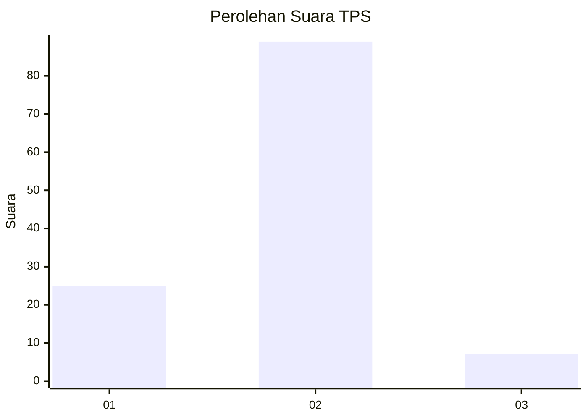
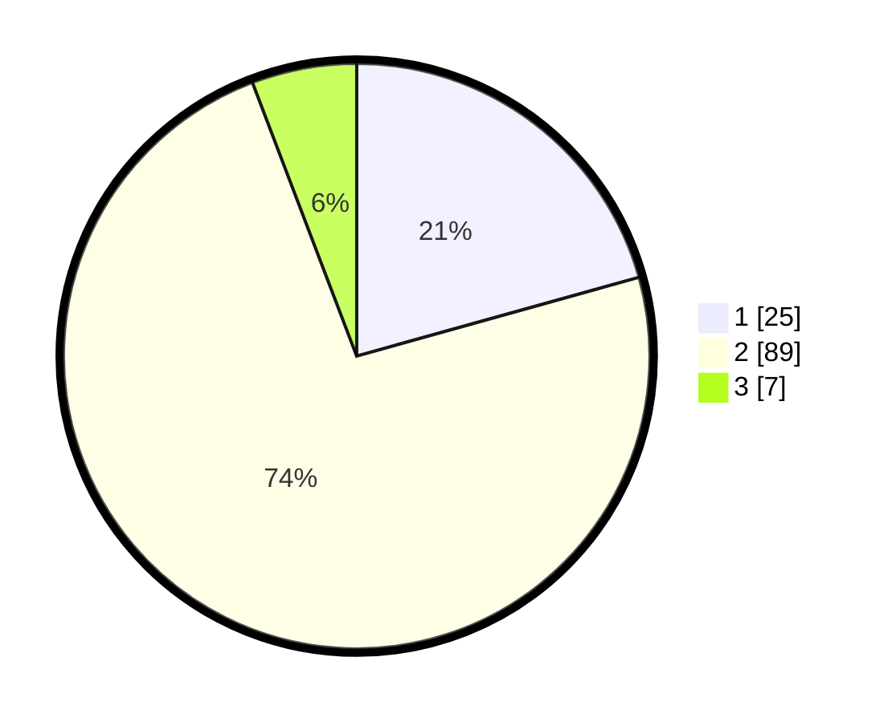

# Hasil

## Grafik

## Tabel

| No. | Nama Paslon    | Suara | Suara (raw) | Persentase |
|:--- |:-------------- | -----:| -----------:| ----------:|
| 1   | ANIES MUHAIMIN | 25    | [25][p-1]   | 20,66      |
| 2   | PRABOWO GIBRAN | 89    | [89][p-2]   | 73,55      |
| 3   | GANJAR MAHFUD  | 7     | [7][p-3]    | 5,79       |

[p-1]: https://github.com/gigit-pemilu/pemilu-2024-62-kalimantan-tengah/blob/main/pilpres/hitung-suara/sub/62-kalimantan-tengah/sub/03-kapuas/sub/17-bataguh/sub/1001-pulau-kupang/sub/021-tps/sub/paslon-1.txt
[p-2]: https://github.com/gigit-pemilu/pemilu-2024-62-kalimantan-tengah/blob/main/pilpres/hitung-suara/sub/62-kalimantan-tengah/sub/03-kapuas/sub/17-bataguh/sub/1001-pulau-kupang/sub/021-tps/sub/paslon-2.txt
[p-3]: https://github.com/gigit-pemilu/pemilu-2024-62-kalimantan-tengah/blob/main/pilpres/hitung-suara/sub/62-kalimantan-tengah/sub/03-kapuas/sub/17-bataguh/sub/1001-pulau-kupang/sub/021-tps/sub/paslon-3.txt

## Foto C Plano

https://sirekap-obj-formc.kpu.go.id/4832/pemilu/ppwp/62/03/17/10/01/6203171001021-20240223-235655--1397f845-7ffd-4ad4-b998-03fdf86a5e64.jpg

https://sirekap-obj-formc.kpu.go.id/4832/pemilu/ppwp/62/03/17/10/01/6203171001021-20240215-073724--a577f141-5393-42cf-9e6b-828304588ad6.jpg

https://sirekap-obj-formc.kpu.go.id/4832/pemilu/ppwp/62/03/17/10/01/6203171001021-20240215-075237--5da44811-daf4-4bdf-9c10-a7621d6f7d8c.jpg

## Metadata

| Key        | Value               |
| ---------- | ------------------- |
| Time Stamp | 2024-02-24 22:31:28 |

