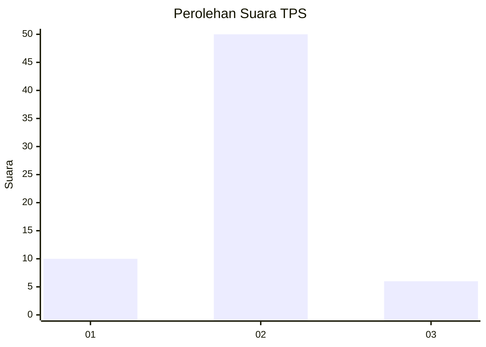
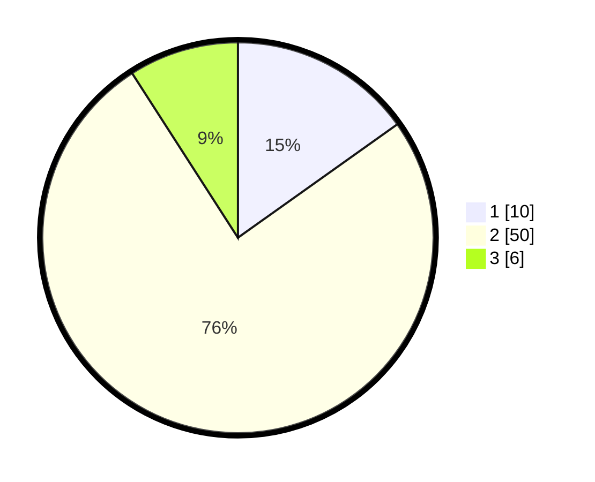

# Hasil

## Grafik

## Tabel

| No. | Nama Paslon    | Suara | Suara (raw) | Persentase |
|:--- |:-------------- | -----:| -----------:| ----------:|
| 1   | ANIES MUHAIMIN | 10    | [10][p-1]   | 15,15      |
| 2   | PRABOWO GIBRAN | 50    | [50][p-2]   | 75,76      |
| 3   | GANJAR MAHFUD  | 6     | [6][p-3]    | 9,09       |

[p-1]: https://github.com/gigit-pemilu/pemilu-2024-62-kalimantan-tengah/blob/main/pilpres/hitung-suara/sub/62-kalimantan-tengah/sub/03-kapuas/sub/17-bataguh/sub/1001-pulau-kupang/sub/023-tps/sub/paslon-1.txt
[p-2]: https://github.com/gigit-pemilu/pemilu-2024-62-kalimantan-tengah/blob/main/pilpres/hitung-suara/sub/62-kalimantan-tengah/sub/03-kapuas/sub/17-bataguh/sub/1001-pulau-kupang/sub/023-tps/sub/paslon-2.txt
[p-3]: https://github.com/gigit-pemilu/pemilu-2024-62-kalimantan-tengah/blob/main/pilpres/hitung-suara/sub/62-kalimantan-tengah/sub/03-kapuas/sub/17-bataguh/sub/1001-pulau-kupang/sub/023-tps/sub/paslon-3.txt

## Foto C Plano

https://sirekap-obj-formc.kpu.go.id/3d50/pemilu/ppwp/62/03/17/10/01/6203171001023-20240223-140720--023e62e9-94fc-47d8-992c-92fe219d0afe.jpg

https://sirekap-obj-formc.kpu.go.id/3d50/pemilu/ppwp/62/03/17/10/01/6203171001023-20240215-093750--57bcf036-812f-4d05-b58b-5af509f5a1cf.jpg

https://sirekap-obj-formc.kpu.go.id/3d50/pemilu/ppwp/62/03/17/10/01/6203171001023-20240215-094242--91e29e5f-b175-4894-a95e-b3135e2d5378.jpg

## Metadata

| Key        | Value               |
| ---------- | ------------------- |
| Time Stamp | 2024-02-24 22:31:28 |

