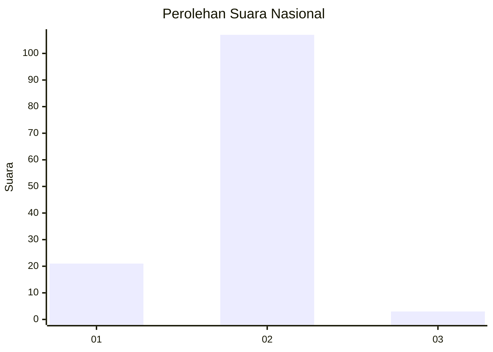
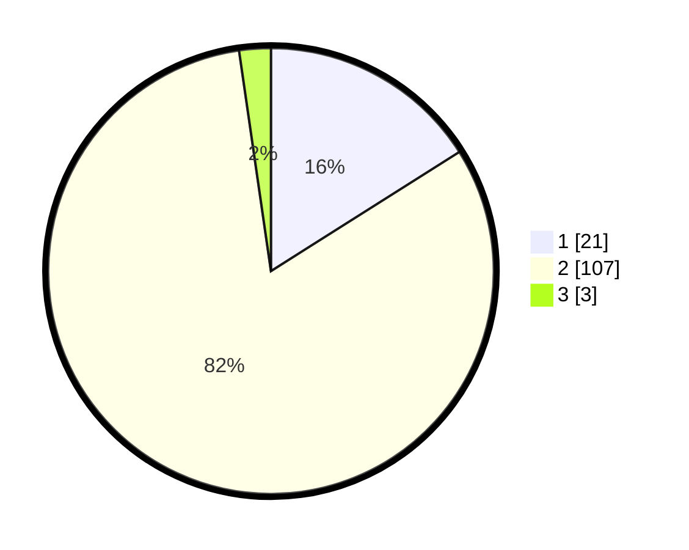

# Hasil

## Grafik

## Tabel

| No. | Nama Paslon    | Suara | Suara (raw) | Persentase |
|:--- |:-------------- | -----:| -----------:| ----------:|
| 1   | ANIES MUHAIMIN | 21    | [21][p-1]   | 16,03      |
| 2   | PRABOWO GIBRAN | 107   | [107][p-2]  | 81,68      |
| 3   | GANJAR MAHFUD  | 3     | [3][p-3]    | 2,29       |

[p-1]: https://github.com/gigit-pemilu/pemilu-2024/blob/main/pilpres/hitung-suara/sub/62-kalimantan-tengah/sub/03-kapuas/sub/17-bataguh/sub/2004-sei-jangkit/sub/003-tps/sub/paslon-1.txt
[p-2]: https://github.com/gigit-pemilu/pemilu-2024/blob/main/pilpres/hitung-suara/sub/62-kalimantan-tengah/sub/03-kapuas/sub/17-bataguh/sub/2004-sei-jangkit/sub/003-tps/sub/paslon-2.txt
[p-3]: https://github.com/gigit-pemilu/pemilu-2024/blob/main/pilpres/hitung-suara/sub/62-kalimantan-tengah/sub/03-kapuas/sub/17-bataguh/sub/2004-sei-jangkit/sub/003-tps/sub/paslon-3.txt

## Foto C Plano

https://sirekap-obj-formc.kpu.go.id/18ce/pemilu/ppwp/62/03/17/20/04/6203172004003-20240219-155248--f57c8a6a-1395-4640-9183-6921158fc997.jpg

https://sirekap-obj-formc.kpu.go.id/18ce/pemilu/ppwp/62/03/17/20/04/6203172004003-20240219-113850--a1da52aa-a13d-4156-a99b-779ed17862cd.jpg

https://sirekap-obj-formc.kpu.go.id/18ce/pemilu/ppwp/62/03/17/20/04/6203172004003-20240219-114027--da25d74d-8f62-474d-a898-02e9c3a2a206.jpg

## Metadata

| Key        | Value               |
| ---------- | ------------------- |
| Time Stamp | 2024-02-19 16:00:00 |

