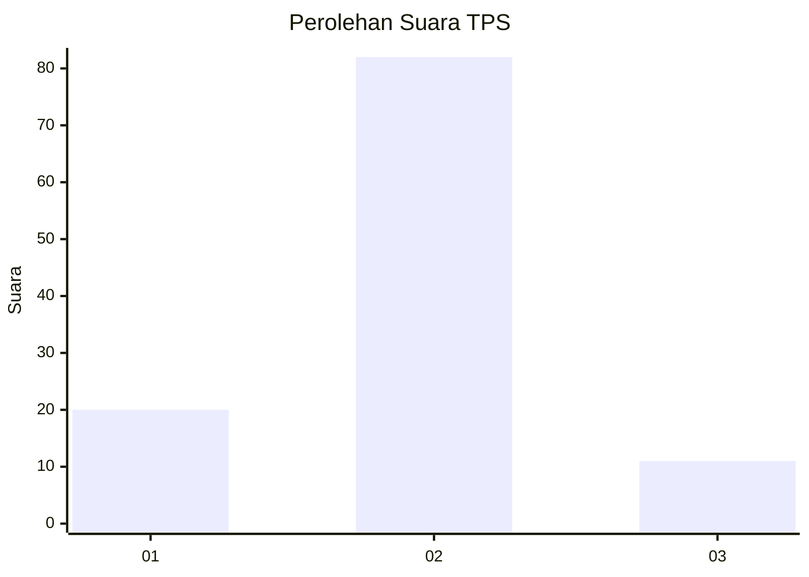
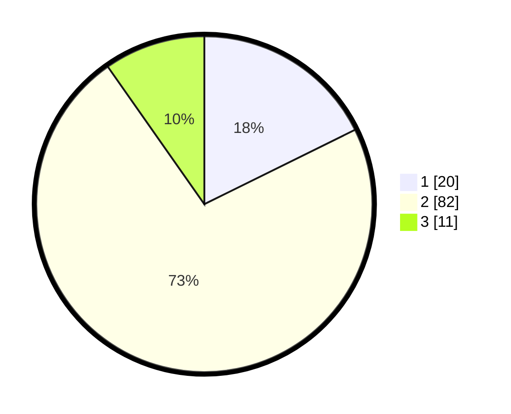

# Hasil

## Grafik

## Tabel

| No. | Nama Paslon    | Suara | Suara (raw) | Persentase |
|:--- |:-------------- | -----:| -----------:| ----------:|
| 1   | ANIES MUHAIMIN | 20    | [20][p-1]   | 17,70      |
| 2   | PRABOWO GIBRAN | 82    | [82][p-2]   | 72,57      |
| 3   | GANJAR MAHFUD  | 11    | [11][p-3]   | 9,73       |

[p-1]: https://github.com/gigit-pemilu/pemilu-2024-62-kalimantan-tengah/blob/main/pilpres/hitung-suara/sub/62-kalimantan-tengah/sub/03-kapuas/sub/17-bataguh/sub/2010-bamban-raya/sub/005-tps/sub/paslon-1.txt
[p-2]: https://github.com/gigit-pemilu/pemilu-2024-62-kalimantan-tengah/blob/main/pilpres/hitung-suara/sub/62-kalimantan-tengah/sub/03-kapuas/sub/17-bataguh/sub/2010-bamban-raya/sub/005-tps/sub/paslon-2.txt
[p-3]: https://github.com/gigit-pemilu/pemilu-2024-62-kalimantan-tengah/blob/main/pilpres/hitung-suara/sub/62-kalimantan-tengah/sub/03-kapuas/sub/17-bataguh/sub/2010-bamban-raya/sub/005-tps/sub/paslon-3.txt

## Foto C Plano

https://sirekap-obj-formc.kpu.go.id/099f/pemilu/ppwp/62/03/17/20/10/6203172010005-20240215-213459--6d3eb19e-8036-4b01-92e3-93d5fae58223.jpg

https://sirekap-obj-formc.kpu.go.id/099f/pemilu/ppwp/62/03/17/20/10/6203172010005-20240215-213551--db11f91e-9620-40d8-8d9b-8e702e9aecef.jpg

https://sirekap-obj-formc.kpu.go.id/099f/pemilu/ppwp/62/03/17/20/10/6203172010005-20240215-213654--ab10b5eb-92e3-4d96-9ea1-1039767e21b1.jpg

## Metadata

| Key        | Value               |
| ---------- | ------------------- |
| Time Stamp | 2024-02-15 23:29:50 |

