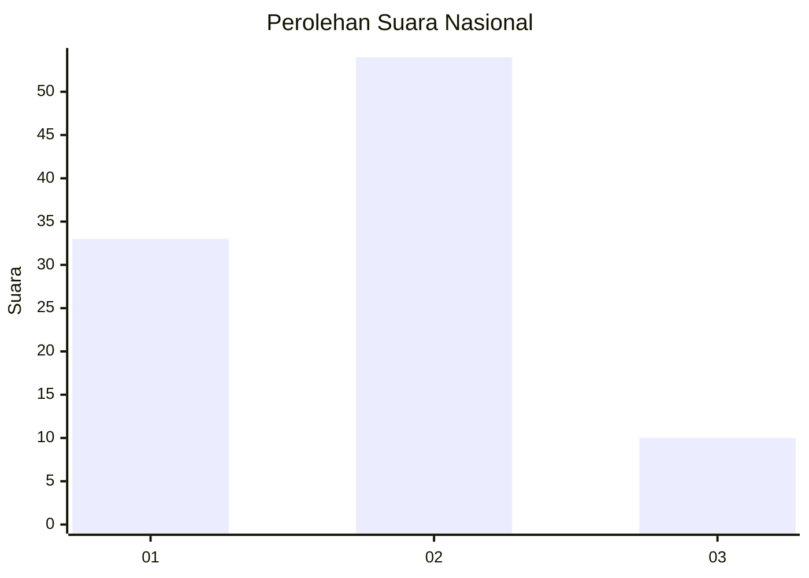
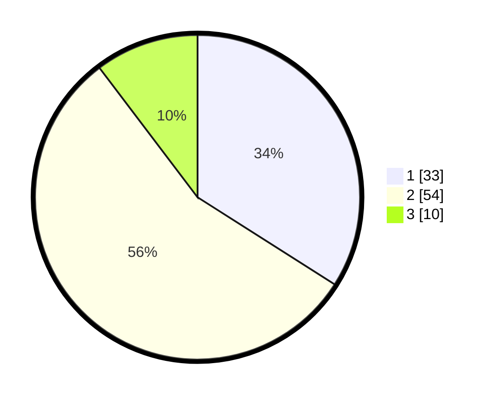

# Hasil

## Grafik

## Tabel

| No. | Nama Paslon    | Suara | Suara (raw) | Persentase |
|:--- |:-------------- | -----:| -----------:| ----------:|
| 1   | ANIES MUHAIMIN | 33    | [33][p-1]   | 34,02      |
| 2   | PRABOWO GIBRAN | 54    | [54][p-2]   | 55,67      |
| 3   | GANJAR MAHFUD  | 10    | [10][p-3]   | 10,31      |

[p-1]: https://github.com/gigit-pemilu/pemilu-2024/blob/main/pilpres/hitung-suara/sub/62-kalimantan-tengah/sub/03-kapuas/sub/17-bataguh/sub/2014-terusan-raya-hulu/sub/005-tps/sub/paslon-1.txt
[p-2]: https://github.com/gigit-pemilu/pemilu-2024/blob/main/pilpres/hitung-suara/sub/62-kalimantan-tengah/sub/03-kapuas/sub/17-bataguh/sub/2014-terusan-raya-hulu/sub/005-tps/sub/paslon-2.txt
[p-3]: https://github.com/gigit-pemilu/pemilu-2024/blob/main/pilpres/hitung-suara/sub/62-kalimantan-tengah/sub/03-kapuas/sub/17-bataguh/sub/2014-terusan-raya-hulu/sub/005-tps/sub/paslon-3.txt

## Foto C Plano

https://sirekap-obj-formc.kpu.go.id/62f0/pemilu/ppwp/62/03/17/20/14/6203172014005-20240219-180332--91b76169-e0d8-4ad2-b2b8-b61b5ddb85bc.jpg

https://sirekap-obj-formc.kpu.go.id/62f0/pemilu/ppwp/62/03/17/20/14/6203172014005-20240219-165633--cf4034c5-2244-41ba-89cc-2a605c49938f.jpg

https://sirekap-obj-formc.kpu.go.id/62f0/pemilu/ppwp/62/03/17/20/14/6203172014005-20240219-164853--6a2d20fa-a429-4050-9367-6b14a5b057ae.jpg

## Metadata

| Key        | Value               |
| ---------- | ------------------- |
| Time Stamp | 2024-02-19 19:00:00 |

