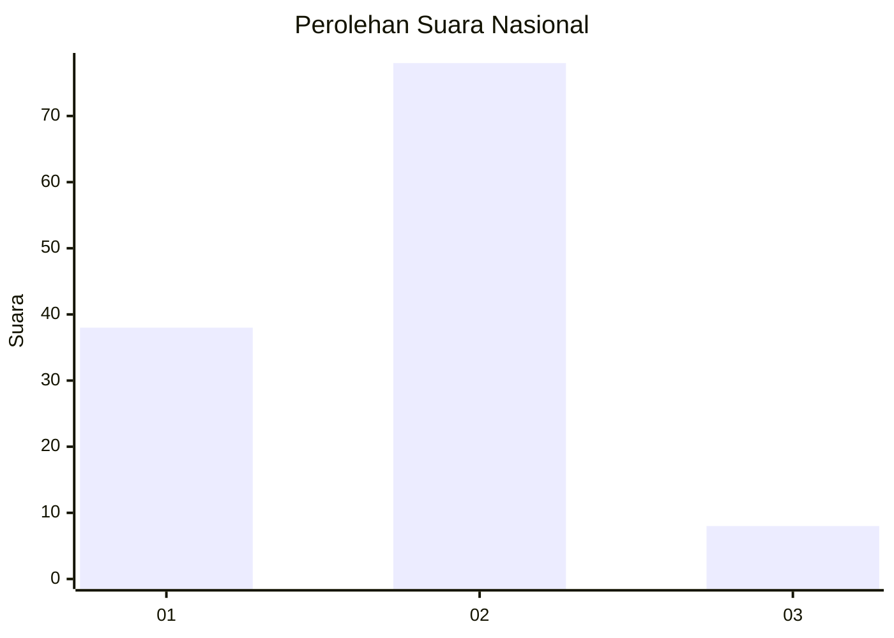
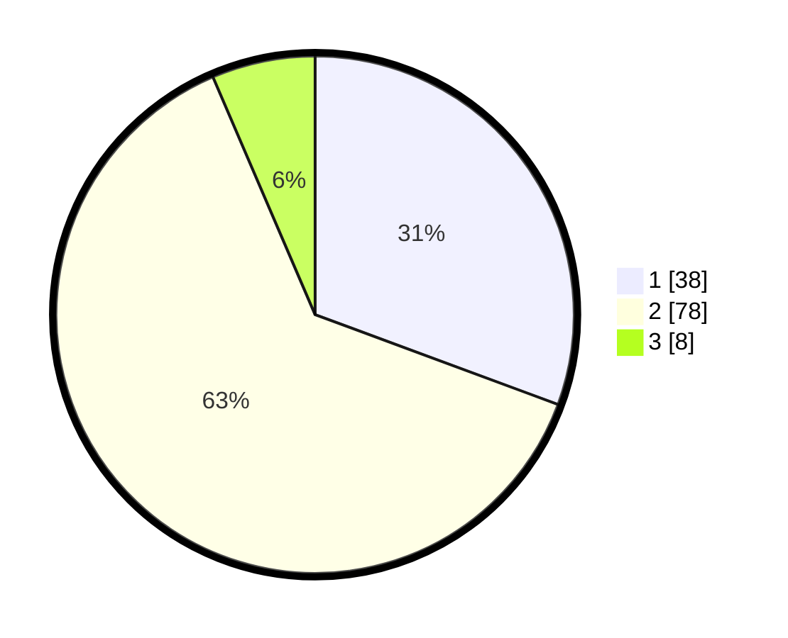

# Hasil

## Grafik

## Tabel

| No. | Nama Paslon    | Suara | Suara (raw) | Persentase |
|:--- |:-------------- | -----:| -----------:| ----------:|
| 1   | ANIES MUHAIMIN | 38    | [38][p-1]   | 30,65      |
| 2   | PRABOWO GIBRAN | 78    | [78][p-2]   | 62,90      |
| 3   | GANJAR MAHFUD  | 8     | [8][p-3]    | 6,45       |

[p-1]: https://github.com/gigit-pemilu/pemilu-2024/blob/main/pilpres/hitung-suara/sub/62-kalimantan-tengah/sub/04-barito-selatan/sub/01-jenamas/sub/2001-tampulang/sub/003-tps/sub/paslon-1.txt
[p-2]: https://github.com/gigit-pemilu/pemilu-2024/blob/main/pilpres/hitung-suara/sub/62-kalimantan-tengah/sub/04-barito-selatan/sub/01-jenamas/sub/2001-tampulang/sub/003-tps/sub/paslon-2.txt
[p-3]: https://github.com/gigit-pemilu/pemilu-2024/blob/main/pilpres/hitung-suara/sub/62-kalimantan-tengah/sub/04-barito-selatan/sub/01-jenamas/sub/2001-tampulang/sub/003-tps/sub/paslon-3.txt

## Foto C Plano

https://sirekap-obj-formc.kpu.go.id/7c24/pemilu/ppwp/62/04/01/20/01/6204012001003-20240214-185635--c09a7234-2ab3-4539-acf4-3c27a9d6c9b8.jpg

https://sirekap-obj-formc.kpu.go.id/7c24/pemilu/ppwp/62/04/01/20/01/6204012001003-20240214-185333--c1ea3ab9-ad1c-435a-a7b5-d916593a34f3.jpg

https://sirekap-obj-formc.kpu.go.id/7c24/pemilu/ppwp/62/04/01/20/01/6204012001003-20240214-191853--b675d0df-5cd5-4a7d-9dd6-76603d2e507a.jpg

## Metadata

| Key        | Value               |
| ---------- | ------------------- |
| Time Stamp | 2024-02-16 12:51:22 |

