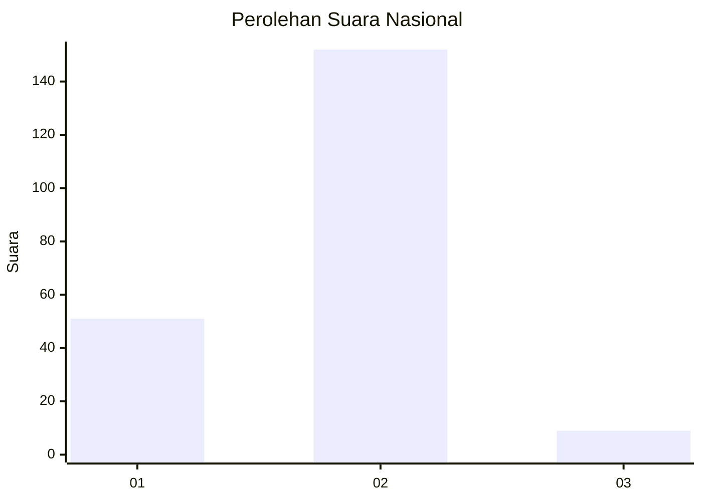
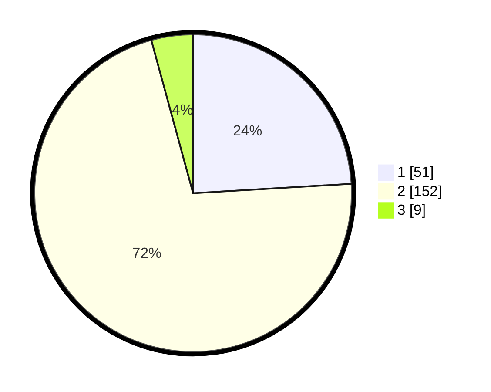

# Hasil

## Grafik

## Tabel

| No. | Nama Paslon    | Suara | Suara (raw) | Persentase |
|:--- |:-------------- | -----:| -----------:| ----------:|
| 1   | ANIES MUHAIMIN | 51    | [51][p-1]   | 24,06      |
| 2   | PRABOWO GIBRAN | 152   | [152][p-2]  | 71,70      |
| 3   | GANJAR MAHFUD  | 9     | [9][p-3]    | 4,25       |

[p-1]: https://github.com/gigit-pemilu/pemilu-2024/blob/main/pilpres/hitung-suara/sub/62-kalimantan-tengah/sub/04-barito-selatan/sub/03-karau-kuala/sub/1002-bangkuang/sub/001-tps/sub/paslon-1.txt
[p-2]: https://github.com/gigit-pemilu/pemilu-2024/blob/main/pilpres/hitung-suara/sub/62-kalimantan-tengah/sub/04-barito-selatan/sub/03-karau-kuala/sub/1002-bangkuang/sub/001-tps/sub/paslon-2.txt
[p-3]: https://github.com/gigit-pemilu/pemilu-2024/blob/main/pilpres/hitung-suara/sub/62-kalimantan-tengah/sub/04-barito-selatan/sub/03-karau-kuala/sub/1002-bangkuang/sub/001-tps/sub/paslon-3.txt

## Foto C Plano

https://sirekap-obj-formc.kpu.go.id/31dd/pemilu/ppwp/62/04/03/10/02/6204031002001-20240215-164142--5089a0b2-e9d8-42d5-a3a1-d87c12ba2755.jpg

https://sirekap-obj-formc.kpu.go.id/31dd/pemilu/ppwp/62/04/03/10/02/6204031002001-20240215-093721--7772e650-ae1b-47ce-8d8c-da63d5514b0d.jpg

https://sirekap-obj-formc.kpu.go.id/31dd/pemilu/ppwp/62/04/03/10/02/6204031002001-20240215-093831--c963dd5e-ec19-4ca1-bb21-0426729d881e.jpg

## Metadata

| Key        | Value               |
| ---------- | ------------------- |
| Time Stamp | 2024-02-15 21:01:18 |

