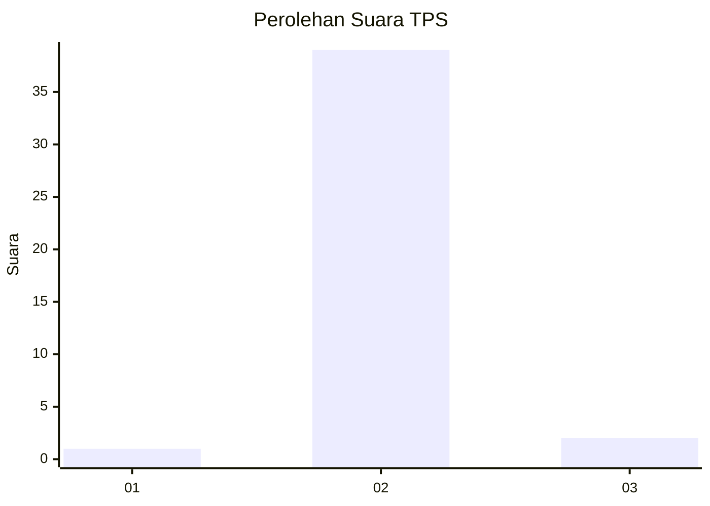
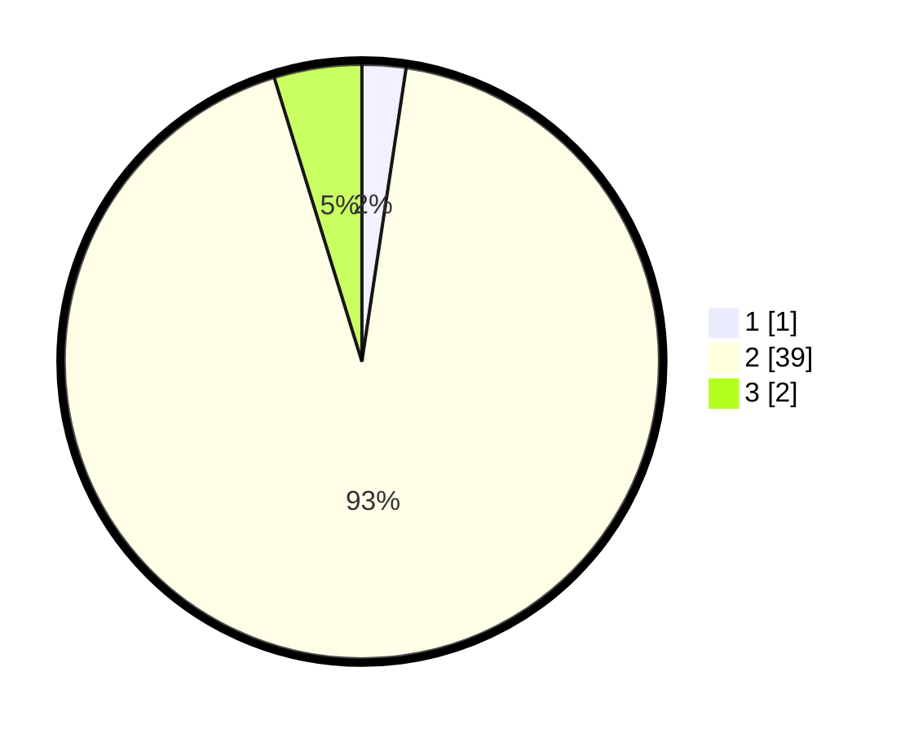

# Hasil

## Grafik

## Tabel

| No. | Nama Paslon    | Suara | Suara (raw) | Persentase |
|:--- |:-------------- | -----:| -----------:| ----------:|
| 1   | ANIES MUHAIMIN | 1     | [1][p-1]    | 2,38       |
| 2   | PRABOWO GIBRAN | 39    | [39][p-2]   | 92,86      |
| 3   | GANJAR MAHFUD  | 2     | [2][p-3]    | 4,76       |

[p-1]: https://github.com/gigit-pemilu/pemilu-2024-62-kalimantan-tengah/blob/main/pilpres/hitung-suara/sub/62-kalimantan-tengah/sub/04-barito-selatan/sub/05-gn-bintang-awai/sub/2008-muara-singan/sub/005-tps/sub/paslon-1.txt
[p-2]: https://github.com/gigit-pemilu/pemilu-2024-62-kalimantan-tengah/blob/main/pilpres/hitung-suara/sub/62-kalimantan-tengah/sub/04-barito-selatan/sub/05-gn-bintang-awai/sub/2008-muara-singan/sub/005-tps/sub/paslon-2.txt
[p-3]: https://github.com/gigit-pemilu/pemilu-2024-62-kalimantan-tengah/blob/main/pilpres/hitung-suara/sub/62-kalimantan-tengah/sub/04-barito-selatan/sub/05-gn-bintang-awai/sub/2008-muara-singan/sub/005-tps/sub/paslon-3.txt

## Foto C Plano

https://sirekap-obj-formc.kpu.go.id/873c/pemilu/ppwp/62/04/05/20/08/6204052008005-20240215-105031--fd0cb65f-8844-4272-a385-8f76805eebe1.jpg

https://sirekap-obj-formc.kpu.go.id/873c/pemilu/ppwp/62/04/05/20/08/6204052008005-20240216-074830--8aa0b8b4-0867-4bbf-8b00-24522fe0a9aa.jpg

https://sirekap-obj-formc.kpu.go.id/873c/pemilu/ppwp/62/04/05/20/08/6204052008005-20240216-075232--a25b0b9c-d455-4a4f-b825-43ddef6aacb3.jpg

## Metadata

| Key        | Value               |
| ---------- | ------------------- |
| Time Stamp | 2024-02-16 11:00:29 |

## DATA PEMILIH TETAP

Jumlah pemilih dalam DPT: **47**.
 * L: **28**.
 * P: **19**.

## DATA PENGGUNA HAK PILIH

Jumlah pengguna hak pilih dalam DPT: **42**.
 * L: **24**.
 * P: **18**.

Jumlah pengguna hak pilih dalam DPTb: **0**.
 * L: **0**.
 * P: **0**.

Jumlah pengguna hak pilih dalam DPK: **0**.
 * L: **0**.
 * P: **0**.

Jumlah pengguna hak pilih: **42**.
 * L: **24**.
 * P: **18**.

## JUMLAH SUARA SAH DAN TIDAK SAH

JUMLAH SELURUH SUARA SAH: **42**.

JUMLAH SUARA TIDAK SAH: **0**.

JUMLAH SELURUH SUARA SAH DAN SUARA TIDAK SAH: **42**.

