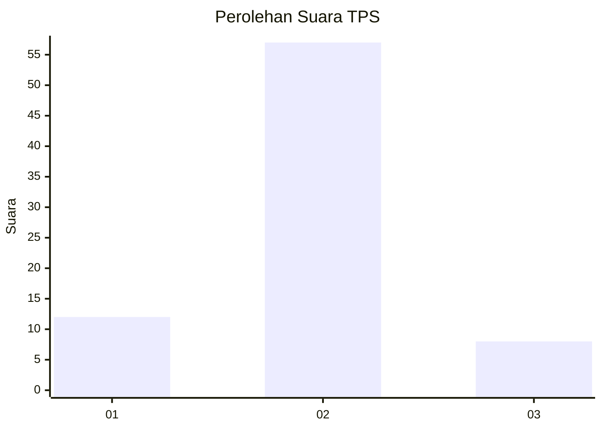
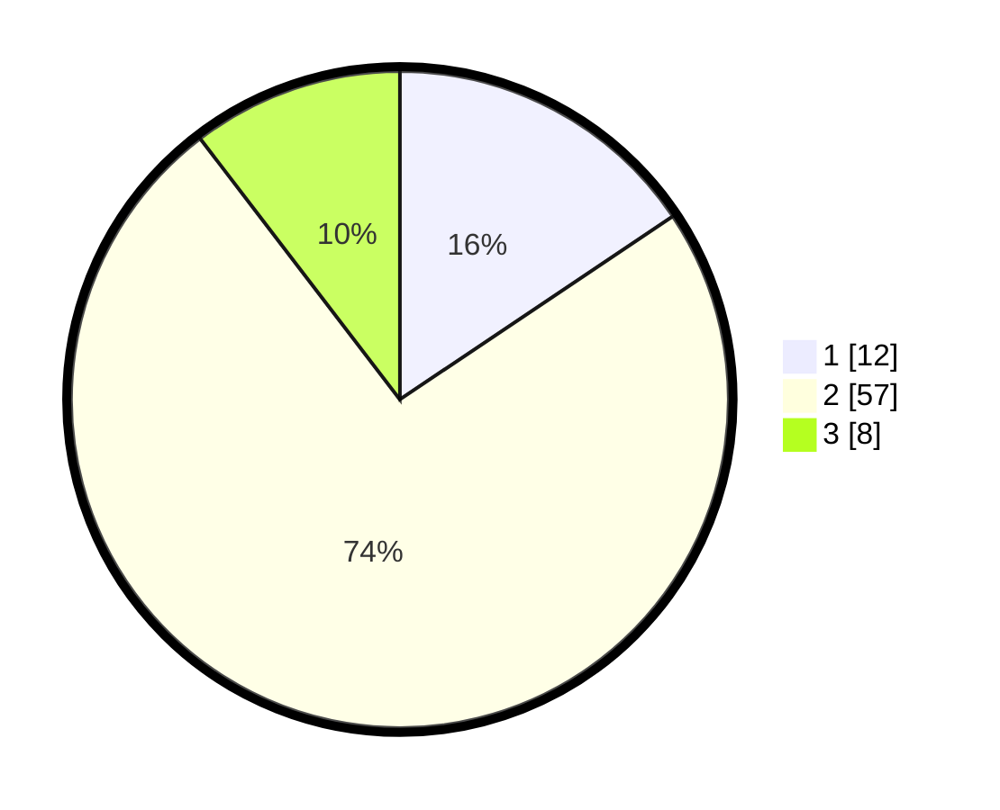

# Hasil

## Grafik

## Tabel

| No. | Nama Paslon    | Suara | Suara (raw) | Persentase |
|:--- |:-------------- | -----:| -----------:| ----------:|
| 1   | ANIES MUHAIMIN | 12    | [12][p-1]   | 15,58      |
| 2   | PRABOWO GIBRAN | 57    | [57][p-2]   | 74,03      |
| 3   | GANJAR MAHFUD  | 8     | [8][p-3]    | 10,39      |

[p-1]: https://github.com/gigit-pemilu/pemilu-2024-62-kalimantan-tengah/blob/main/pilpres/hitung-suara/sub/62-kalimantan-tengah/sub/05-barito-utara/sub/01-montallat/sub/1001-montallat-i/sub/001-tps/sub/paslon-1.txt
[p-2]: https://github.com/gigit-pemilu/pemilu-2024-62-kalimantan-tengah/blob/main/pilpres/hitung-suara/sub/62-kalimantan-tengah/sub/05-barito-utara/sub/01-montallat/sub/1001-montallat-i/sub/001-tps/sub/paslon-2.txt
[p-3]: https://github.com/gigit-pemilu/pemilu-2024-62-kalimantan-tengah/blob/main/pilpres/hitung-suara/sub/62-kalimantan-tengah/sub/05-barito-utara/sub/01-montallat/sub/1001-montallat-i/sub/001-tps/sub/paslon-3.txt

## Foto C Plano

https://sirekap-obj-formc.kpu.go.id/feff/pemilu/ppwp/62/05/01/10/01/6205011001001-20240219-143059--4b28d9c6-cdba-4f7b-93e3-a5b0c1d49dea.jpg

https://sirekap-obj-formc.kpu.go.id/feff/pemilu/ppwp/62/05/01/10/01/6205011001001-20240219-143101--65265fa0-4069-4466-bef5-b1191a644db7.jpg

https://sirekap-obj-formc.kpu.go.id/feff/pemilu/ppwp/62/05/01/10/01/6205011001001-20240219-143100--20f8d1d0-620b-4dbf-941b-ea72573ff38a.jpg

## Metadata

| Key        | Value               |
| ---------- | ------------------- |
| Time Stamp | 2024-02-21 21:00:04 |

## DATA PEMILIH TETAP

Jumlah pemilih dalam DPT: **116**.
 * L: **63**.
 * P: **53**.

## DATA PENGGUNA HAK PILIH

Jumlah pengguna hak pilih dalam DPT: **76**.
 * L: **37**.
 * P: **39**.

Jumlah pengguna hak pilih dalam DPTb: **2**.
 * L: **2**.
 * P: **0**.

Jumlah pengguna hak pilih dalam DPK: **0**.
 * L: **0**.
 * P: **0**.

Jumlah pengguna hak pilih: **78**.
 * L: **39**.
 * P: **39**.

## JUMLAH SUARA SAH DAN TIDAK SAH

JUMLAH SELURUH SUARA SAH: **77**.

JUMLAH SUARA TIDAK SAH: **1**.

JUMLAH SELURUH SUARA SAH DAN SUARA TIDAK SAH: **78**.

