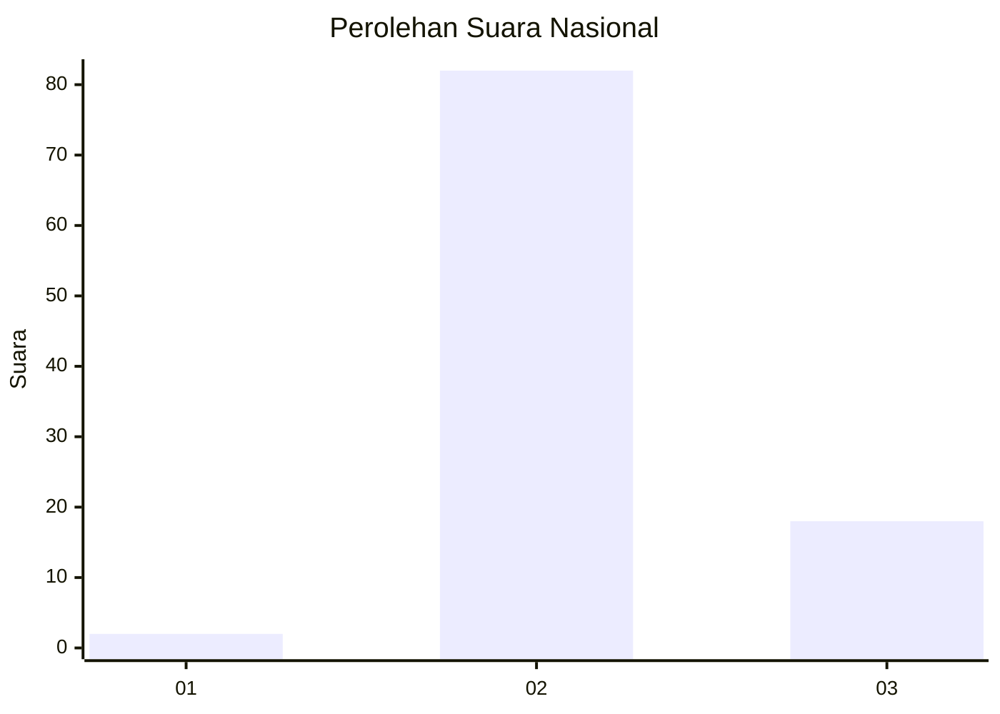
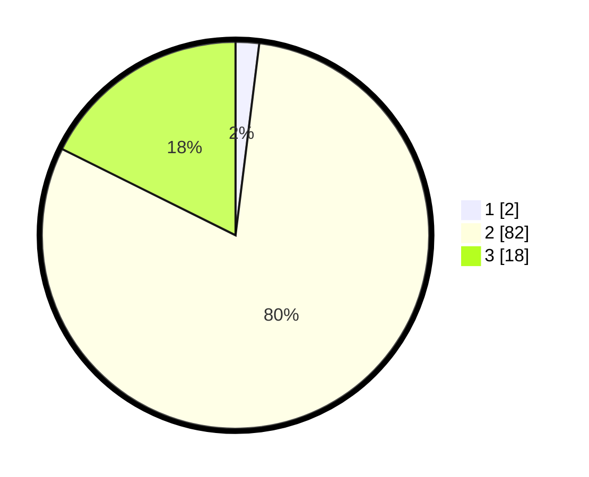

# Hasil

## Grafik

## Tabel

| No. | Nama Paslon    | Suara | Suara (raw) | Persentase |
|:--- |:-------------- | -----:| -----------:| ----------:|
| 1   | ANIES MUHAIMIN | 2     | [2][p-1]    | 1,96       |
| 2   | PRABOWO GIBRAN | 82    | [82][p-2]   | 80,39      |
| 3   | GANJAR MAHFUD  | 18    | [18][p-3]   | 17,65      |

[p-1]: https://github.com/gigit-pemilu/pemilu-2024/blob/main/pilpres/hitung-suara/sub/62-kalimantan-tengah/sub/05-barito-utara/sub/01-montallat/sub/2006-rubei/sub/001-tps/sub/paslon-1.txt
[p-2]: https://github.com/gigit-pemilu/pemilu-2024/blob/main/pilpres/hitung-suara/sub/62-kalimantan-tengah/sub/05-barito-utara/sub/01-montallat/sub/2006-rubei/sub/001-tps/sub/paslon-2.txt
[p-3]: https://github.com/gigit-pemilu/pemilu-2024/blob/main/pilpres/hitung-suara/sub/62-kalimantan-tengah/sub/05-barito-utara/sub/01-montallat/sub/2006-rubei/sub/001-tps/sub/paslon-3.txt

## Foto C Plano

https://sirekap-obj-formc.kpu.go.id/c576/pemilu/ppwp/62/05/01/20/06/6205012006001-20240214-155804--9af6f432-0a13-4d6b-a678-03c2bb6ac028.jpg

https://sirekap-obj-formc.kpu.go.id/c576/pemilu/ppwp/62/05/01/20/06/6205012006001-20240214-155615--55f00315-299a-48ed-b225-7f8addc1dfec.jpg

https://sirekap-obj-formc.kpu.go.id/c576/pemilu/ppwp/62/05/01/20/06/6205012006001-20240214-155720--aabced30-3de8-4193-918b-0c882137c46e.jpg

## Metadata

| Key        | Value               |
| ---------- | ------------------- |
| Time Stamp | 2024-02-25 14:00:00 |

