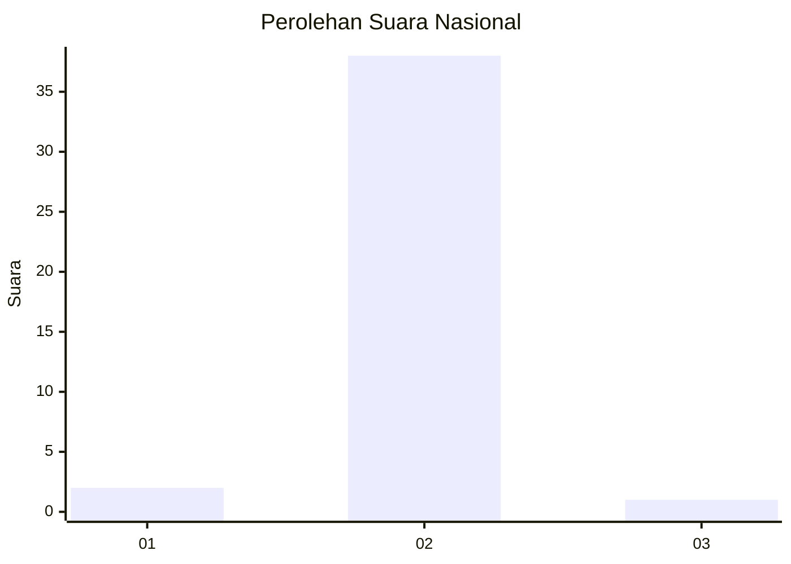
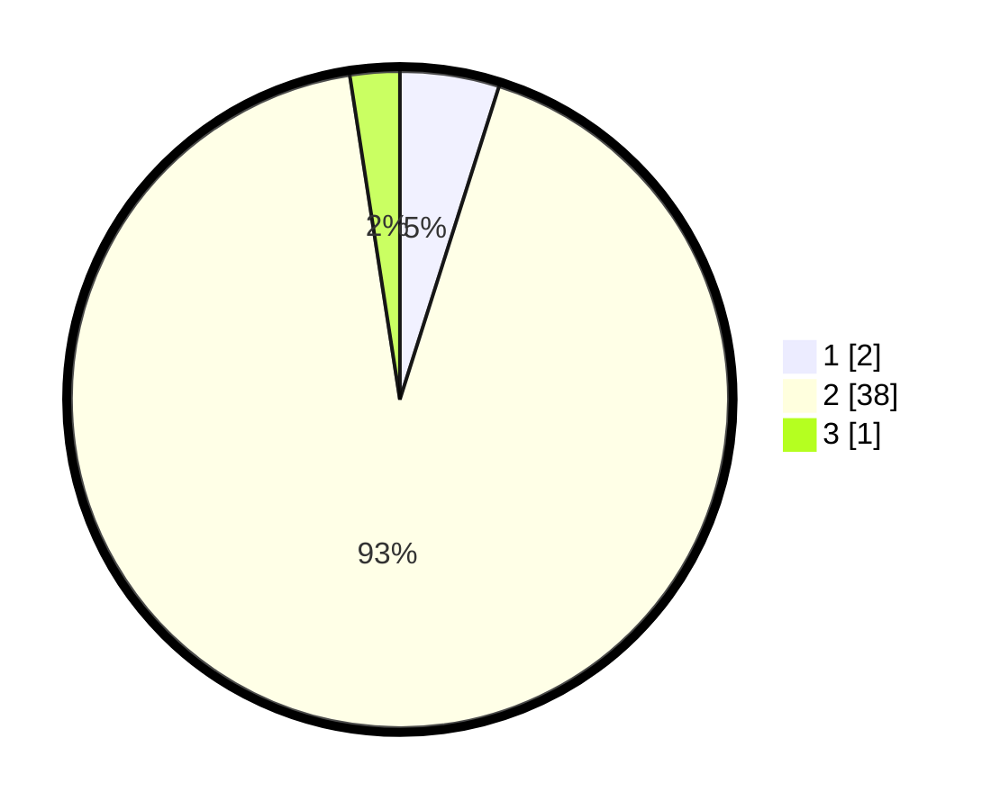

# Hasil

## Grafik

## Tabel

| No. | Nama Paslon    | Suara | Suara (raw) | Persentase |
|:--- |:-------------- | -----:| -----------:| ----------:|
| 1   | ANIES MUHAIMIN | 2     | [2][p-1]    | 4,88       |
| 2   | PRABOWO GIBRAN | 38    | [38][p-2]   | 92,68      |
| 3   | GANJAR MAHFUD  | 1     | [1][p-3]    | 2,44       |

[p-1]: https://github.com/gigit-pemilu/pemilu-2024/blob/main/pilpres/hitung-suara/sub/62-kalimantan-tengah/sub/05-barito-utara/sub/03-gunung-purei/sub/2001-tanjung-harapan/sub/001-tps/sub/paslon-1.txt
[p-2]: https://github.com/gigit-pemilu/pemilu-2024/blob/main/pilpres/hitung-suara/sub/62-kalimantan-tengah/sub/05-barito-utara/sub/03-gunung-purei/sub/2001-tanjung-harapan/sub/001-tps/sub/paslon-2.txt
[p-3]: https://github.com/gigit-pemilu/pemilu-2024/blob/main/pilpres/hitung-suara/sub/62-kalimantan-tengah/sub/05-barito-utara/sub/03-gunung-purei/sub/2001-tanjung-harapan/sub/001-tps/sub/paslon-3.txt

## Foto C Plano

https://sirekap-obj-formc.kpu.go.id/78b7/pemilu/ppwp/62/05/03/20/01/6205032001001-20240216-142122--81ca446f-ded5-4ad5-83af-b6a13018dac5.jpg

https://sirekap-obj-formc.kpu.go.id/78b7/pemilu/ppwp/62/05/03/20/01/6205032001001-20240216-142123--dfe81a56-076e-41fc-8de2-29a21d251526.jpg

https://sirekap-obj-formc.kpu.go.id/78b7/pemilu/ppwp/62/05/03/20/01/6205032001001-20240216-142122--6f3f5b72-8ae8-4381-9224-24da79a6d18b.jpg

## Metadata

| Key        | Value               |
| ---------- | ------------------- |
| Time Stamp | 2024-02-19 09:00:00 |

## DATA PEMILIH TETAP

Jumlah pemilih dalam DPT: **42**.
 * L: **24**.
 * P: **18**.

## DATA PENGGUNA HAK PILIH

Jumlah pengguna hak pilih dalam DPT: **37**.
 * L: **21**.
 * P: **16**.

Jumlah pengguna hak pilih dalam DPTb: **2**.
 * L: **2**.
 * P: **0**.

Jumlah pengguna hak pilih dalam DPK: **2**.
 * L: **1**.
 * P: **1**.

Jumlah pengguna hak pilih: **41**.
 * L: **24**.
 * P: **17**.

## JUMLAH SUARA SAH DAN TIDAK SAH

JUMLAH SELURUH SUARA SAH: **41**.

JUMLAH SUARA TIDAK SAH: **0**.

JUMLAH SELURUH SUARA SAH DAN SUARA TIDAK SAH: **41**.

