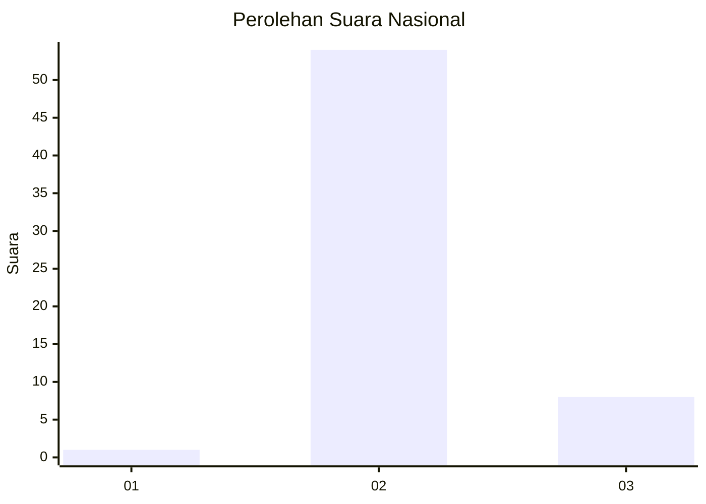
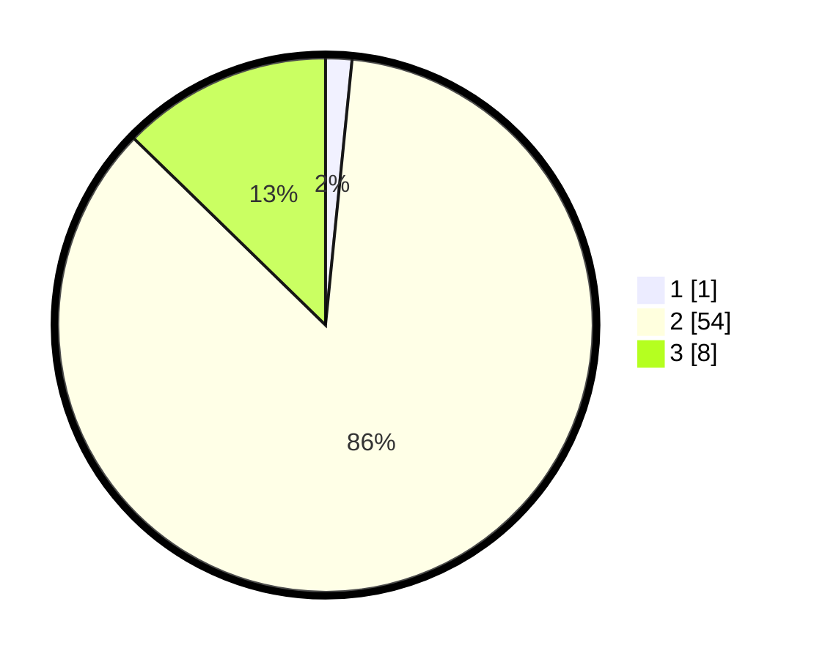

# Hasil

## Grafik

## Tabel

| No. | Nama Paslon    | Suara | Suara (raw) | Persentase |
|:--- |:-------------- | -----:| -----------:| ----------:|
| 1   | ANIES MUHAIMIN | 1     | [1][p-1]    | 1,59       |
| 2   | PRABOWO GIBRAN | 54    | [54][p-2]   | 85,71      |
| 3   | GANJAR MAHFUD  | 8     | [8][p-3]    | 12,70      |

[p-1]: https://github.com/gigit-pemilu/pemilu-2024/blob/main/pilpres/hitung-suara/sub/62-kalimantan-tengah/sub/05-barito-utara/sub/03-gunung-purei/sub/2005-lawarang/sub/001-tps/sub/paslon-1.txt
[p-2]: https://github.com/gigit-pemilu/pemilu-2024/blob/main/pilpres/hitung-suara/sub/62-kalimantan-tengah/sub/05-barito-utara/sub/03-gunung-purei/sub/2005-lawarang/sub/001-tps/sub/paslon-2.txt
[p-3]: https://github.com/gigit-pemilu/pemilu-2024/blob/main/pilpres/hitung-suara/sub/62-kalimantan-tengah/sub/05-barito-utara/sub/03-gunung-purei/sub/2005-lawarang/sub/001-tps/sub/paslon-3.txt

## Foto C Plano

https://sirekap-obj-formc.kpu.go.id/8250/pemilu/ppwp/62/05/03/20/05/6205032005001-20240216-210920--04905570-d1a8-473a-bc29-0fda1cd4a861.jpg

https://sirekap-obj-formc.kpu.go.id/8250/pemilu/ppwp/62/05/03/20/05/6205032005001-20240216-211142--befa3f9b-b390-4125-a237-558d0b5c4856.jpg

https://sirekap-obj-formc.kpu.go.id/8250/pemilu/ppwp/62/05/03/20/05/6205032005001-20240216-211350--47c9c5b4-20d4-4a75-a965-c4cbf5d9b1b6.jpg

## Metadata

| Key        | Value               |
| ---------- | ------------------- |
| Time Stamp | 2024-02-19 09:00:00 |

## DATA PEMILIH TETAP

Jumlah pemilih dalam DPT: **71**.
 * L: **37**.
 * P: **34**.

## DATA PENGGUNA HAK PILIH

Jumlah pengguna hak pilih dalam DPT: **62**.
 * L: **32**.
 * P: **30**.

Jumlah pengguna hak pilih dalam DPTb: **4**.
 * L: **2**.
 * P: **2**.

Jumlah pengguna hak pilih dalam DPK: **1**.
 * L: **0**.
 * P: **1**.

Jumlah pengguna hak pilih: **67**.
 * L: **34**.
 * P: **33**.

## JUMLAH SUARA SAH DAN TIDAK SAH

JUMLAH SELURUH SUARA SAH: **63**.

JUMLAH SUARA TIDAK SAH: **4**.

JUMLAH SELURUH SUARA SAH DAN SUARA TIDAK SAH: **67**.

