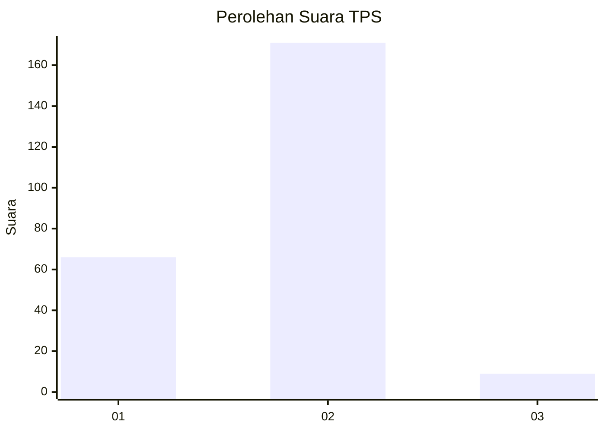
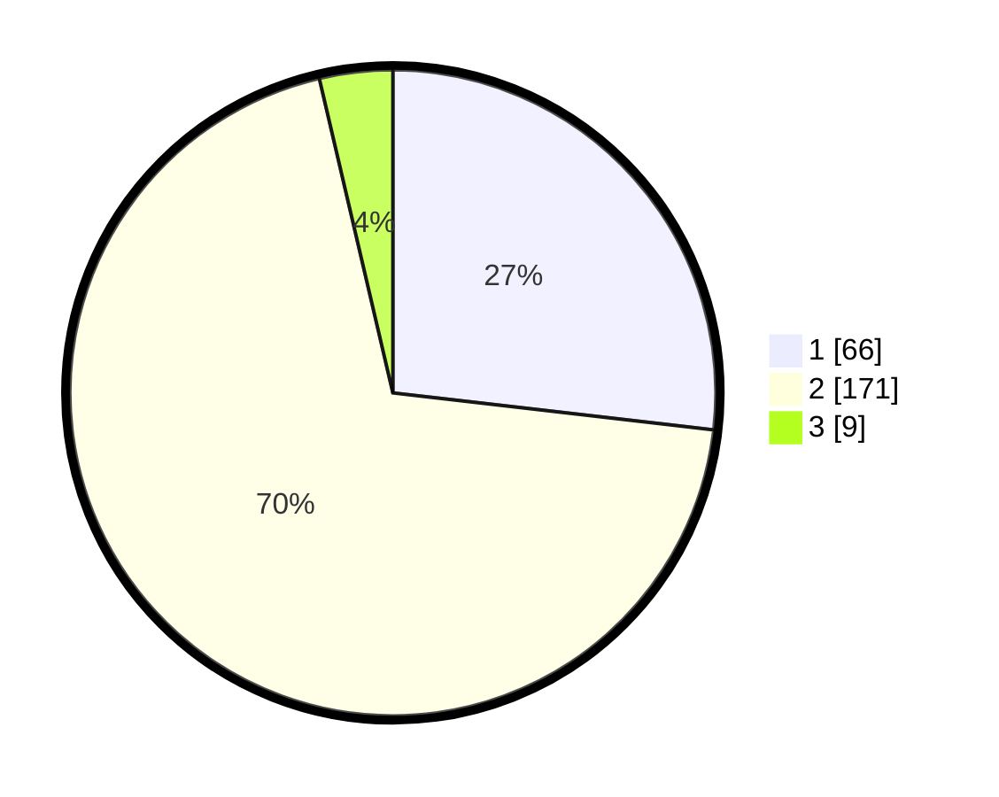

# Hasil

## Grafik

## Tabel

| No. | Nama Paslon    | Suara | Suara (raw) | Persentase |
|:--- |:-------------- | -----:| -----------:| ----------:|
| 1   | ANIES MUHAIMIN | 66    | [66][p-1]   | 26,83      |
| 2   | PRABOWO GIBRAN | 171   | [171][p-2]  | 69,51      |
| 3   | GANJAR MAHFUD  | 9     | [9][p-3]    | 3,66       |

[p-1]: https://github.com/gigit-pemilu/pemilu-2024-62-kalimantan-tengah/blob/main/pilpres/hitung-suara/sub/62-kalimantan-tengah/sub/05-barito-utara/sub/04-teweh-timur/sub/2002-sampirang-ii/sub/001-tps/sub/paslon-1.txt
[p-2]: https://github.com/gigit-pemilu/pemilu-2024-62-kalimantan-tengah/blob/main/pilpres/hitung-suara/sub/62-kalimantan-tengah/sub/05-barito-utara/sub/04-teweh-timur/sub/2002-sampirang-ii/sub/001-tps/sub/paslon-2.txt
[p-3]: https://github.com/gigit-pemilu/pemilu-2024-62-kalimantan-tengah/blob/main/pilpres/hitung-suara/sub/62-kalimantan-tengah/sub/05-barito-utara/sub/04-teweh-timur/sub/2002-sampirang-ii/sub/001-tps/sub/paslon-3.txt

## Foto C Plano

https://sirekap-obj-formc.kpu.go.id/8970/pemilu/ppwp/62/05/04/20/02/6205042002001-20240214-234446--4db0c257-fe00-424e-9427-d6ccd58d3a27.jpg

https://sirekap-obj-formc.kpu.go.id/8970/pemilu/ppwp/62/05/04/20/02/6205042002001-20240216-134859--d2a8c41a-876c-477a-9993-8601fb62aa9e.jpg

https://sirekap-obj-formc.kpu.go.id/8970/pemilu/ppwp/62/05/04/20/02/6205042002001-20240216-134858--09d72452-9f73-4c2c-80c1-eb694a06dacc.jpg

## Metadata

| Key        | Value               |
| ---------- | ------------------- |
| Time Stamp | 2024-02-16 22:01:00 |

