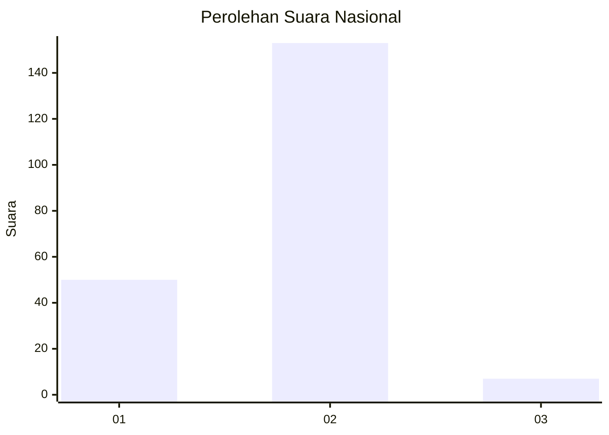

# Hasil

## Grafik

## Tabel

| No. | Nama Paslon    | Suara | Suara (raw) | Persentase |
|:--- |:-------------- | -----:| -----------:| ----------:|
| 1   | ANIES MUHAIMIN | 50    | [50][p-1]   | 23,81      |
| 2   | PRABOWO GIBRAN | 153   | [153][p-2]  | 72,86      |
| 3   | GANJAR MAHFUD  | 7     | [7][p-3]    | 3,33       |

[p-1]: https://github.com/gigit-pemilu/pemilu-2024/blob/main/pilpres/hitung-suara/sub/62-kalimantan-tengah/sub/05-barito-utara/sub/05-teweh-tengah/sub/1013-lanjas/sub/006-tps/sub/paslon-1.txt
[p-2]: https://github.com/gigit-pemilu/pemilu-2024/blob/main/pilpres/hitung-suara/sub/62-kalimantan-tengah/sub/05-barito-utara/sub/05-teweh-tengah/sub/1013-lanjas/sub/006-tps/sub/paslon-2.txt
[p-3]: https://github.com/gigit-pemilu/pemilu-2024/blob/main/pilpres/hitung-suara/sub/62-kalimantan-tengah/sub/05-barito-utara/sub/05-teweh-tengah/sub/1013-lanjas/sub/006-tps/sub/paslon-3.txt

## Foto C Plano

https://sirekap-obj-formc.kpu.go.id/97f0/pemilu/ppwp/62/05/05/10/13/6205051013006-20240214-195609--200aef2a-cedb-4e82-bcda-d0dabc965411.jpg

https://sirekap-obj-formc.kpu.go.id/97f0/pemilu/ppwp/62/05/05/10/13/6205051013006-20240214-195502--17686c4c-a865-4a8e-a462-7ffa21718382.jpg

https://sirekap-obj-formc.kpu.go.id/97f0/pemilu/ppwp/62/05/05/10/13/6205051013006-20240216-163302--7339cee9-ccef-4d22-9dfa-71b7db1f65b5.jpg

## Metadata

| Key        | Value               |
| ---------- | ------------------- |
| Time Stamp | 2024-02-16 17:00:00 |

