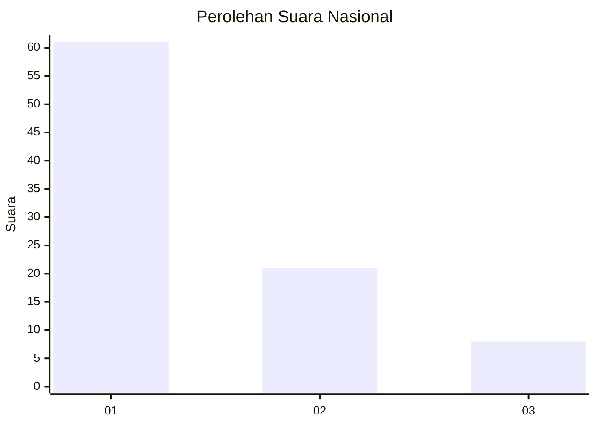
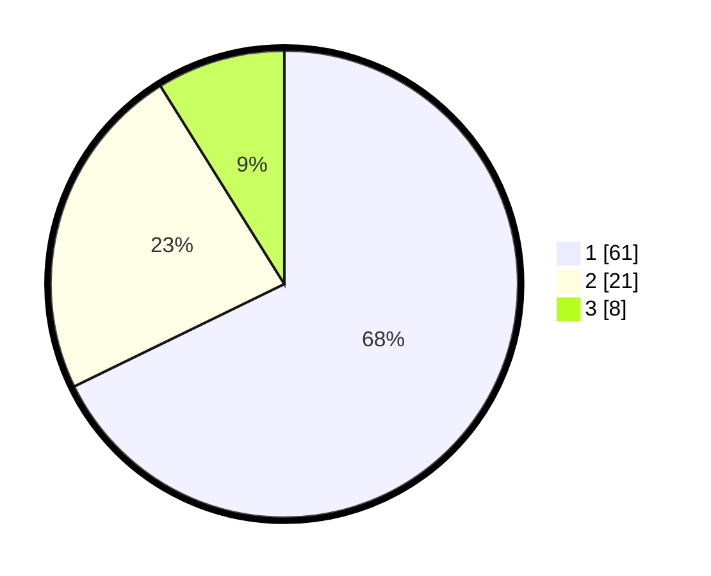

# Hasil

## Grafik

## Tabel

| No. | Nama Paslon    | Suara | Suara (raw) | Persentase |
|:--- |:-------------- | -----:| -----------:| ----------:|
| 1   | ANIES MUHAIMIN | 61    | [61][p-1]   | 67,78      |
| 2   | PRABOWO GIBRAN | 21    | [21][p-2]   | 23,33      |
| 3   | GANJAR MAHFUD  | 8     | [8][p-3]    | 8,89       |

[p-1]: https://github.com/gigit-pemilu/pemilu-2024/blob/main/pilpres/hitung-suara/sub/62-kalimantan-tengah/sub/05-barito-utara/sub/05-teweh-tengah/sub/1014-melayu/sub/041-tps/sub/paslon-1.txt
[p-2]: https://github.com/gigit-pemilu/pemilu-2024/blob/main/pilpres/hitung-suara/sub/62-kalimantan-tengah/sub/05-barito-utara/sub/05-teweh-tengah/sub/1014-melayu/sub/041-tps/sub/paslon-2.txt
[p-3]: https://github.com/gigit-pemilu/pemilu-2024/blob/main/pilpres/hitung-suara/sub/62-kalimantan-tengah/sub/05-barito-utara/sub/05-teweh-tengah/sub/1014-melayu/sub/041-tps/sub/paslon-3.txt

## Foto C Plano

https://sirekap-obj-formc.kpu.go.id/d9c1/pemilu/ppwp/62/05/05/10/14/6205051014041-20240216-135116--1511efe5-1fc0-4a31-a01a-a71e52eb7ead.jpg

https://sirekap-obj-formc.kpu.go.id/d9c1/pemilu/ppwp/62/05/05/10/14/6205051014041-20240216-135117--b71df611-40f6-4754-8a68-61d2967a9e06.jpg

https://sirekap-obj-formc.kpu.go.id/d9c1/pemilu/ppwp/62/05/05/10/14/6205051014041-20240216-135116--63efe261-f611-4cb5-be6d-2526bb602e1b.jpg

## Metadata

| Key        | Value               |
| ---------- | ------------------- |
| Time Stamp | 2024-02-24 22:31:28 |

