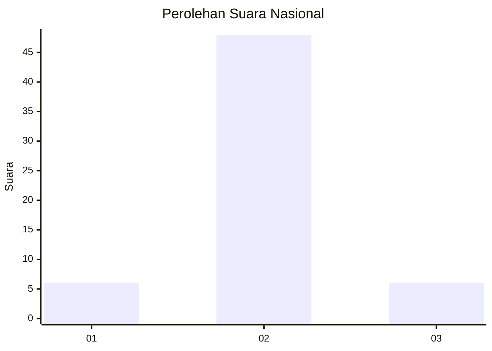
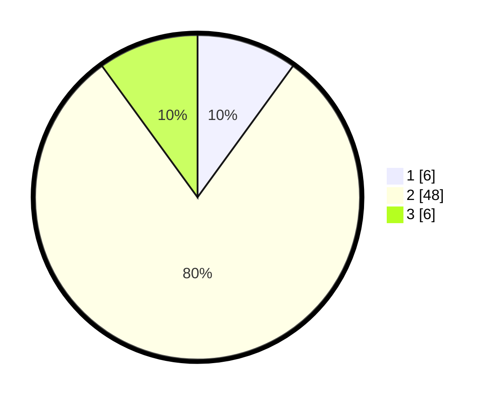

# Hasil

## Grafik

## Tabel

| No. | Nama Paslon    | Suara | Suara (raw) | Persentase |
|:--- |:-------------- | -----:| -----------:| ----------:|
| 1   | ANIES MUHAIMIN | 6     | [6][p-1]    | 10,00      |
| 2   | PRABOWO GIBRAN | 48    | [48][p-2]   | 80,00      |
| 3   | GANJAR MAHFUD  | 6     | [6][p-3]    | 10,00      |

[p-1]: https://github.com/gigit-pemilu/pemilu-2024/blob/main/pilpres/hitung-suara/sub/62-kalimantan-tengah/sub/05-barito-utara/sub/05-teweh-tengah/sub/2012-pendreh/sub/007-tps/sub/paslon-1.txt
[p-2]: https://github.com/gigit-pemilu/pemilu-2024/blob/main/pilpres/hitung-suara/sub/62-kalimantan-tengah/sub/05-barito-utara/sub/05-teweh-tengah/sub/2012-pendreh/sub/007-tps/sub/paslon-2.txt
[p-3]: https://github.com/gigit-pemilu/pemilu-2024/blob/main/pilpres/hitung-suara/sub/62-kalimantan-tengah/sub/05-barito-utara/sub/05-teweh-tengah/sub/2012-pendreh/sub/007-tps/sub/paslon-3.txt

## Foto C Plano

https://sirekap-obj-formc.kpu.go.id/d24b/pemilu/ppwp/62/05/05/20/12/6205052012007-20240214-155450--f6b76f85-4710-42e1-8bb8-7ef0e9920e20.jpg

https://sirekap-obj-formc.kpu.go.id/d24b/pemilu/ppwp/62/05/05/20/12/6205052012007-20240214-160059--4088ae44-511e-438d-9fc3-2e39c89bef4a.jpg

https://sirekap-obj-formc.kpu.go.id/d24b/pemilu/ppwp/62/05/05/20/12/6205052012007-20240217-212414--a8e451cd-eae8-48c3-9ba3-570b84ac8b83.jpg

## Metadata

| Key        | Value               |
| ---------- | ------------------- |
| Time Stamp | 2024-02-19 06:16:00 |

