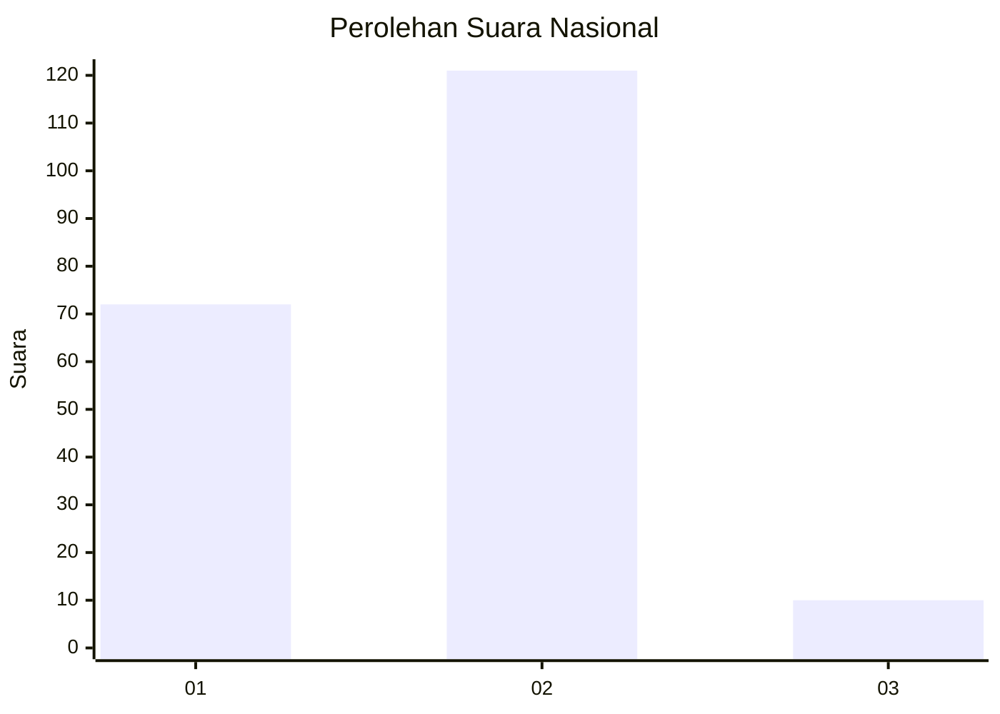
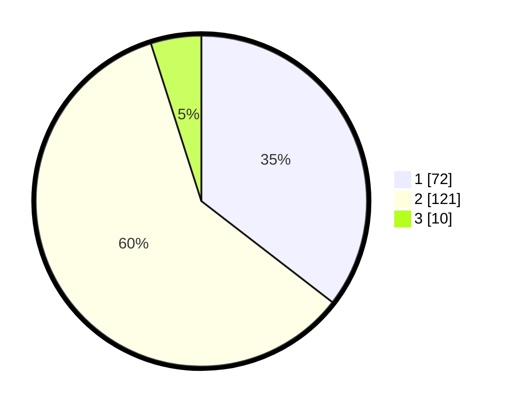

# Hasil

## Grafik

## Tabel

| No. | Nama Paslon    | Suara | Suara (raw) | Persentase |
|:--- |:-------------- | -----:| -----------:| ----------:|
| 1   | ANIES MUHAIMIN | 72    | [72][p-1]   | 35,47      |
| 2   | PRABOWO GIBRAN | 121   | [121][p-2]  | 59,61      |
| 3   | GANJAR MAHFUD  | 10    | [10][p-3]   | 4,93       |

[p-1]: https://github.com/gigit-pemilu/pemilu-2024/blob/main/pilpres/hitung-suara/sub/62-kalimantan-tengah/sub/05-barito-utara/sub/07-teweh-baru/sub/1001-jingah/sub/004-tps/sub/paslon-1.txt
[p-2]: https://github.com/gigit-pemilu/pemilu-2024/blob/main/pilpres/hitung-suara/sub/62-kalimantan-tengah/sub/05-barito-utara/sub/07-teweh-baru/sub/1001-jingah/sub/004-tps/sub/paslon-2.txt
[p-3]: https://github.com/gigit-pemilu/pemilu-2024/blob/main/pilpres/hitung-suara/sub/62-kalimantan-tengah/sub/05-barito-utara/sub/07-teweh-baru/sub/1001-jingah/sub/004-tps/sub/paslon-3.txt

## Foto C Plano

https://sirekap-obj-formc.kpu.go.id/1008/pemilu/ppwp/62/05/07/10/01/6205071001004-20240306-140208--15f56ed7-9d9f-4979-8710-62a7d822bcd0.jpg

https://sirekap-obj-formc.kpu.go.id/1008/pemilu/ppwp/62/05/07/10/01/6205071001004-20240214-155742--d8bbd5e8-afdd-4da1-9adc-f925028d1829.jpg

https://sirekap-obj-formc.kpu.go.id/1008/pemilu/ppwp/62/05/07/10/01/6205071001004-20240214-160103--69746c2c-dd78-4a56-91cc-da6466fa8fa5.jpg

## Metadata

| Key        | Value               |
| ---------- | ------------------- |
| Time Stamp | 2024-03-06 15:00:00 |

