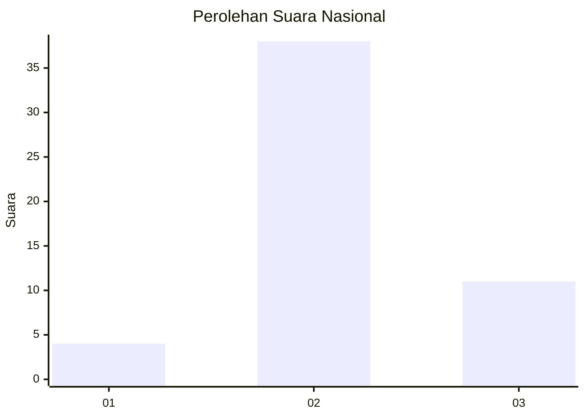
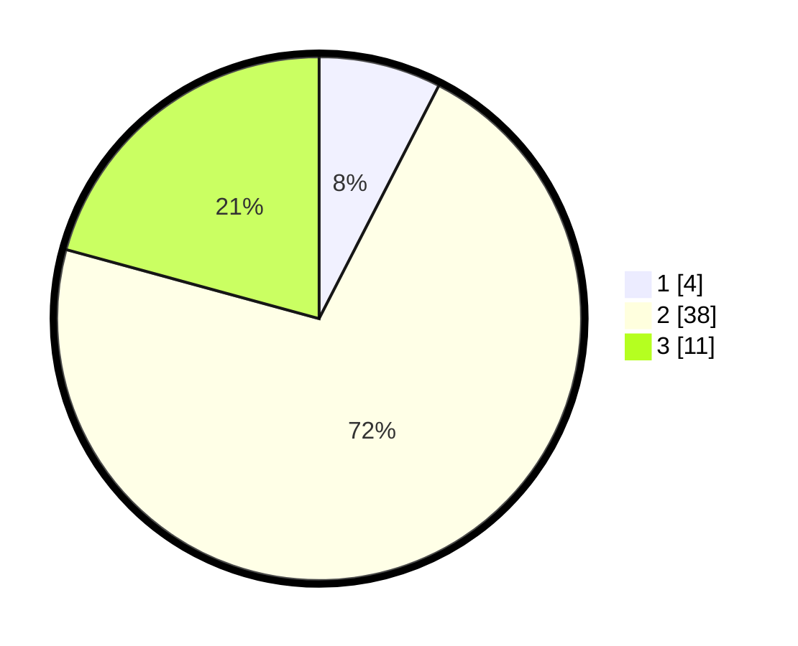

# Hasil

## Grafik

## Tabel

| No. | Nama Paslon    | Suara | Suara (raw) | Persentase |
|:--- |:-------------- | -----:| -----------:| ----------:|
| 1   | ANIES MUHAIMIN | 4     | [4][p-1]    | 7,55       |
| 2   | PRABOWO GIBRAN | 38    | [38][p-2]   | 71,70      |
| 3   | GANJAR MAHFUD  | 11    | [11][p-3]   | 20,75      |

[p-1]: https://github.com/gigit-pemilu/pemilu-2024/blob/main/pilpres/hitung-suara/sub/62-kalimantan-tengah/sub/05-barito-utara/sub/07-teweh-baru/sub/2006-malawaken/sub/008-tps/sub/paslon-1.txt
[p-2]: https://github.com/gigit-pemilu/pemilu-2024/blob/main/pilpres/hitung-suara/sub/62-kalimantan-tengah/sub/05-barito-utara/sub/07-teweh-baru/sub/2006-malawaken/sub/008-tps/sub/paslon-2.txt
[p-3]: https://github.com/gigit-pemilu/pemilu-2024/blob/main/pilpres/hitung-suara/sub/62-kalimantan-tengah/sub/05-barito-utara/sub/07-teweh-baru/sub/2006-malawaken/sub/008-tps/sub/paslon-3.txt

## Foto C Plano

https://sirekap-obj-formc.kpu.go.id/1777/pemilu/ppwp/62/05/07/20/06/6205072006008-20240215-090429--b49b734e-bac1-4879-addb-cc60ab9e2097.jpg

https://sirekap-obj-formc.kpu.go.id/1777/pemilu/ppwp/62/05/07/20/06/6205072006008-20240215-090513--87579367-f311-46ac-aec7-a8b5656bc2f2.jpg

https://sirekap-obj-formc.kpu.go.id/1777/pemilu/ppwp/62/05/07/20/06/6205072006008-20240215-090639--92cdc6a2-d7a6-4065-bba4-8a2ddabc7b44.jpg

## Metadata

| Key        | Value               |
| ---------- | ------------------- |
| Time Stamp | 2024-02-24 22:31:28 |

