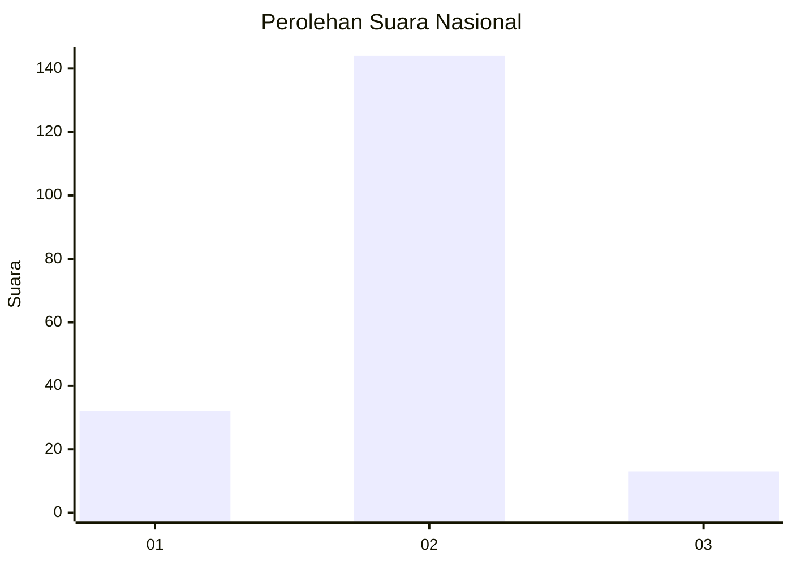
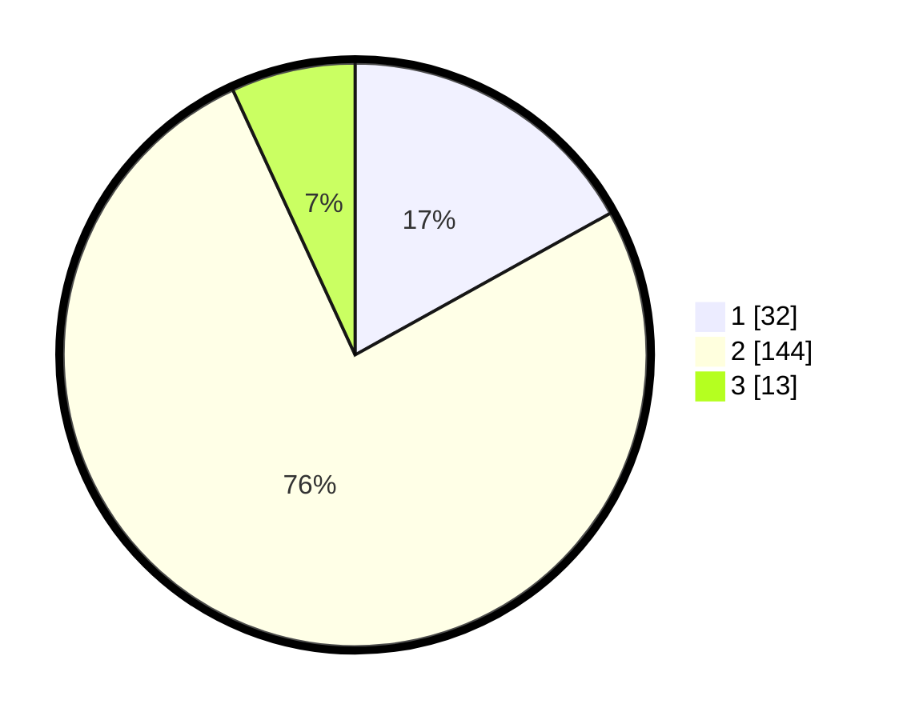

# Hasil

## Grafik

## Tabel

| No. | Nama Paslon    | Suara | Suara (raw) | Persentase |
|:--- |:-------------- | -----:| -----------:| ----------:|
| 1   | ANIES MUHAIMIN | 32    | [32][p-1]   | 16,93      |
| 2   | PRABOWO GIBRAN | 144   | [144][p-2]  | 76,19      |
| 3   | GANJAR MAHFUD  | 13    | [13][p-3]   | 6,88       |

[p-1]: https://github.com/gigit-pemilu/pemilu-2024/blob/main/pilpres/hitung-suara/sub/62-kalimantan-tengah/sub/05-barito-utara/sub/08-teweh-selatan/sub/2003-bintang-ninggi-i/sub/002-tps/sub/paslon-1.txt
[p-2]: https://github.com/gigit-pemilu/pemilu-2024/blob/main/pilpres/hitung-suara/sub/62-kalimantan-tengah/sub/05-barito-utara/sub/08-teweh-selatan/sub/2003-bintang-ninggi-i/sub/002-tps/sub/paslon-2.txt
[p-3]: https://github.com/gigit-pemilu/pemilu-2024/blob/main/pilpres/hitung-suara/sub/62-kalimantan-tengah/sub/05-barito-utara/sub/08-teweh-selatan/sub/2003-bintang-ninggi-i/sub/002-tps/sub/paslon-3.txt

## Foto C Plano

https://sirekap-obj-formc.kpu.go.id/b087/pemilu/ppwp/62/05/08/20/03/6205082003002-20240226-172951--1667af46-8f02-43af-9fca-b91a520a1d13.jpg

https://sirekap-obj-formc.kpu.go.id/b087/pemilu/ppwp/62/05/08/20/03/6205082003002-20240226-173141--627d7d8f-25dc-40f6-9e58-df3a5a576d7c.jpg

https://sirekap-obj-formc.kpu.go.id/b087/pemilu/ppwp/62/05/08/20/03/6205082003002-20240226-173324--11e5a14b-e5c4-4ac8-9c84-04935eef8f02.jpg

## Metadata

| Key        | Value               |
| ---------- | ------------------- |
| Time Stamp | 2024-02-28 19:00:00 |

