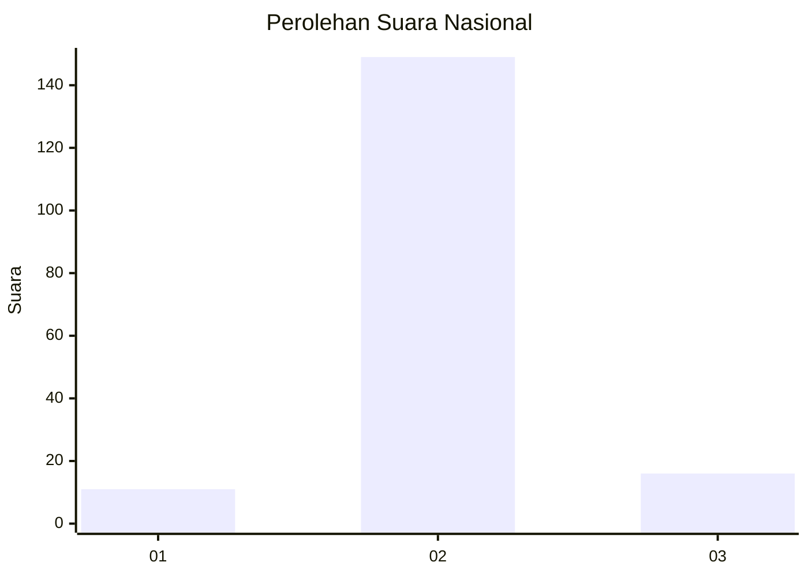
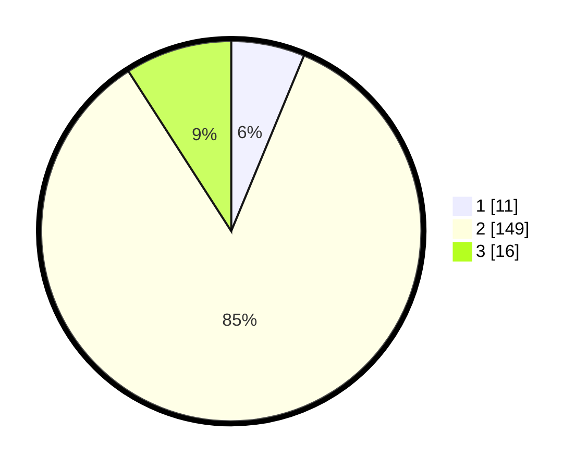

# Hasil

## Grafik

## Tabel

| No. | Nama Paslon    | Suara | Suara (raw) | Persentase |
|:--- |:-------------- | -----:| -----------:| ----------:|
| 1   | ANIES MUHAIMIN | 11    | [11][p-1]   | 6,25       |
| 2   | PRABOWO GIBRAN | 149   | [149][p-2]  | 84,66      |
| 3   | GANJAR MAHFUD  | 16    | [16][p-3]   | 9,09       |

[p-1]: https://github.com/gigit-pemilu/pemilu-2024/blob/main/pilpres/hitung-suara/sub/62-kalimantan-tengah/sub/05-barito-utara/sub/08-teweh-selatan/sub/2003-bintang-ninggi-i/sub/003-tps/sub/paslon-1.txt
[p-2]: https://github.com/gigit-pemilu/pemilu-2024/blob/main/pilpres/hitung-suara/sub/62-kalimantan-tengah/sub/05-barito-utara/sub/08-teweh-selatan/sub/2003-bintang-ninggi-i/sub/003-tps/sub/paslon-2.txt
[p-3]: https://github.com/gigit-pemilu/pemilu-2024/blob/main/pilpres/hitung-suara/sub/62-kalimantan-tengah/sub/05-barito-utara/sub/08-teweh-selatan/sub/2003-bintang-ninggi-i/sub/003-tps/sub/paslon-3.txt

## Foto C Plano

https://sirekap-obj-formc.kpu.go.id/4c3d/pemilu/ppwp/62/05/08/20/03/6205082003003-20240226-173728--39d61680-e89d-4799-9365-56b02e172fd1.jpg

https://sirekap-obj-formc.kpu.go.id/4c3d/pemilu/ppwp/62/05/08/20/03/6205082003003-20240226-173858--fe5c18a6-65c5-4aab-b422-2e15e3f3eaf9.jpg

https://sirekap-obj-formc.kpu.go.id/4c3d/pemilu/ppwp/62/05/08/20/03/6205082003003-20240227-132651--ccd0c8a2-2a13-40ea-9014-4aecea60168b.jpg

## Metadata

| Key        | Value               |
| ---------- | ------------------- |
| Time Stamp | 2024-02-28 19:00:00 |

