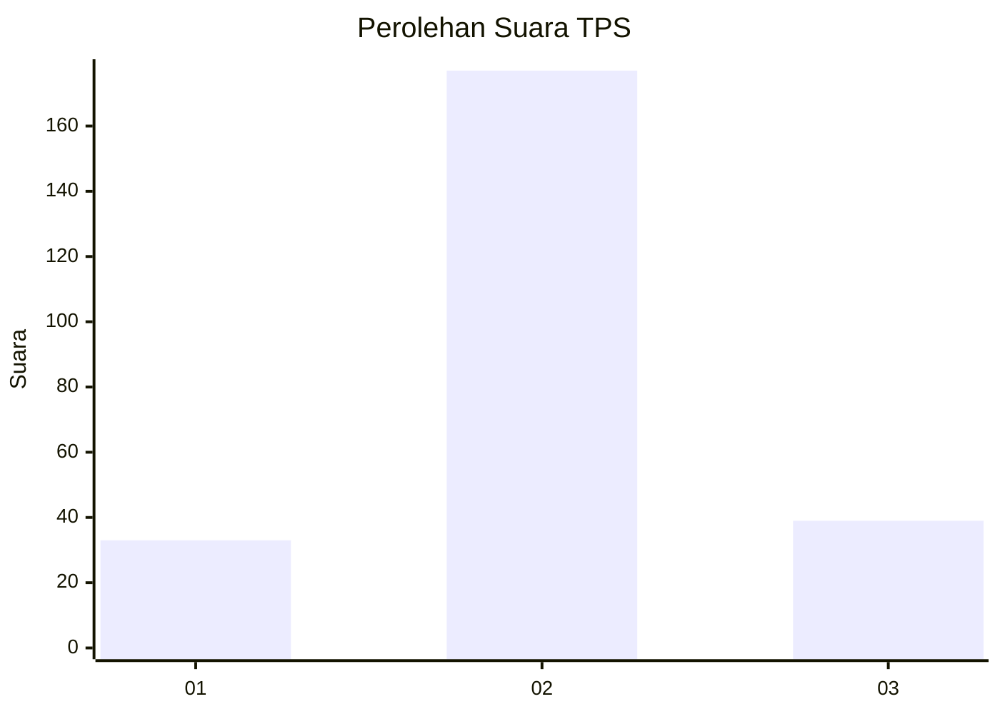

# Hasil

## Grafik

## Tabel

| No. | Nama Paslon    | Suara | Suara (raw) | Persentase |
|:--- |:-------------- | -----:| -----------:| ----------:|
| 1   | ANIES MUHAIMIN | 33    | [33][p-1]   | 13,25      |
| 2   | PRABOWO GIBRAN | 177   | [177][p-2]  | 71,08      |
| 3   | GANJAR MAHFUD  | 39    | [39][p-3]   | 15,66      |

[p-1]: https://github.com/gigit-pemilu/pemilu-2024-62-kalimantan-tengah/blob/main/pilpres/hitung-suara/sub/62-kalimantan-tengah/sub/05-barito-utara/sub/08-teweh-selatan/sub/2003-bintang-ninggi-i/sub/004-tps/sub/paslon-1.txt
[p-2]: https://github.com/gigit-pemilu/pemilu-2024-62-kalimantan-tengah/blob/main/pilpres/hitung-suara/sub/62-kalimantan-tengah/sub/05-barito-utara/sub/08-teweh-selatan/sub/2003-bintang-ninggi-i/sub/004-tps/sub/paslon-2.txt
[p-3]: https://github.com/gigit-pemilu/pemilu-2024-62-kalimantan-tengah/blob/main/pilpres/hitung-suara/sub/62-kalimantan-tengah/sub/05-barito-utara/sub/08-teweh-selatan/sub/2003-bintang-ninggi-i/sub/004-tps/sub/paslon-3.txt

## Foto C Plano

https://sirekap-obj-formc.kpu.go.id/089d/pemilu/ppwp/62/05/08/20/03/6205082003004-20240227-132929--aacc133f-5696-42d4-a22a-e9f86bb048b5.jpg

https://sirekap-obj-formc.kpu.go.id/089d/pemilu/ppwp/62/05/08/20/03/6205082003004-20240227-133029--886d664e-6567-4e94-a493-692bc8d42ea4.jpg

https://sirekap-obj-formc.kpu.go.id/089d/pemilu/ppwp/62/05/08/20/03/6205082003004-20240227-133133--a264202b-13ee-4400-aac8-e5ab9889407c.jpg

## Metadata

| Key        | Value               |
| ---------- | ------------------- |
| Time Stamp | 2024-02-28 19:00:00 |

