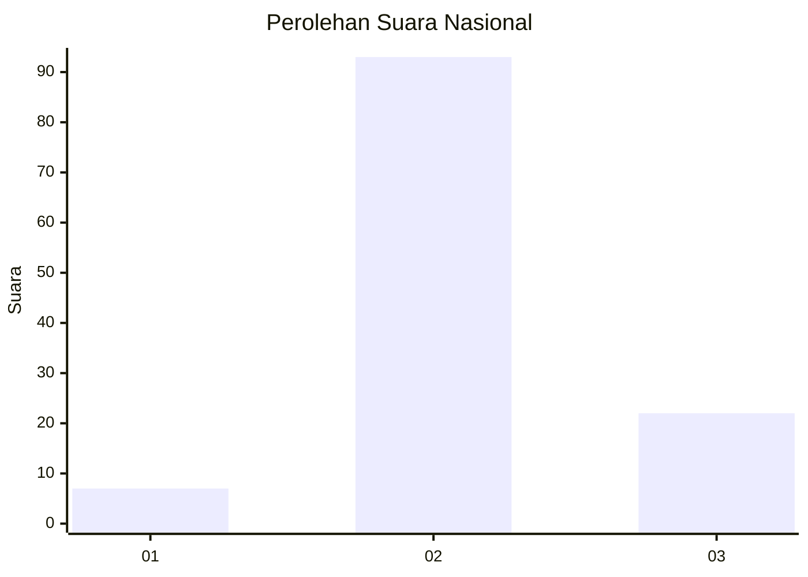
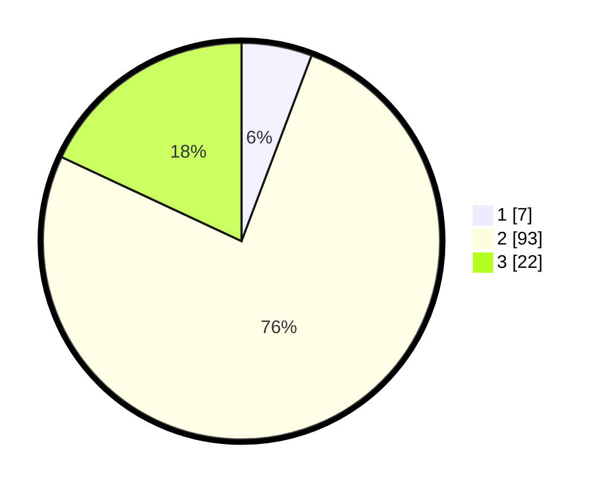

# Hasil

## Grafik

## Tabel

| No. | Nama Paslon    | Suara | Suara (raw) | Persentase |
|:--- |:-------------- | -----:| -----------:| ----------:|
| 1   | ANIES MUHAIMIN | 7     | [7][p-1]    | 5,74       |
| 2   | PRABOWO GIBRAN | 93    | [93][p-2]   | 76,23      |
| 3   | GANJAR MAHFUD  | 22    | [22][p-3]   | 18,03      |

[p-1]: https://github.com/gigit-pemilu/pemilu-2024/blob/main/pilpres/hitung-suara/sub/62-kalimantan-tengah/sub/05-barito-utara/sub/08-teweh-selatan/sub/2009-pandran-raya/sub/002-tps/sub/paslon-1.txt
[p-2]: https://github.com/gigit-pemilu/pemilu-2024/blob/main/pilpres/hitung-suara/sub/62-kalimantan-tengah/sub/05-barito-utara/sub/08-teweh-selatan/sub/2009-pandran-raya/sub/002-tps/sub/paslon-2.txt
[p-3]: https://github.com/gigit-pemilu/pemilu-2024/blob/main/pilpres/hitung-suara/sub/62-kalimantan-tengah/sub/05-barito-utara/sub/08-teweh-selatan/sub/2009-pandran-raya/sub/002-tps/sub/paslon-3.txt

## Foto C Plano

https://sirekap-obj-formc.kpu.go.id/9b6a/pemilu/ppwp/62/05/08/20/09/6205082009002-20240217-151551--9fabffaa-3b62-469b-9ee4-8f57691e8249.jpg

https://sirekap-obj-formc.kpu.go.id/9b6a/pemilu/ppwp/62/05/08/20/09/6205082009002-20240217-151617--27a774e0-35dd-488b-8b7b-2a5974a0e668.jpg

https://sirekap-obj-formc.kpu.go.id/9b6a/pemilu/ppwp/62/05/08/20/09/6205082009002-20240217-151653--44c07d07-abf2-4741-bacb-18566ee853b6.jpg

## Metadata

| Key        | Value               |
| ---------- | ------------------- |
| Time Stamp | 2024-02-24 22:31:28 |

