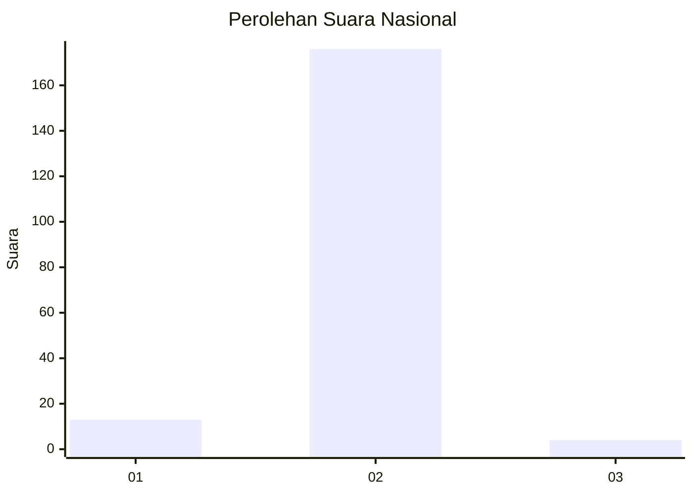
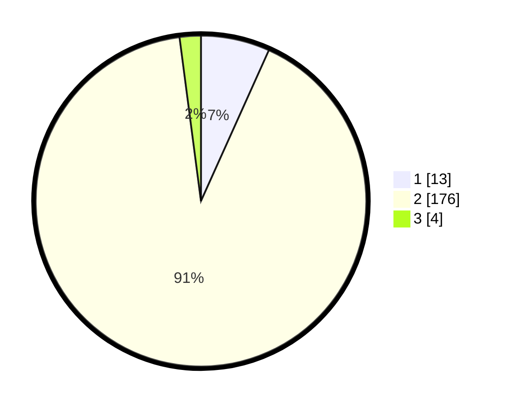

# Hasil

## Grafik

## Tabel

| No. | Nama Paslon    | Suara | Suara (raw) | Persentase |
|:--- |:-------------- | -----:| -----------:| ----------:|
| 1   | ANIES MUHAIMIN | 13    | [13][p-1]   | 6,74       |
| 2   | PRABOWO GIBRAN | 176   | [176][p-2]  | 91,19      |
| 3   | GANJAR MAHFUD  | 4     | [4][p-3]    | 2,07       |

[p-1]: https://github.com/gigit-pemilu/pemilu-2024/blob/main/pilpres/hitung-suara/sub/62-kalimantan-tengah/sub/05-barito-utara/sub/09-lahei-barat/sub/2001-nihan-hilir/sub/004-tps/sub/paslon-1.txt
[p-2]: https://github.com/gigit-pemilu/pemilu-2024/blob/main/pilpres/hitung-suara/sub/62-kalimantan-tengah/sub/05-barito-utara/sub/09-lahei-barat/sub/2001-nihan-hilir/sub/004-tps/sub/paslon-2.txt
[p-3]: https://github.com/gigit-pemilu/pemilu-2024/blob/main/pilpres/hitung-suara/sub/62-kalimantan-tengah/sub/05-barito-utara/sub/09-lahei-barat/sub/2001-nihan-hilir/sub/004-tps/sub/paslon-3.txt

## Foto C Plano

https://sirekap-obj-formc.kpu.go.id/dfa7/pemilu/ppwp/62/05/09/20/01/6205092001004-20240217-013903--179f44e4-0deb-4ff3-b75d-91525154c94c.jpg

https://sirekap-obj-formc.kpu.go.id/dfa7/pemilu/ppwp/62/05/09/20/01/6205092001004-20240217-013904--f90efa11-ea9a-4320-9970-2097e4e6d210.jpg

https://sirekap-obj-formc.kpu.go.id/dfa7/pemilu/ppwp/62/05/09/20/01/6205092001004-20240217-013903--ef3a49c3-5d17-4b75-8ed9-3aa6df9be0c2.jpg

## Metadata

| Key        | Value               |
| ---------- | ------------------- |
| Time Stamp | 2024-02-24 22:31:28 |

## DATA PEMILIH TETAP

Jumlah pemilih dalam DPT: **278**.
 * L: **148**.
 * P: **130**.

## DATA PENGGUNA HAK PILIH

Jumlah pengguna hak pilih dalam DPT: **175**.
 * L: **83**.
 * P: **92**.

Jumlah pengguna hak pilih dalam DPTb: **31**.
 * L: **19**.
 * P: **12**.

Jumlah pengguna hak pilih dalam DPK: **206**.
 * L: **102**.
 * P: **104**.

Jumlah pengguna hak pilih: **206**.
 * L: **175**.
 * P: **31**.

## JUMLAH SUARA SAH DAN TIDAK SAH

JUMLAH SELURUH SUARA SAH: **193**.

JUMLAH SUARA TIDAK SAH: **13**.

JUMLAH SELURUH SUARA SAH DAN SUARA TIDAK SAH: **206**.

