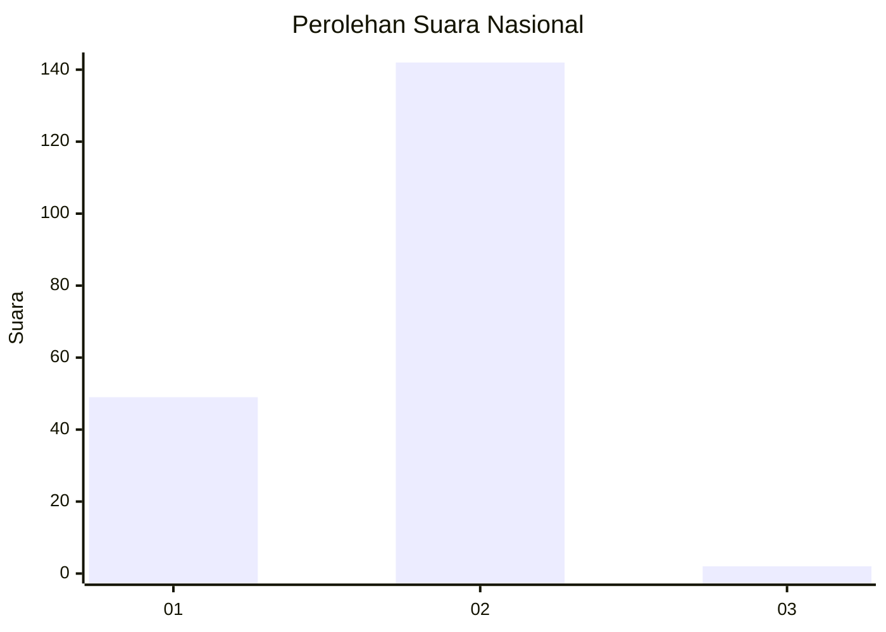
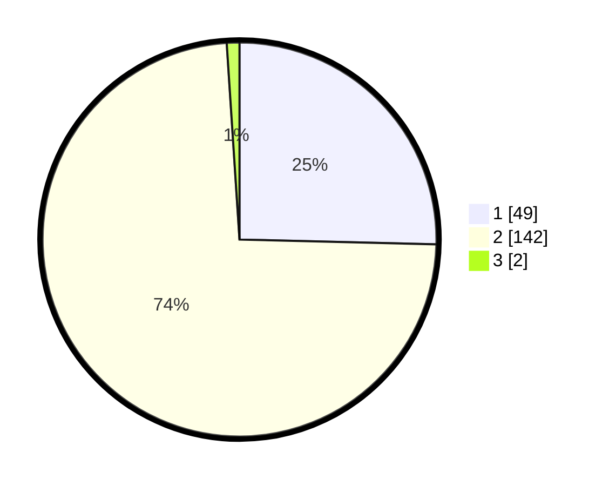

# Hasil

## Grafik

## Tabel

| No. | Nama Paslon    | Suara | Suara (raw) | Persentase |
|:--- |:-------------- | -----:| -----------:| ----------:|
| 1   | ANIES MUHAIMIN | 49    | [49][p-1]   | 25,39      |
| 2   | PRABOWO GIBRAN | 142   | [142][p-2]  | 73,58      |
| 3   | GANJAR MAHFUD  | 2     | [2][p-3]    | 1,04       |

[p-1]: https://github.com/gigit-pemilu/pemilu-2024/blob/main/pilpres/hitung-suara/sub/62-kalimantan-tengah/sub/06-katingan/sub/01-kamipang/sub/2001-galinggang/sub/002-tps/sub/paslon-1.txt
[p-2]: https://github.com/gigit-pemilu/pemilu-2024/blob/main/pilpres/hitung-suara/sub/62-kalimantan-tengah/sub/06-katingan/sub/01-kamipang/sub/2001-galinggang/sub/002-tps/sub/paslon-2.txt
[p-3]: https://github.com/gigit-pemilu/pemilu-2024/blob/main/pilpres/hitung-suara/sub/62-kalimantan-tengah/sub/06-katingan/sub/01-kamipang/sub/2001-galinggang/sub/002-tps/sub/paslon-3.txt

## Foto C Plano

https://sirekap-obj-formc.kpu.go.id/0a92/pemilu/ppwp/62/06/01/20/01/6206012001002-20240221-004129--1753e0d2-f54a-422a-b620-cef9849c8fae.jpg

https://sirekap-obj-formc.kpu.go.id/0a92/pemilu/ppwp/62/06/01/20/01/6206012001002-20240221-004155--65b6c9c6-a3c7-4318-8154-1baf92c0d719.jpg

https://sirekap-obj-formc.kpu.go.id/0a92/pemilu/ppwp/62/06/01/20/01/6206012001002-20240221-004221--5f42b996-0064-4f2c-9be2-f7c4a1c70f6d.jpg

## Metadata

| Key        | Value               |
| ---------- | ------------------- |
| Time Stamp | 2024-02-25 15:00:00 |

