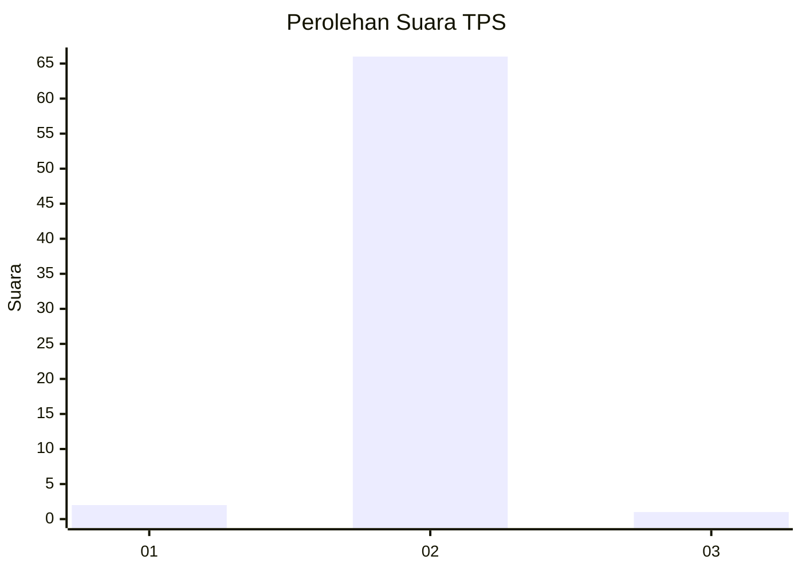
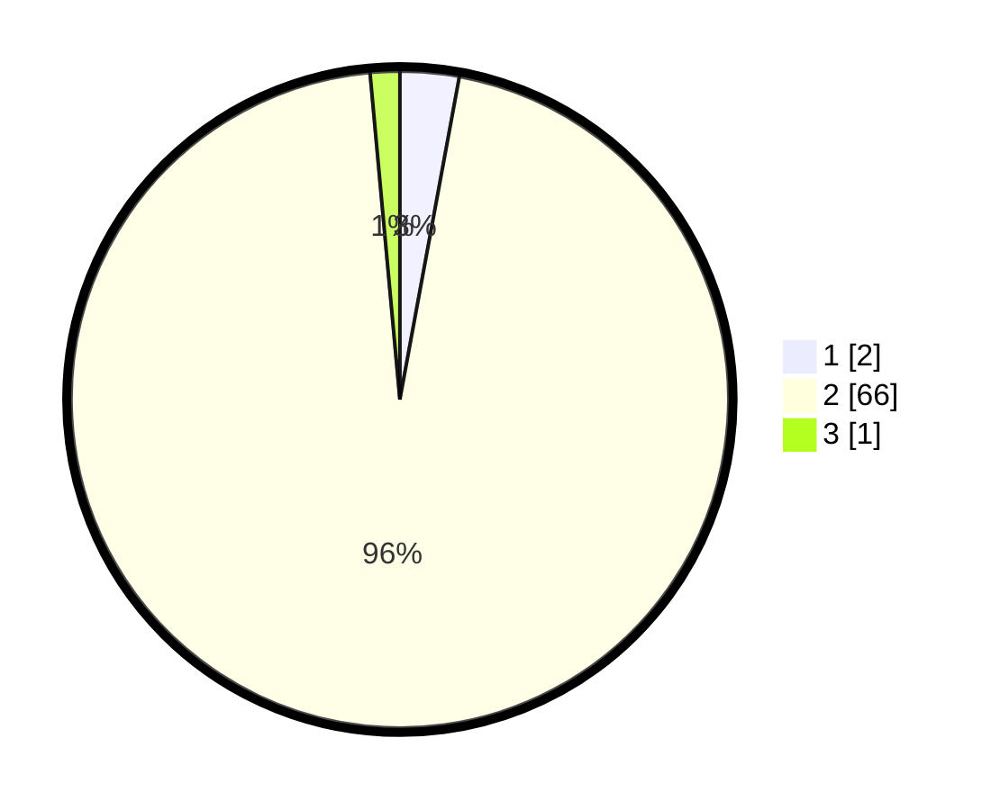

# Hasil

## Grafik

## Tabel

| No. | Nama Paslon    | Suara | Suara (raw) | Persentase |
|:--- |:-------------- | -----:| -----------:| ----------:|
| 1   | ANIES MUHAIMIN | 2     | [2][p-1]    | 2,90       |
| 2   | PRABOWO GIBRAN | 66    | [66][p-2]   | 95,65      |
| 3   | GANJAR MAHFUD  | 1     | [1][p-3]    | 1,45       |

[p-1]: https://github.com/gigit-pemilu/pemilu-2024-62-kalimantan-tengah/blob/main/pilpres/hitung-suara/sub/62-kalimantan-tengah/sub/06-katingan/sub/01-kamipang/sub/2001-galinggang/sub/004-tps/sub/paslon-1.txt
[p-2]: https://github.com/gigit-pemilu/pemilu-2024-62-kalimantan-tengah/blob/main/pilpres/hitung-suara/sub/62-kalimantan-tengah/sub/06-katingan/sub/01-kamipang/sub/2001-galinggang/sub/004-tps/sub/paslon-2.txt
[p-3]: https://github.com/gigit-pemilu/pemilu-2024-62-kalimantan-tengah/blob/main/pilpres/hitung-suara/sub/62-kalimantan-tengah/sub/06-katingan/sub/01-kamipang/sub/2001-galinggang/sub/004-tps/sub/paslon-3.txt

## Foto C Plano

https://sirekap-obj-formc.kpu.go.id/bfca/pemilu/ppwp/62/06/01/20/01/6206012001004-20240221-023706--ae2b82d6-674a-434f-aa58-b0454e98c3e3.jpg

https://sirekap-obj-formc.kpu.go.id/bfca/pemilu/ppwp/62/06/01/20/01/6206012001004-20240221-023754--5dc58cb1-38de-4588-ac80-185331c33920.jpg

https://sirekap-obj-formc.kpu.go.id/bfca/pemilu/ppwp/62/06/01/20/01/6206012001004-20240221-023824--46c39938-222b-4c2f-b846-10260a6484fb.jpg

## Metadata

| Key        | Value               |
| ---------- | ------------------- |
| Time Stamp | 2024-02-25 12:00:00 |

