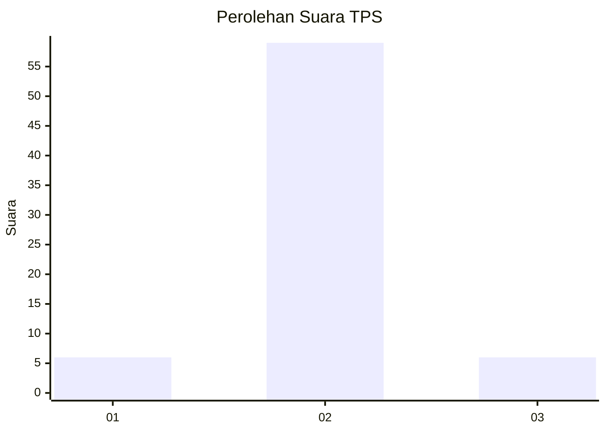
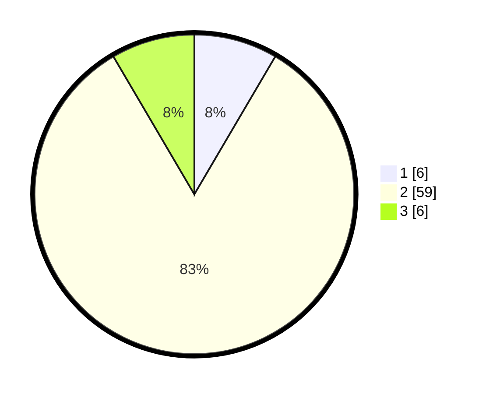

# Hasil

## Grafik

## Tabel

| No. | Nama Paslon    | Suara | Suara (raw) | Persentase |
|:--- |:-------------- | -----:| -----------:| ----------:|
| 1   | ANIES MUHAIMIN | 6     | [6][p-1]    | 8,45       |
| 2   | PRABOWO GIBRAN | 59    | [59][p-2]   | 83,10      |
| 3   | GANJAR MAHFUD  | 6     | [6][p-3]    | 8,45       |

[p-1]: https://github.com/gigit-pemilu/pemilu-2024-62-kalimantan-tengah/blob/main/pilpres/hitung-suara/sub/62-kalimantan-tengah/sub/06-katingan/sub/01-kamipang/sub/2001-galinggang/sub/005-tps/sub/paslon-1.txt
[p-2]: https://github.com/gigit-pemilu/pemilu-2024-62-kalimantan-tengah/blob/main/pilpres/hitung-suara/sub/62-kalimantan-tengah/sub/06-katingan/sub/01-kamipang/sub/2001-galinggang/sub/005-tps/sub/paslon-2.txt
[p-3]: https://github.com/gigit-pemilu/pemilu-2024-62-kalimantan-tengah/blob/main/pilpres/hitung-suara/sub/62-kalimantan-tengah/sub/06-katingan/sub/01-kamipang/sub/2001-galinggang/sub/005-tps/sub/paslon-3.txt

## Foto C Plano

https://sirekap-obj-formc.kpu.go.id/b06c/pemilu/ppwp/62/06/01/20/01/6206012001005-20240221-014312--083d8d4d-4d51-40a3-8bbf-cb8b40b5c549.jpg

https://sirekap-obj-formc.kpu.go.id/b06c/pemilu/ppwp/62/06/01/20/01/6206012001005-20240221-014341--e1ffcd95-e2a1-418c-bbe6-6482c64b8fe3.jpg

https://sirekap-obj-formc.kpu.go.id/b06c/pemilu/ppwp/62/06/01/20/01/6206012001005-20240221-014432--99138702-269f-4f8c-a1e3-f16e4e420564.jpg

## Metadata

| Key        | Value               |
| ---------- | ------------------- |
| Time Stamp | 2024-02-25 15:00:00 |

