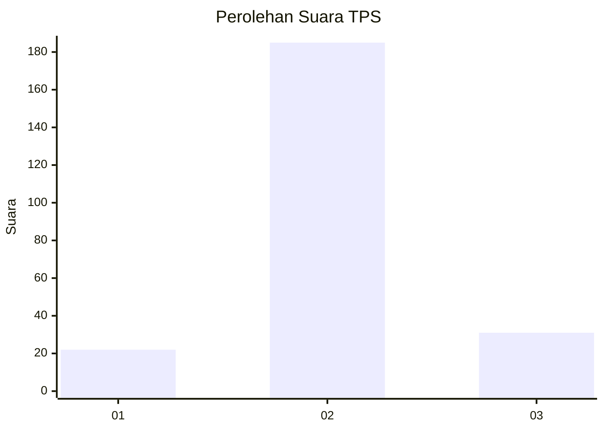
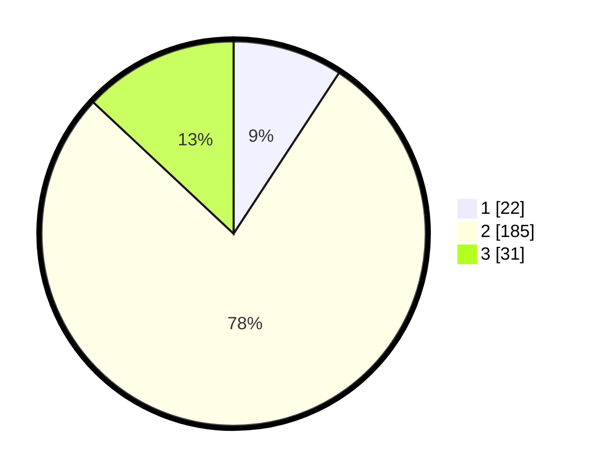

# Hasil

## Grafik

## Tabel

| No. | Nama Paslon    | Suara | Suara (raw) | Persentase |
|:--- |:-------------- | -----:| -----------:| ----------:|
| 1   | ANIES MUHAIMIN | 22    | [22][p-1]   | 9,24       |
| 2   | PRABOWO GIBRAN | 185   | [185][p-2]  | 77,73      |
| 3   | GANJAR MAHFUD  | 31    | [31][p-3]   | 13,03      |

[p-1]: https://github.com/gigit-pemilu/pemilu-2024-62-kalimantan-tengah/blob/main/pilpres/hitung-suara/sub/62-kalimantan-tengah/sub/06-katingan/sub/02-katingan-hilir/sub/1003-kasongan-baru/sub/007-tps/sub/paslon-1.txt
[p-2]: https://github.com/gigit-pemilu/pemilu-2024-62-kalimantan-tengah/blob/main/pilpres/hitung-suara/sub/62-kalimantan-tengah/sub/06-katingan/sub/02-katingan-hilir/sub/1003-kasongan-baru/sub/007-tps/sub/paslon-2.txt
[p-3]: https://github.com/gigit-pemilu/pemilu-2024-62-kalimantan-tengah/blob/main/pilpres/hitung-suara/sub/62-kalimantan-tengah/sub/06-katingan/sub/02-katingan-hilir/sub/1003-kasongan-baru/sub/007-tps/sub/paslon-3.txt

## Foto C Plano

https://sirekap-obj-formc.kpu.go.id/e107/pemilu/ppwp/62/06/02/10/03/6206021003007-20240214-192217--2cc4f98c-9d1c-4bd2-b8c9-5cb440d3b5ca.jpg

https://sirekap-obj-formc.kpu.go.id/e107/pemilu/ppwp/62/06/02/10/03/6206021003007-20240214-192407--fa6e942e-c6a9-4aef-83c9-77899f669f69.jpg

https://sirekap-obj-formc.kpu.go.id/e107/pemilu/ppwp/62/06/02/10/03/6206021003007-20240214-192542--4bac0f18-5c6e-42bf-ade2-0b2fe39da382.jpg

## Metadata

| Key        | Value               |
| ---------- | ------------------- |
| Time Stamp | 2024-02-15 20:00:44 |

