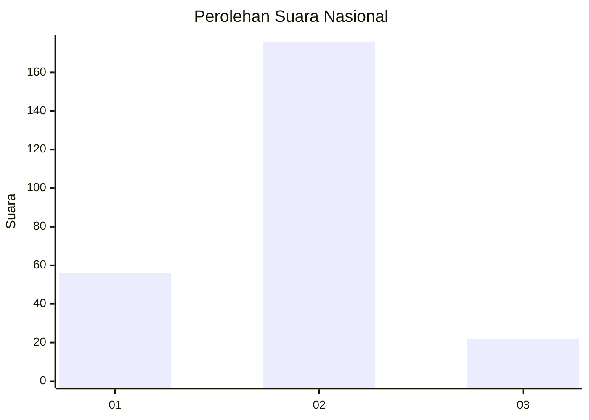
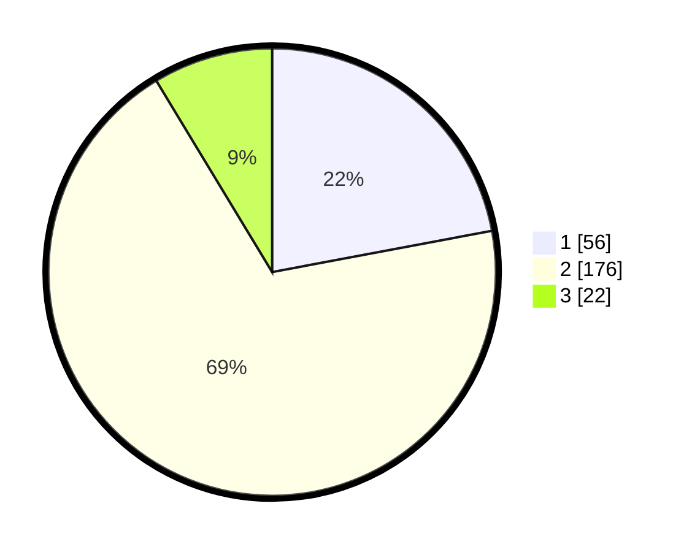

# Hasil

## Grafik

## Tabel

| No. | Nama Paslon    | Suara | Suara (raw) | Persentase |
|:--- |:-------------- | -----:| -----------:| ----------:|
| 1   | ANIES MUHAIMIN | 56    | [56][p-1]   | 22,05      |
| 2   | PRABOWO GIBRAN | 176   | [176][p-2]  | 69,29      |
| 3   | GANJAR MAHFUD  | 22    | [22][p-3]   | 8,66       |

[p-1]: https://github.com/gigit-pemilu/pemilu-2024/blob/main/pilpres/hitung-suara/sub/62-kalimantan-tengah/sub/06-katingan/sub/02-katingan-hilir/sub/1004-kasongan-lama/sub/012-tps/sub/paslon-1.txt
[p-2]: https://github.com/gigit-pemilu/pemilu-2024/blob/main/pilpres/hitung-suara/sub/62-kalimantan-tengah/sub/06-katingan/sub/02-katingan-hilir/sub/1004-kasongan-lama/sub/012-tps/sub/paslon-2.txt
[p-3]: https://github.com/gigit-pemilu/pemilu-2024/blob/main/pilpres/hitung-suara/sub/62-kalimantan-tengah/sub/06-katingan/sub/02-katingan-hilir/sub/1004-kasongan-lama/sub/012-tps/sub/paslon-3.txt

## Foto C Plano

https://sirekap-obj-formc.kpu.go.id/d4ee/pemilu/ppwp/62/06/02/10/04/6206021004012-20240215-024640--1cd0ead4-3332-45c4-9401-cb3e5f71e02c.jpg

https://sirekap-obj-formc.kpu.go.id/d4ee/pemilu/ppwp/62/06/02/10/04/6206021004012-20240215-024503--ad5ac12e-9845-4a7d-899f-e5868d010c2c.jpg

https://sirekap-obj-formc.kpu.go.id/d4ee/pemilu/ppwp/62/06/02/10/04/6206021004012-20240215-024306--f1b3da5a-a006-453c-a516-701f71753207.jpg

## Metadata

| Key        | Value               |
| ---------- | ------------------- |
| Time Stamp | 2024-02-15 15:30:25 |

