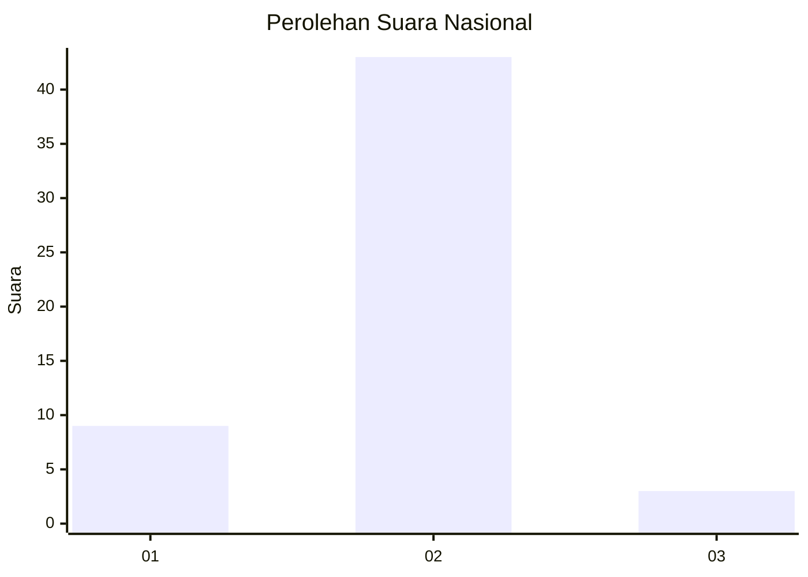
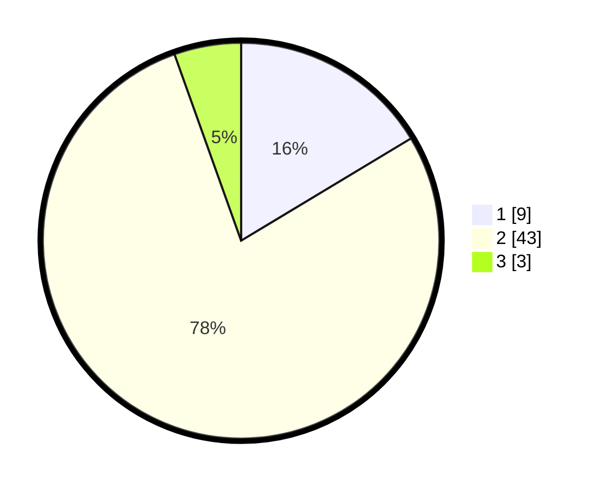

# Hasil

## Grafik

## Tabel

| No. | Nama Paslon    | Suara | Suara (raw) | Persentase |
|:--- |:-------------- | -----:| -----------:| ----------:|
| 1   | ANIES MUHAIMIN | 9     | [9][p-1]    | 16,36      |
| 2   | PRABOWO GIBRAN | 43    | [43][p-2]   | 78,18      |
| 3   | GANJAR MAHFUD  | 3     | [3][p-3]    | 5,45       |

[p-1]: https://github.com/gigit-pemilu/pemilu-2024/blob/main/pilpres/hitung-suara/sub/62-kalimantan-tengah/sub/06-katingan/sub/02-katingan-hilir/sub/2002-tumbang-liting/sub/004-tps/sub/paslon-1.txt
[p-2]: https://github.com/gigit-pemilu/pemilu-2024/blob/main/pilpres/hitung-suara/sub/62-kalimantan-tengah/sub/06-katingan/sub/02-katingan-hilir/sub/2002-tumbang-liting/sub/004-tps/sub/paslon-2.txt
[p-3]: https://github.com/gigit-pemilu/pemilu-2024/blob/main/pilpres/hitung-suara/sub/62-kalimantan-tengah/sub/06-katingan/sub/02-katingan-hilir/sub/2002-tumbang-liting/sub/004-tps/sub/paslon-3.txt

## Foto C Plano

https://sirekap-obj-formc.kpu.go.id/cd62/pemilu/ppwp/62/06/02/20/02/6206022002004-20240214-204225--a935af26-a6c4-4898-ae99-803e2634a369.jpg

https://sirekap-obj-formc.kpu.go.id/cd62/pemilu/ppwp/62/06/02/20/02/6206022002004-20240214-204442--e0aa4f0e-38c9-4bc4-8ff0-3af64116bb0b.jpg

https://sirekap-obj-formc.kpu.go.id/cd62/pemilu/ppwp/62/06/02/20/02/6206022002004-20240214-204618--412eb272-856d-4dc1-bc68-6fb747450a3a.jpg

## Metadata

| Key        | Value               |
| ---------- | ------------------- |
| Time Stamp | 2024-02-19 06:16:00 |

## DATA PEMILIH TETAP

Jumlah pemilih dalam DPT: **65**.
 * L: **32**.
 * P: **33**.

## DATA PENGGUNA HAK PILIH

Jumlah pengguna hak pilih dalam DPT: **49**.
 * L: **25**.
 * P: **24**.

Jumlah pengguna hak pilih dalam DPTb: **1**.
 * L: **1**.
 * P: **0**.

Jumlah pengguna hak pilih dalam DPK: **6**.
 * L: **3**.
 * P: **3**.

Jumlah pengguna hak pilih: **56**.
 * L: **29**.
 * P: **27**.

## JUMLAH SUARA SAH DAN TIDAK SAH

JUMLAH SELURUH SUARA SAH: **55**.

JUMLAH SUARA TIDAK SAH: **1**.

JUMLAH SELURUH SUARA SAH DAN SUARA TIDAK SAH: **56**.

