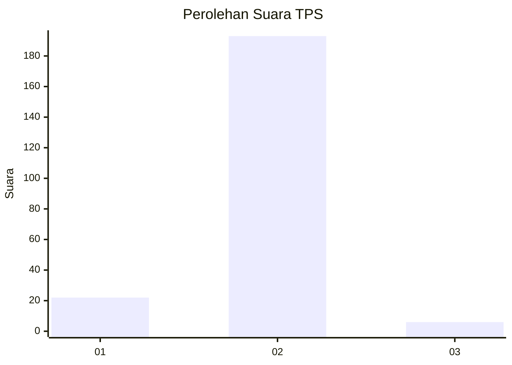
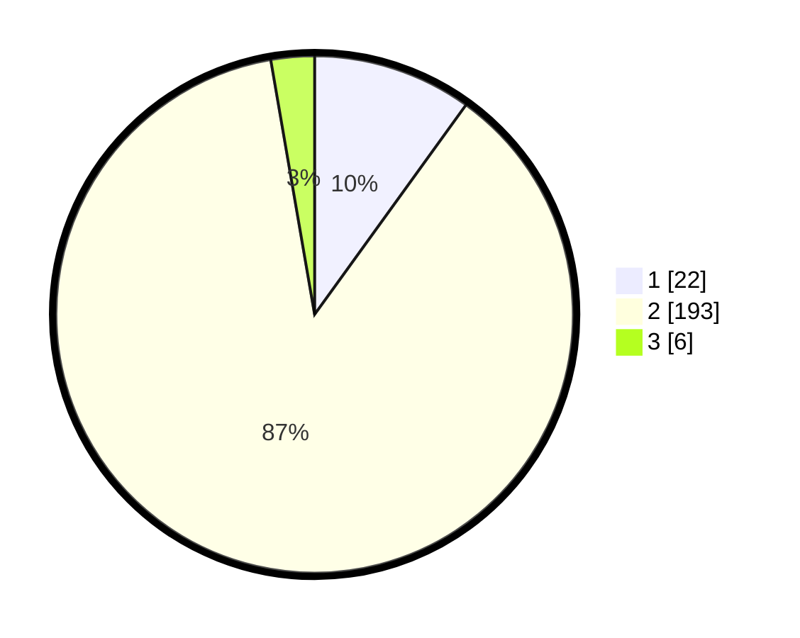

# Hasil

## Grafik

## Tabel

| No. | Nama Paslon    | Suara | Suara (raw) | Persentase |
|:--- |:-------------- | -----:| -----------:| ----------:|
| 1   | ANIES MUHAIMIN | 22    | [22][p-1]   | 9,95       |
| 2   | PRABOWO GIBRAN | 193   | [193][p-2]  | 87,33      |
| 3   | GANJAR MAHFUD  | 6     | [6][p-3]    | 2,71       |

[p-1]: https://github.com/gigit-pemilu/pemilu-2024-62-kalimantan-tengah/blob/main/pilpres/hitung-suara/sub/62-kalimantan-tengah/sub/06-katingan/sub/02-katingan-hilir/sub/2006-banut-kalanaman/sub/003-tps/sub/paslon-1.txt
[p-2]: https://github.com/gigit-pemilu/pemilu-2024-62-kalimantan-tengah/blob/main/pilpres/hitung-suara/sub/62-kalimantan-tengah/sub/06-katingan/sub/02-katingan-hilir/sub/2006-banut-kalanaman/sub/003-tps/sub/paslon-2.txt
[p-3]: https://github.com/gigit-pemilu/pemilu-2024-62-kalimantan-tengah/blob/main/pilpres/hitung-suara/sub/62-kalimantan-tengah/sub/06-katingan/sub/02-katingan-hilir/sub/2006-banut-kalanaman/sub/003-tps/sub/paslon-3.txt

## Foto C Plano

https://sirekap-obj-formc.kpu.go.id/cb8f/pemilu/ppwp/62/06/02/20/06/6206022006003-20240214-155721--7c9bf582-782b-4ddc-831c-a39fc6cce4aa.jpg

https://sirekap-obj-formc.kpu.go.id/cb8f/pemilu/ppwp/62/06/02/20/06/6206022006003-20240214-202300--f7a36c14-d27e-4d24-936f-ebfb6c61b0dc.jpg

https://sirekap-obj-formc.kpu.go.id/cb8f/pemilu/ppwp/62/06/02/20/06/6206022006003-20240214-203609--8bf69012-69fb-481a-8744-0f115feeb012.jpg

## Metadata

| Key        | Value               |
| ---------- | ------------------- |
| Time Stamp | 2024-02-15 19:00:26 |

