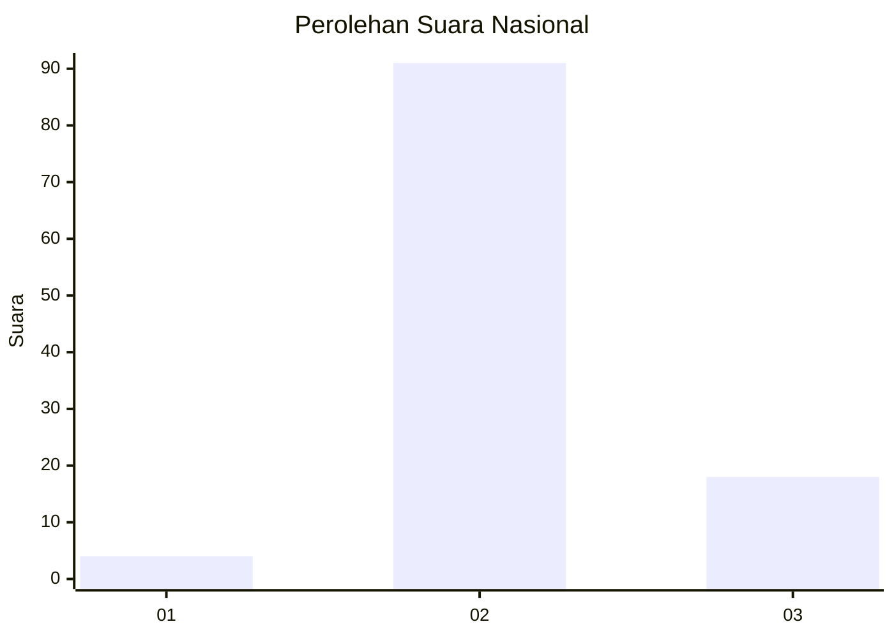
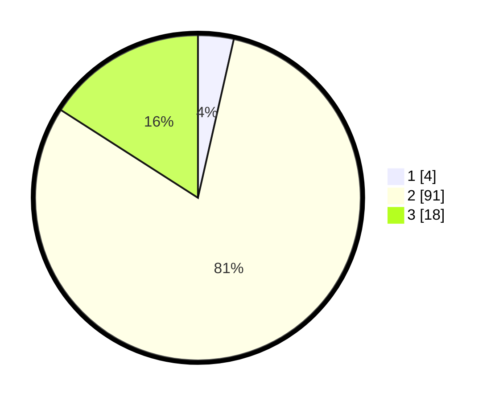

# Hasil

## Grafik

## Tabel

| No. | Nama Paslon    | Suara | Suara (raw) | Persentase |
|:--- |:-------------- | -----:| -----------:| ----------:|
| 1   | ANIES MUHAIMIN | 4     | [4][p-1]    | 3,54       |
| 2   | PRABOWO GIBRAN | 91    | [91][p-2]   | 80,53      |
| 3   | GANJAR MAHFUD  | 18    | [18][p-3]   | 15,93      |

[p-1]: https://github.com/gigit-pemilu/pemilu-2024/blob/main/pilpres/hitung-suara/sub/62-kalimantan-tengah/sub/06-katingan/sub/03-tewang-sangalang-garing/sub/2005-tarusan-danum/sub/002-tps/sub/paslon-1.txt
[p-2]: https://github.com/gigit-pemilu/pemilu-2024/blob/main/pilpres/hitung-suara/sub/62-kalimantan-tengah/sub/06-katingan/sub/03-tewang-sangalang-garing/sub/2005-tarusan-danum/sub/002-tps/sub/paslon-2.txt
[p-3]: https://github.com/gigit-pemilu/pemilu-2024/blob/main/pilpres/hitung-suara/sub/62-kalimantan-tengah/sub/06-katingan/sub/03-tewang-sangalang-garing/sub/2005-tarusan-danum/sub/002-tps/sub/paslon-3.txt

## Foto C Plano

https://sirekap-obj-formc.kpu.go.id/20cb/pemilu/ppwp/62/06/03/20/05/6206032005002-20240215-093729--4d0152c4-5ef9-4e4c-be19-59a5f878f196.jpg

https://sirekap-obj-formc.kpu.go.id/20cb/pemilu/ppwp/62/06/03/20/05/6206032005002-20240215-094021--791b1c44-71cb-48d3-90eb-dbc62f43a053.jpg

https://sirekap-obj-formc.kpu.go.id/20cb/pemilu/ppwp/62/06/03/20/05/6206032005002-20240215-094343--c2e55730-8ed9-49dd-a9a0-93427a0999ab.jpg

## Metadata

| Key        | Value               |
| ---------- | ------------------- |
| Time Stamp | 2024-02-15 19:00:26 |

