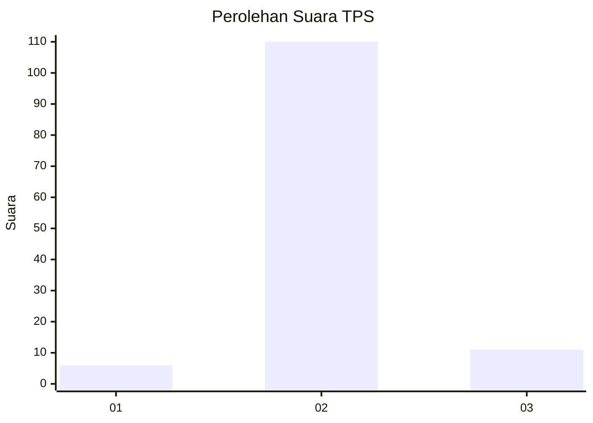
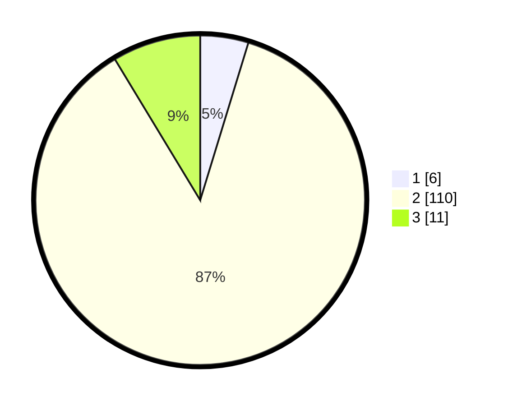

# Hasil

## Grafik

## Tabel

| No. | Nama Paslon    | Suara | Suara (raw) | Persentase |
|:--- |:-------------- | -----:| -----------:| ----------:|
| 1   | ANIES MUHAIMIN | 6     | [6][p-1]    | 4,72       |
| 2   | PRABOWO GIBRAN | 110   | [110][p-2]  | 86,61      |
| 3   | GANJAR MAHFUD  | 11    | [11][p-3]   | 8,66       |

[p-1]: https://github.com/gigit-pemilu/pemilu-2024-62-kalimantan-tengah/blob/main/pilpres/hitung-suara/sub/62-kalimantan-tengah/sub/06-katingan/sub/03-tewang-sangalang-garing/sub/2009-tewang-manyangen/sub/001-tps/sub/paslon-1.txt
[p-2]: https://github.com/gigit-pemilu/pemilu-2024-62-kalimantan-tengah/blob/main/pilpres/hitung-suara/sub/62-kalimantan-tengah/sub/06-katingan/sub/03-tewang-sangalang-garing/sub/2009-tewang-manyangen/sub/001-tps/sub/paslon-2.txt
[p-3]: https://github.com/gigit-pemilu/pemilu-2024-62-kalimantan-tengah/blob/main/pilpres/hitung-suara/sub/62-kalimantan-tengah/sub/06-katingan/sub/03-tewang-sangalang-garing/sub/2009-tewang-manyangen/sub/001-tps/sub/paslon-3.txt

## Foto C Plano

https://sirekap-obj-formc.kpu.go.id/4cd5/pemilu/ppwp/62/06/03/20/09/6206032009001-20240215-075536--b7064e81-82a1-40f0-a1e9-8874bb053b15.jpg

https://sirekap-obj-formc.kpu.go.id/4cd5/pemilu/ppwp/62/06/03/20/09/6206032009001-20240215-075928--d6e8452f-8492-4846-8e76-fa5c9c0097cb.jpg

https://sirekap-obj-formc.kpu.go.id/4cd5/pemilu/ppwp/62/06/03/20/09/6206032009001-20240215-080125--f9bae6ba-3edd-47e0-9382-b4ea28d1778c.jpg

## Metadata

| Key        | Value               |
| ---------- | ------------------- |
| Time Stamp | 2024-02-15 19:00:26 |

