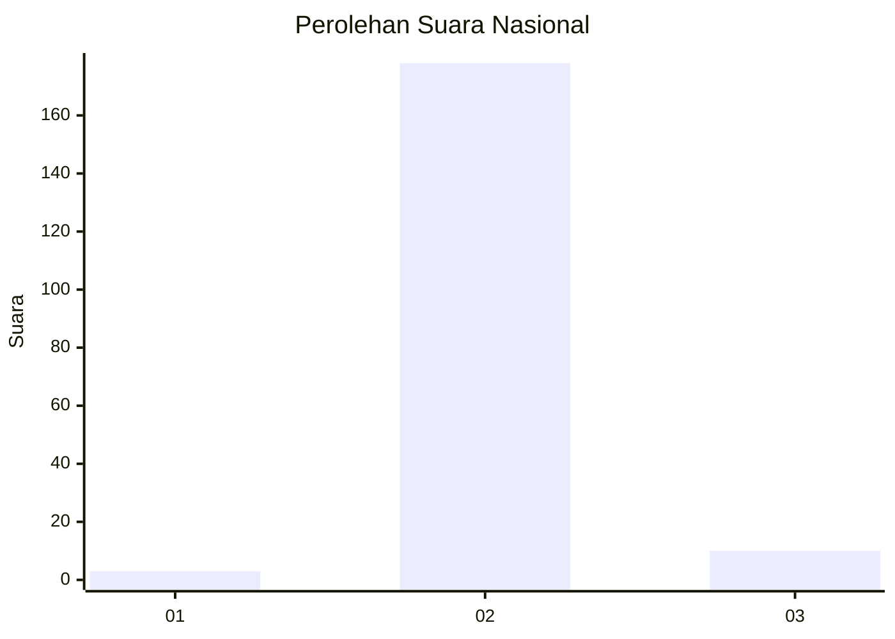
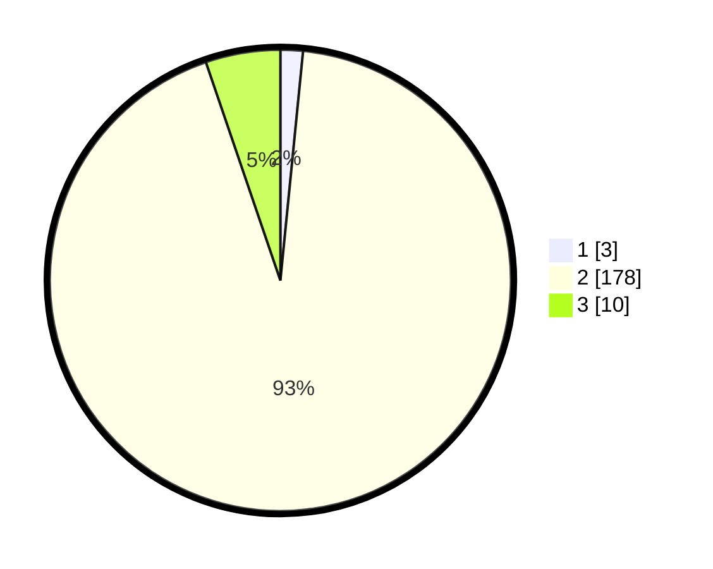

# Hasil

## Grafik

## Tabel

| No. | Nama Paslon    | Suara | Suara (raw) | Persentase |
|:--- |:-------------- | -----:| -----------:| ----------:|
| 1   | ANIES MUHAIMIN | 3     | [3][p-1]    | 1,57       |
| 2   | PRABOWO GIBRAN | 178   | [178][p-2]  | 93,19      |
| 3   | GANJAR MAHFUD  | 10    | [10][p-3]   | 5,24       |

[p-1]: https://github.com/gigit-pemilu/pemilu-2024/blob/main/pilpres/hitung-suara/sub/62-kalimantan-tengah/sub/06-katingan/sub/03-tewang-sangalang-garing/sub/2009-tewang-manyangen/sub/002-tps/sub/paslon-1.txt
[p-2]: https://github.com/gigit-pemilu/pemilu-2024/blob/main/pilpres/hitung-suara/sub/62-kalimantan-tengah/sub/06-katingan/sub/03-tewang-sangalang-garing/sub/2009-tewang-manyangen/sub/002-tps/sub/paslon-2.txt
[p-3]: https://github.com/gigit-pemilu/pemilu-2024/blob/main/pilpres/hitung-suara/sub/62-kalimantan-tengah/sub/06-katingan/sub/03-tewang-sangalang-garing/sub/2009-tewang-manyangen/sub/002-tps/sub/paslon-3.txt

## Foto C Plano

https://sirekap-obj-formc.kpu.go.id/7a25/pemilu/ppwp/62/06/03/20/09/6206032009002-20240215-064109--440e314c-43c1-4b89-b4e5-4ae44ea05bc4.jpg

https://sirekap-obj-formc.kpu.go.id/7a25/pemilu/ppwp/62/06/03/20/09/6206032009002-20240215-064212--1fc295bb-0cb1-4bc5-a8a3-82bc5ac06d7f.jpg

https://sirekap-obj-formc.kpu.go.id/7a25/pemilu/ppwp/62/06/03/20/09/6206032009002-20240215-064328--f7718446-d515-4566-abac-1e8cc7d96236.jpg

## Metadata

| Key        | Value               |
| ---------- | ------------------- |
| Time Stamp | 2024-02-15 22:30:27 |

