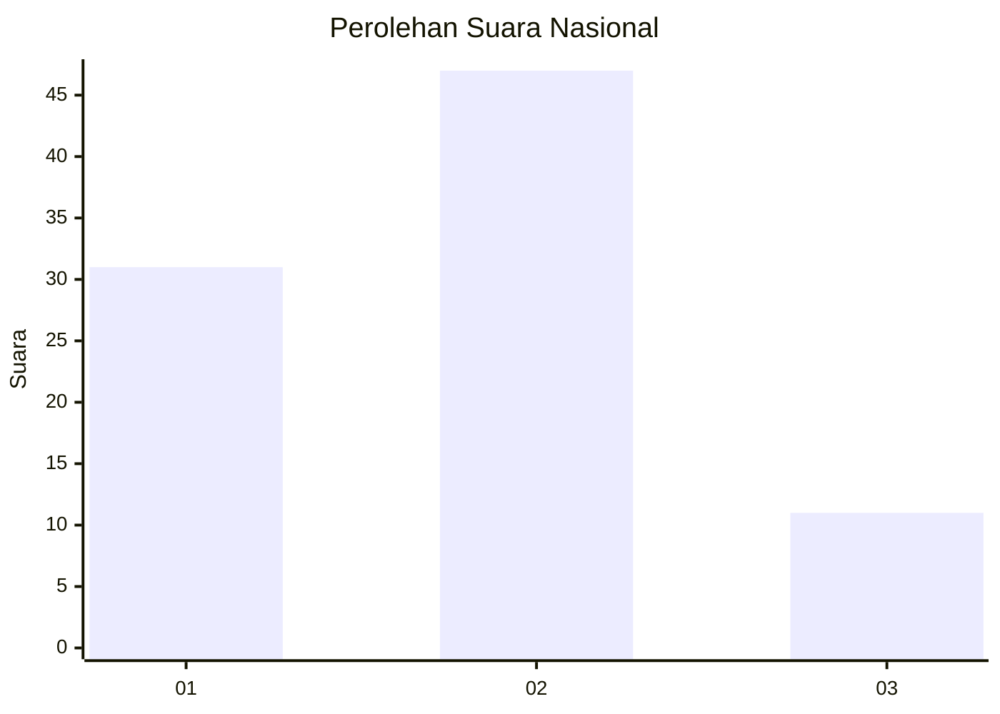
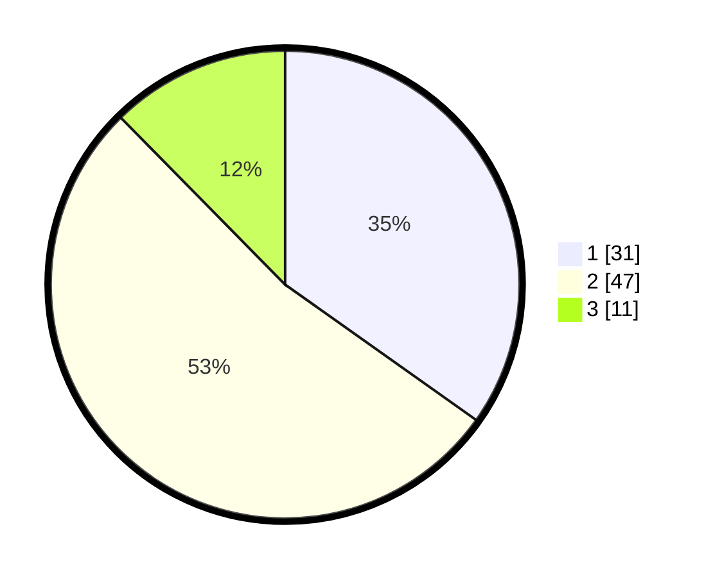

# Hasil

## Grafik

## Tabel

| No. | Nama Paslon    | Suara | Suara (raw) | Persentase |
|:--- |:-------------- | -----:| -----------:| ----------:|
| 1   | ANIES MUHAIMIN | 31    | [31][p-1]   | 34,83      |
| 2   | PRABOWO GIBRAN | 47    | [47][p-2]   | 52,81      |
| 3   | GANJAR MAHFUD  | 11    | [11][p-3]   | 12,36      |

[p-1]: https://github.com/gigit-pemilu/pemilu-2024/blob/main/pilpres/hitung-suara/sub/62-kalimantan-tengah/sub/06-katingan/sub/03-tewang-sangalang-garing/sub/2010-karya-unggang/sub/001-tps/sub/paslon-1.txt
[p-2]: https://github.com/gigit-pemilu/pemilu-2024/blob/main/pilpres/hitung-suara/sub/62-kalimantan-tengah/sub/06-katingan/sub/03-tewang-sangalang-garing/sub/2010-karya-unggang/sub/001-tps/sub/paslon-2.txt
[p-3]: https://github.com/gigit-pemilu/pemilu-2024/blob/main/pilpres/hitung-suara/sub/62-kalimantan-tengah/sub/06-katingan/sub/03-tewang-sangalang-garing/sub/2010-karya-unggang/sub/001-tps/sub/paslon-3.txt

## Foto C Plano

https://sirekap-obj-formc.kpu.go.id/50dd/pemilu/ppwp/62/06/03/20/10/6206032010001-20240220-095543--5bceec20-0bc2-4ea2-8718-b64cf998953c.jpg

https://sirekap-obj-formc.kpu.go.id/50dd/pemilu/ppwp/62/06/03/20/10/6206032010001-20240220-095624--1e475483-9a7b-4064-ba85-6317e6548354.jpg

https://sirekap-obj-formc.kpu.go.id/50dd/pemilu/ppwp/62/06/03/20/10/6206032010001-20240220-095753--c42bb8e2-04f2-4a77-9ee2-6b064680d135.jpg

## Metadata

| Key        | Value               |
| ---------- | ------------------- |
| Time Stamp | 2024-02-20 19:00:00 |

## DATA PEMILIH TETAP

Jumlah pemilih dalam DPT: **155**.
 * L: **47**.
 * P: **77**.

## DATA PENGGUNA HAK PILIH

Jumlah pengguna hak pilih dalam DPT: **177**.
 * L: **55**.
 * P: **58**.

Jumlah pengguna hak pilih dalam DPTb: **4**.
 * L: **0**.
 * P: **4**.

Jumlah pengguna hak pilih dalam DPK: **17**.
 * L: **11**.
 * P: **2**.

Jumlah pengguna hak pilih: **144**.
 * L: **75**.
 * P: **54**.

## JUMLAH SUARA SAH DAN TIDAK SAH

JUMLAH SELURUH SUARA SAH: **175**.

JUMLAH SUARA TIDAK SAH: **5**.

JUMLAH SELURUH SUARA SAH DAN SUARA TIDAK SAH: **140**.

