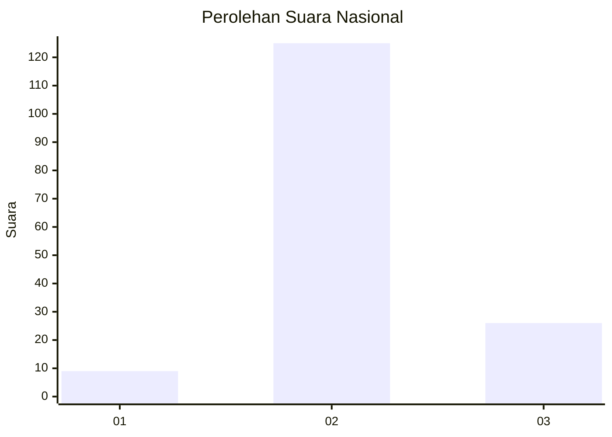
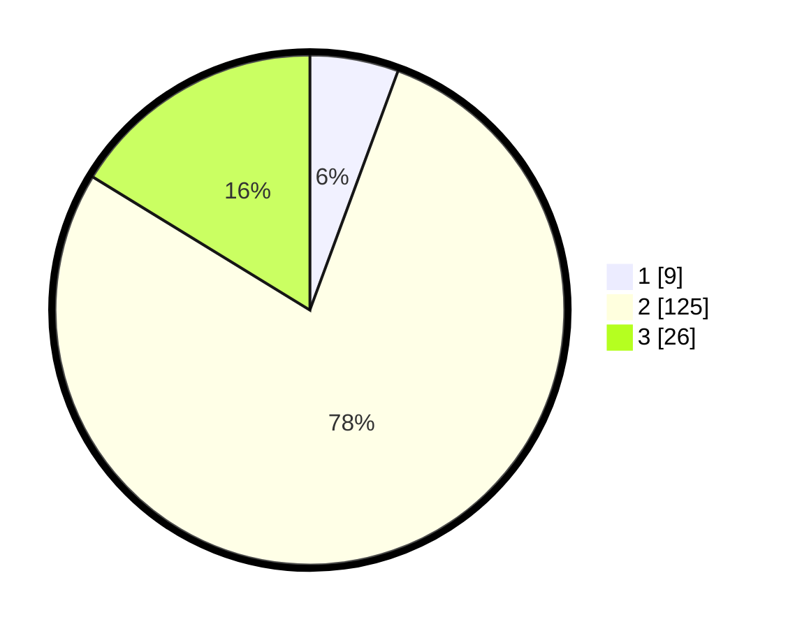

# Hasil

## Grafik

## Tabel

| No. | Nama Paslon    | Suara | Suara (raw) | Persentase |
|:--- |:-------------- | -----:| -----------:| ----------:|
| 1   | ANIES MUHAIMIN | 9     | [9][p-1]    | 5,63       |
| 2   | PRABOWO GIBRAN | 125   | [125][p-2]  | 78,13      |
| 3   | GANJAR MAHFUD  | 26    | [26][p-3]   | 16,25      |

[p-1]: https://github.com/gigit-pemilu/pemilu-2024/blob/main/pilpres/hitung-suara/sub/62-kalimantan-tengah/sub/06-katingan/sub/04-pulau-malan/sub/2002-tewang-darayu/sub/001-tps/sub/paslon-1.txt
[p-2]: https://github.com/gigit-pemilu/pemilu-2024/blob/main/pilpres/hitung-suara/sub/62-kalimantan-tengah/sub/06-katingan/sub/04-pulau-malan/sub/2002-tewang-darayu/sub/001-tps/sub/paslon-2.txt
[p-3]: https://github.com/gigit-pemilu/pemilu-2024/blob/main/pilpres/hitung-suara/sub/62-kalimantan-tengah/sub/06-katingan/sub/04-pulau-malan/sub/2002-tewang-darayu/sub/001-tps/sub/paslon-3.txt

## Foto C Plano

https://sirekap-obj-formc.kpu.go.id/0a1e/pemilu/ppwp/62/06/04/20/02/6206042002001-20240218-165238--843d3a3e-5fda-47da-979e-2e1dc7909d43.jpg

https://sirekap-obj-formc.kpu.go.id/0a1e/pemilu/ppwp/62/06/04/20/02/6206042002001-20240215-062248--8a84748a-96b9-4c7d-ad0d-400981579647.jpg

https://sirekap-obj-formc.kpu.go.id/0a1e/pemilu/ppwp/62/06/04/20/02/6206042002001-20240214-193331--167c81ac-911b-4bde-8818-91687d40bc9d.jpg

## Metadata

| Key        | Value               |
| ---------- | ------------------- |
| Time Stamp | 2024-02-19 06:16:00 |

