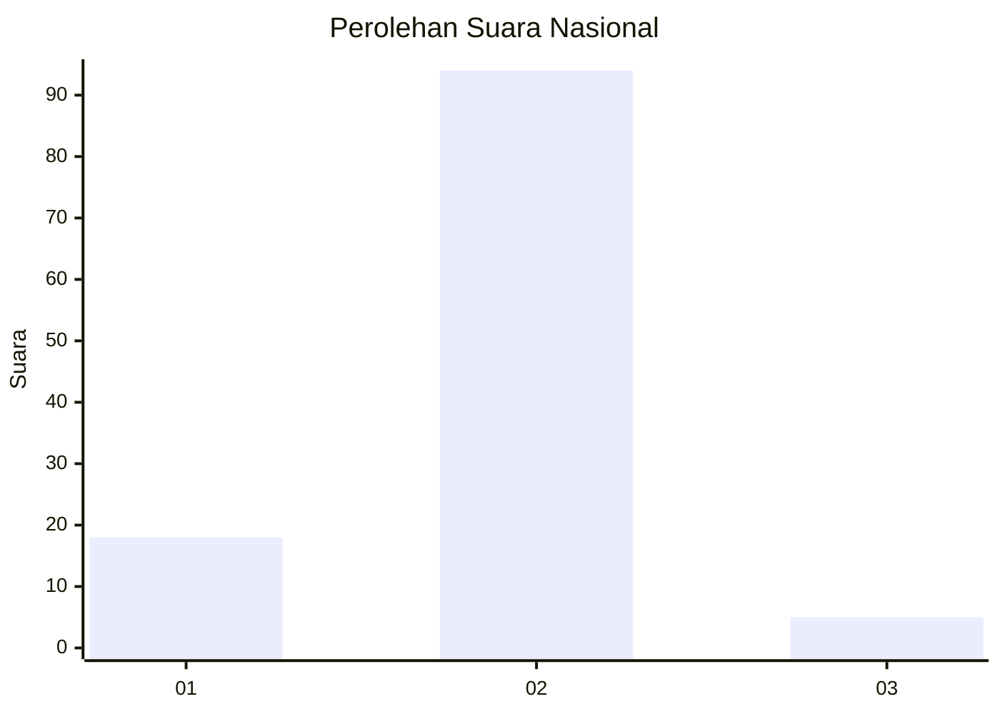
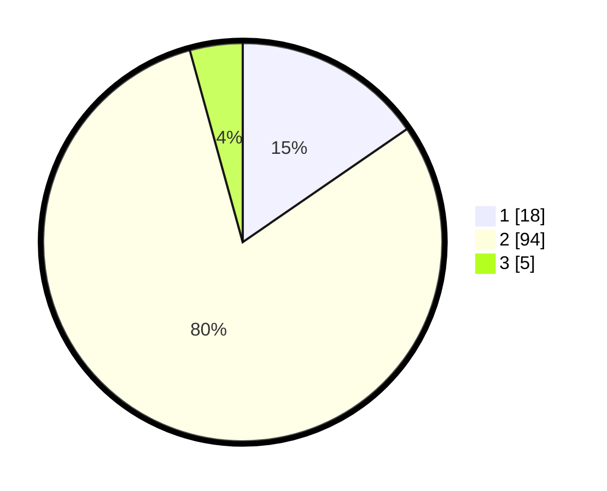

# Hasil

## Grafik

## Tabel

| No. | Nama Paslon    | Suara | Suara (raw) | Persentase |
|:--- |:-------------- | -----:| -----------:| ----------:|
| 1   | ANIES MUHAIMIN | 18    | [18][p-1]   | 15,38      |
| 2   | PRABOWO GIBRAN | 94    | [94][p-2]   | 80,34      |
| 3   | GANJAR MAHFUD  | 5     | [5][p-3]    | 4,27       |

[p-1]: https://github.com/gigit-pemilu/pemilu-2024/blob/main/pilpres/hitung-suara/sub/62-kalimantan-tengah/sub/06-katingan/sub/05-katingan-tengah/sub/2008-napu-sahur/sub/001-tps/sub/paslon-1.txt
[p-2]: https://github.com/gigit-pemilu/pemilu-2024/blob/main/pilpres/hitung-suara/sub/62-kalimantan-tengah/sub/06-katingan/sub/05-katingan-tengah/sub/2008-napu-sahur/sub/001-tps/sub/paslon-2.txt
[p-3]: https://github.com/gigit-pemilu/pemilu-2024/blob/main/pilpres/hitung-suara/sub/62-kalimantan-tengah/sub/06-katingan/sub/05-katingan-tengah/sub/2008-napu-sahur/sub/001-tps/sub/paslon-3.txt

## Foto C Plano

https://sirekap-obj-formc.kpu.go.id/7a68/pemilu/ppwp/62/06/05/20/08/6206052008001-20240216-005631--0f18b3a7-5738-449b-8125-909cdaaa99a4.jpg

https://sirekap-obj-formc.kpu.go.id/7a68/pemilu/ppwp/62/06/05/20/08/6206052008001-20240216-003535--15f78041-7b2c-48a5-917b-ad076b0cd1f3.jpg

https://sirekap-obj-formc.kpu.go.id/7a68/pemilu/ppwp/62/06/05/20/08/6206052008001-20240216-003753--e97c7ed6-883f-4ccb-bd38-bf73ce162a2f.jpg

## Metadata

| Key        | Value               |
| ---------- | ------------------- |
| Time Stamp | 2024-02-16 06:00:27 |

