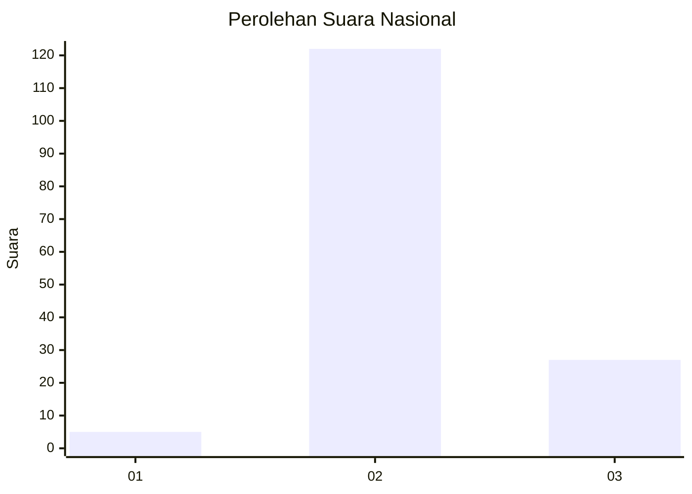

# Hasil

## Grafik

## Tabel

| No. | Nama Paslon    | Suara | Suara (raw) | Persentase |
|:--- |:-------------- | -----:| -----------:| ----------:|
| 1   | ANIES MUHAIMIN | 5     | [5][p-1]    | 3,25       |
| 2   | PRABOWO GIBRAN | 122   | [122][p-2]  | 79,22      |
| 3   | GANJAR MAHFUD  | 27    | [27][p-3]   | 17,53      |

[p-1]: https://github.com/gigit-pemilu/pemilu-2024/blob/main/pilpres/hitung-suara/sub/62-kalimantan-tengah/sub/06-katingan/sub/05-katingan-tengah/sub/2011-rantau-asem/sub/004-tps/sub/paslon-1.txt
[p-2]: https://github.com/gigit-pemilu/pemilu-2024/blob/main/pilpres/hitung-suara/sub/62-kalimantan-tengah/sub/06-katingan/sub/05-katingan-tengah/sub/2011-rantau-asem/sub/004-tps/sub/paslon-2.txt
[p-3]: https://github.com/gigit-pemilu/pemilu-2024/blob/main/pilpres/hitung-suara/sub/62-kalimantan-tengah/sub/06-katingan/sub/05-katingan-tengah/sub/2011-rantau-asem/sub/004-tps/sub/paslon-3.txt

## Foto C Plano

https://sirekap-obj-formc.kpu.go.id/e533/pemilu/ppwp/62/06/05/20/11/6206052011004-20240215-221601--79689769-07b6-4fc6-b8d1-d253bbfc6544.jpg

https://sirekap-obj-formc.kpu.go.id/e533/pemilu/ppwp/62/06/05/20/11/6206052011004-20240215-221732--6f04c9ce-f5eb-422d-b9d3-9a07a169f975.jpg

https://sirekap-obj-formc.kpu.go.id/e533/pemilu/ppwp/62/06/05/20/11/6206052011004-20240215-221849--f0c9f87b-a5e7-4ef2-95b2-f90a5e28fba9.jpg

## Metadata

| Key        | Value               |
| ---------- | ------------------- |
| Time Stamp | 2024-02-15 23:29:50 |

