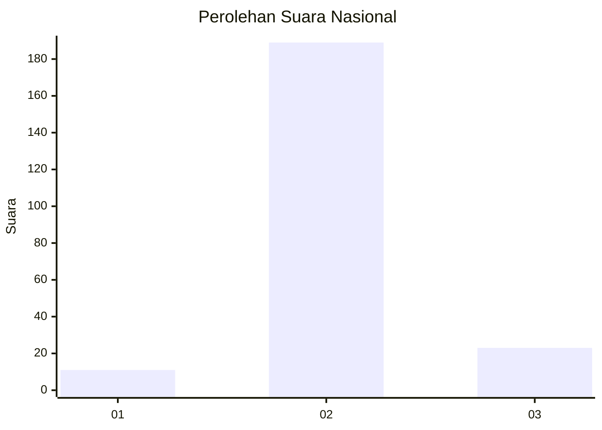
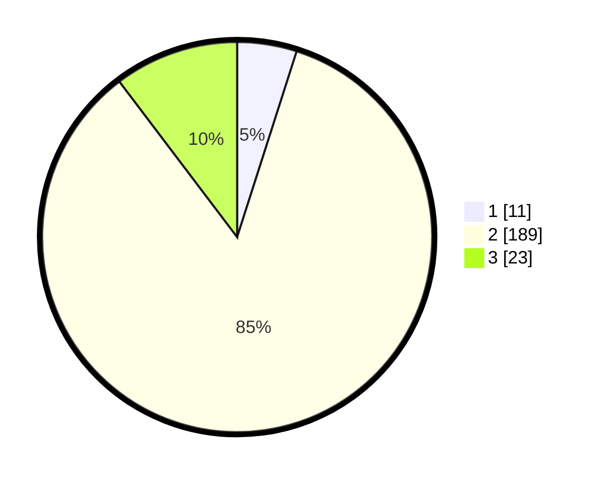

# Hasil

## Grafik

## Tabel

| No. | Nama Paslon    | Suara | Suara (raw) | Persentase |
|:--- |:-------------- | -----:| -----------:| ----------:|
| 1   | ANIES MUHAIMIN | 11    | [11][p-1]   | 4,93       |
| 2   | PRABOWO GIBRAN | 189   | [189][p-2]  | 84,75      |
| 3   | GANJAR MAHFUD  | 23    | [23][p-3]   | 10,31      |

[p-1]: https://github.com/gigit-pemilu/pemilu-2024/blob/main/pilpres/hitung-suara/sub/62-kalimantan-tengah/sub/06-katingan/sub/05-katingan-tengah/sub/2014-tumbang-marak/sub/003-tps/sub/paslon-1.txt
[p-2]: https://github.com/gigit-pemilu/pemilu-2024/blob/main/pilpres/hitung-suara/sub/62-kalimantan-tengah/sub/06-katingan/sub/05-katingan-tengah/sub/2014-tumbang-marak/sub/003-tps/sub/paslon-2.txt
[p-3]: https://github.com/gigit-pemilu/pemilu-2024/blob/main/pilpres/hitung-suara/sub/62-kalimantan-tengah/sub/06-katingan/sub/05-katingan-tengah/sub/2014-tumbang-marak/sub/003-tps/sub/paslon-3.txt

## Foto C Plano

https://sirekap-obj-formc.kpu.go.id/d212/pemilu/ppwp/62/06/05/20/14/6206052014003-20240216-175757--b416037b-0e37-4ecc-8da7-c8c4f1ad5a64.jpg

https://sirekap-obj-formc.kpu.go.id/d212/pemilu/ppwp/62/06/05/20/14/6206052014003-20240216-175931--06e80e4b-b06e-4130-8c92-485b2e565abb.jpg

https://sirekap-obj-formc.kpu.go.id/d212/pemilu/ppwp/62/06/05/20/14/6206052014003-20240217-152134--0bd1003d-5e20-4484-a35a-2ac7046e5374.jpg

## Metadata

| Key        | Value               |
| ---------- | ------------------- |
| Time Stamp | 2024-02-19 06:16:00 |

