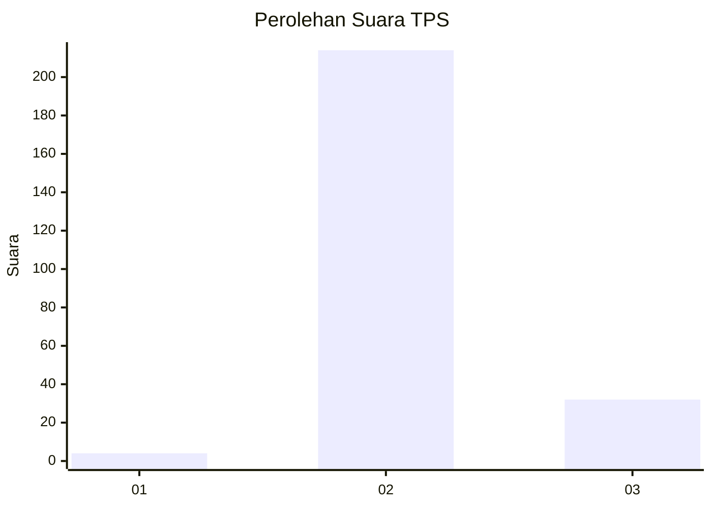
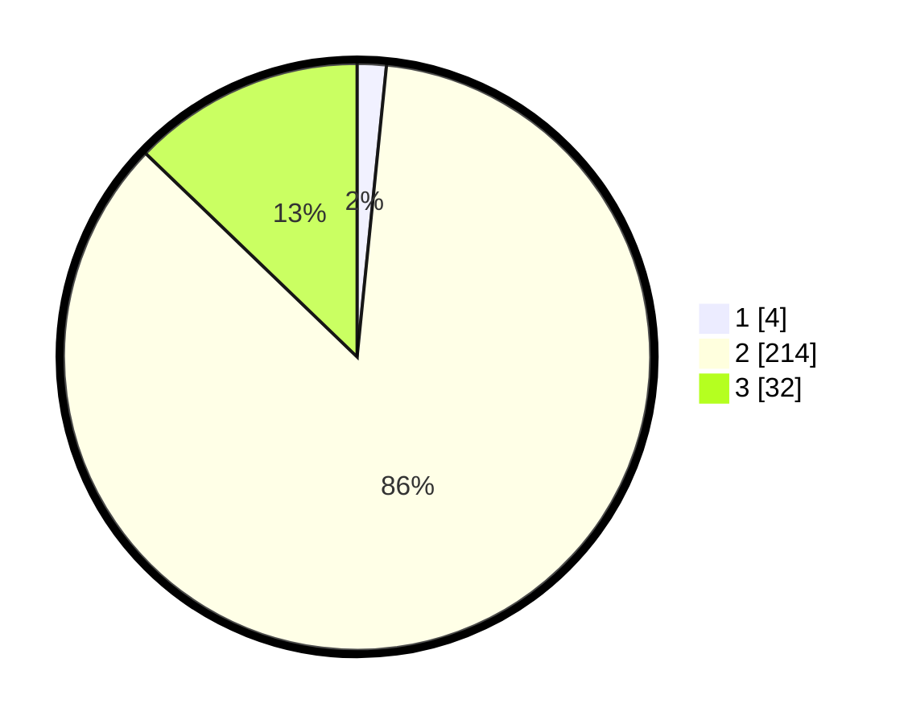

# Hasil

## Grafik

## Tabel

| No. | Nama Paslon    | Suara | Suara (raw) | Persentase |
|:--- |:-------------- | -----:| -----------:| ----------:|
| 1   | ANIES MUHAIMIN | 4     | [4][p-1]    | 1,60       |
| 2   | PRABOWO GIBRAN | 214   | [214][p-2]  | 85,60      |
| 3   | GANJAR MAHFUD  | 32    | [32][p-3]   | 12,80      |

[p-1]: https://github.com/gigit-pemilu/pemilu-2024-62-kalimantan-tengah/blob/main/pilpres/hitung-suara/sub/62-kalimantan-tengah/sub/06-katingan/sub/06-sanaman-mantikei/sub/2001-dehes/sub/001-tps/sub/paslon-1.txt
[p-2]: https://github.com/gigit-pemilu/pemilu-2024-62-kalimantan-tengah/blob/main/pilpres/hitung-suara/sub/62-kalimantan-tengah/sub/06-katingan/sub/06-sanaman-mantikei/sub/2001-dehes/sub/001-tps/sub/paslon-2.txt
[p-3]: https://github.com/gigit-pemilu/pemilu-2024-62-kalimantan-tengah/blob/main/pilpres/hitung-suara/sub/62-kalimantan-tengah/sub/06-katingan/sub/06-sanaman-mantikei/sub/2001-dehes/sub/001-tps/sub/paslon-3.txt

## Foto C Plano

https://sirekap-obj-formc.kpu.go.id/69e4/pemilu/ppwp/62/06/06/20/01/6206062001001-20240226-143923--d435fd37-9777-44dd-8d98-c3d28151a706.jpg

https://sirekap-obj-formc.kpu.go.id/69e4/pemilu/ppwp/62/06/06/20/01/6206062001001-20240214-213221--8040d9ad-c6c8-45b8-a967-6fc26fa5dd62.jpg

https://sirekap-obj-formc.kpu.go.id/69e4/pemilu/ppwp/62/06/06/20/01/6206062001001-20240214-213833--0111ca8c-016c-44ee-9d8d-3d5e67cb0959.jpg

## Metadata

| Key        | Value               |
| ---------- | ------------------- |
| Time Stamp | 2024-02-26 15:00:00 |

