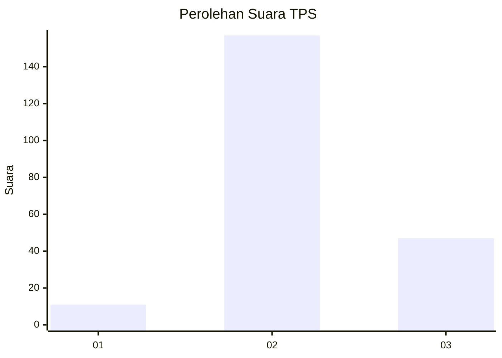
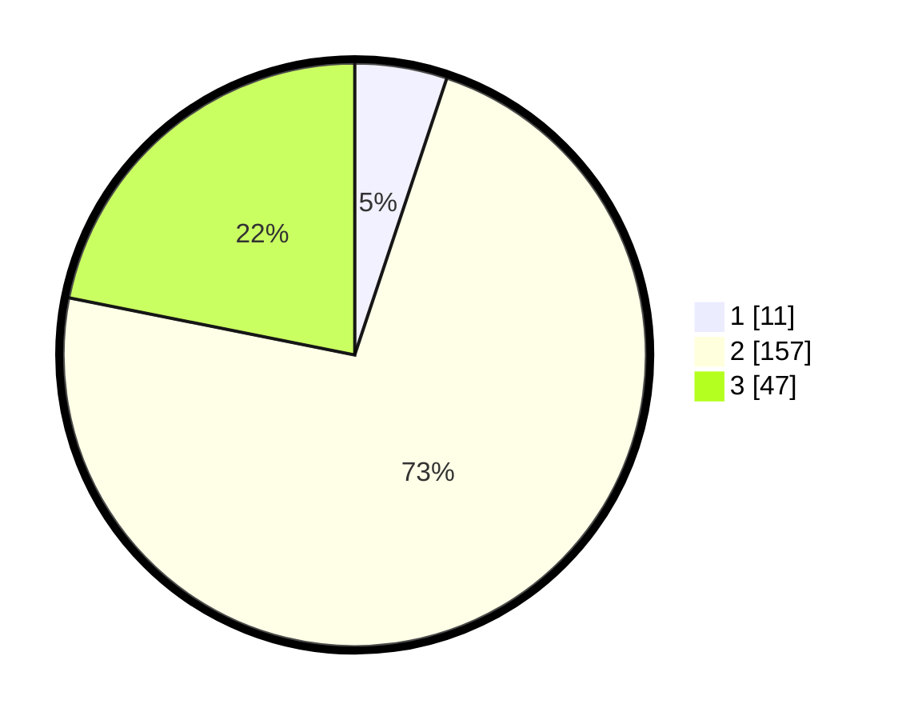

# Hasil

## Grafik

## Tabel

| No. | Nama Paslon    | Suara | Suara (raw) | Persentase |
|:--- |:-------------- | -----:| -----------:| ----------:|
| 1   | ANIES MUHAIMIN | 11    | [11][p-1]   | 5,12       |
| 2   | PRABOWO GIBRAN | 157   | [157][p-2]  | 73,02      |
| 3   | GANJAR MAHFUD  | 47    | [47][p-3]   | 21,86      |

[p-1]: https://github.com/gigit-pemilu/pemilu-2024-62-kalimantan-tengah/blob/main/pilpres/hitung-suara/sub/62-kalimantan-tengah/sub/06-katingan/sub/06-sanaman-mantikei/sub/2003-tumbang-kaman/sub/005-tps/sub/paslon-1.txt
[p-2]: https://github.com/gigit-pemilu/pemilu-2024-62-kalimantan-tengah/blob/main/pilpres/hitung-suara/sub/62-kalimantan-tengah/sub/06-katingan/sub/06-sanaman-mantikei/sub/2003-tumbang-kaman/sub/005-tps/sub/paslon-2.txt
[p-3]: https://github.com/gigit-pemilu/pemilu-2024-62-kalimantan-tengah/blob/main/pilpres/hitung-suara/sub/62-kalimantan-tengah/sub/06-katingan/sub/06-sanaman-mantikei/sub/2003-tumbang-kaman/sub/005-tps/sub/paslon-3.txt

## Foto C Plano

https://sirekap-obj-formc.kpu.go.id/7244/pemilu/ppwp/62/06/06/20/03/6206062003005-20240215-124250--573bd572-0aa1-4dd2-894f-a61711f968a8.jpg

https://sirekap-obj-formc.kpu.go.id/7244/pemilu/ppwp/62/06/06/20/03/6206062003005-20240215-124417--dfd312df-89a2-4b41-aa8c-9b8b0d717c86.jpg

https://sirekap-obj-formc.kpu.go.id/7244/pemilu/ppwp/62/06/06/20/03/6206062003005-20240215-124635--40b50c8f-7c10-4097-a357-8878952085e8.jpg

## Metadata

| Key        | Value               |
| ---------- | ------------------- |
| Time Stamp | 2024-02-16 00:00:26 |

