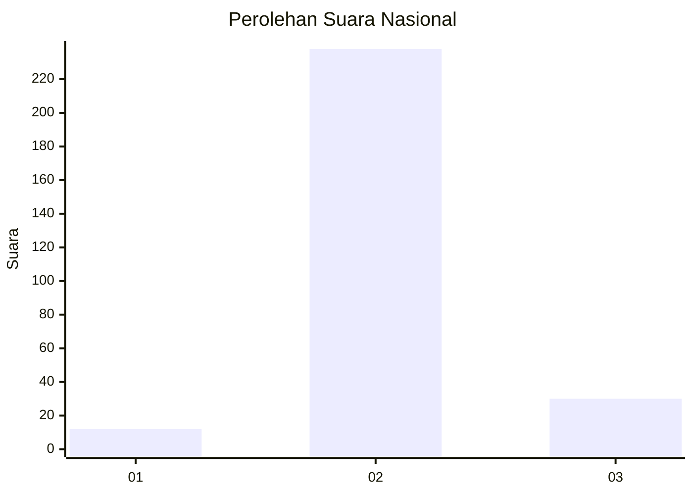
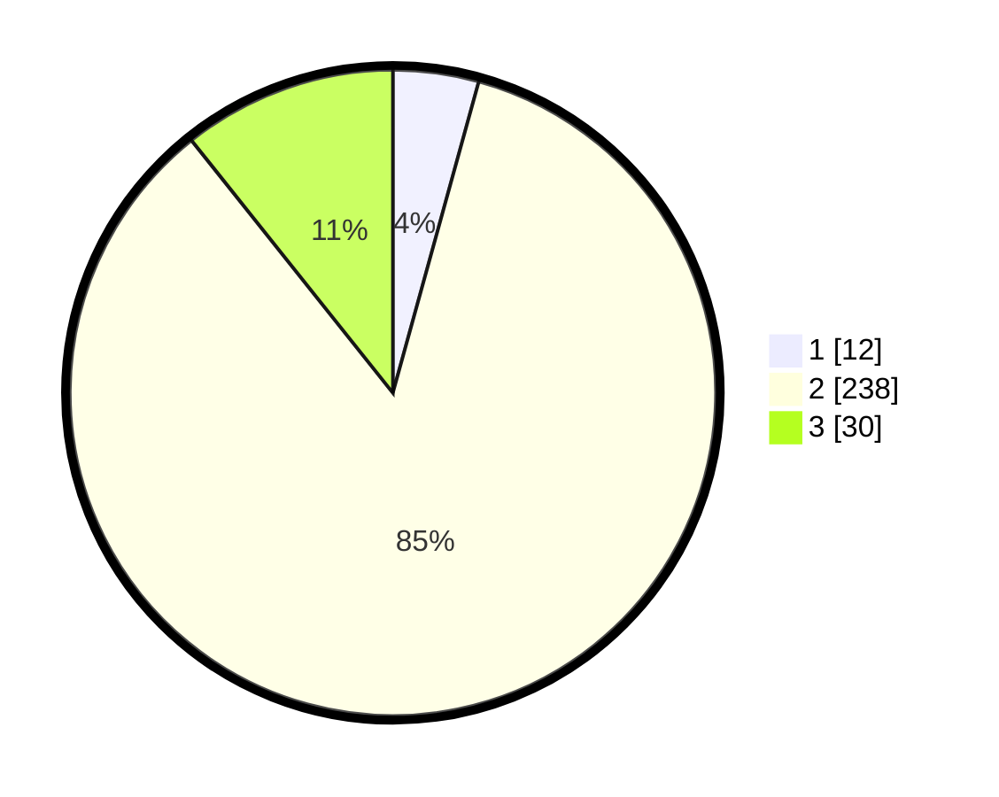

# Hasil

## Grafik

## Tabel

| No. | Nama Paslon    | Suara | Suara (raw) | Persentase |
|:--- |:-------------- | -----:| -----------:| ----------:|
| 1   | ANIES MUHAIMIN | 12    | [12][p-1]   | 4,29       |
| 2   | PRABOWO GIBRAN | 238   | [238][p-2]  | 85,00      |
| 3   | GANJAR MAHFUD  | 30    | [30][p-3]   | 10,71      |

[p-1]: https://github.com/gigit-pemilu/pemilu-2024/blob/main/pilpres/hitung-suara/sub/62-kalimantan-tengah/sub/06-katingan/sub/06-sanaman-mantikei/sub/2004-tumbang-manggo/sub/003-tps/sub/paslon-1.txt
[p-2]: https://github.com/gigit-pemilu/pemilu-2024/blob/main/pilpres/hitung-suara/sub/62-kalimantan-tengah/sub/06-katingan/sub/06-sanaman-mantikei/sub/2004-tumbang-manggo/sub/003-tps/sub/paslon-2.txt
[p-3]: https://github.com/gigit-pemilu/pemilu-2024/blob/main/pilpres/hitung-suara/sub/62-kalimantan-tengah/sub/06-katingan/sub/06-sanaman-mantikei/sub/2004-tumbang-manggo/sub/003-tps/sub/paslon-3.txt

## Foto C Plano

https://sirekap-obj-formc.kpu.go.id/e4a4/pemilu/ppwp/62/06/06/20/04/6206062004003-20240214-212936--b370db97-b3e3-4ff8-84d9-e66b4f353246.jpg

https://sirekap-obj-formc.kpu.go.id/e4a4/pemilu/ppwp/62/06/06/20/04/6206062004003-20240214-211210--000e6942-32aa-4f27-8170-75152a1b745f.jpg

https://sirekap-obj-formc.kpu.go.id/e4a4/pemilu/ppwp/62/06/06/20/04/6206062004003-20240214-211415--9c56ad05-3c40-4181-98f2-9c42fb8959c8.jpg

## Metadata

| Key        | Value               |
| ---------- | ------------------- |
| Time Stamp | 2024-02-15 19:00:26 |

