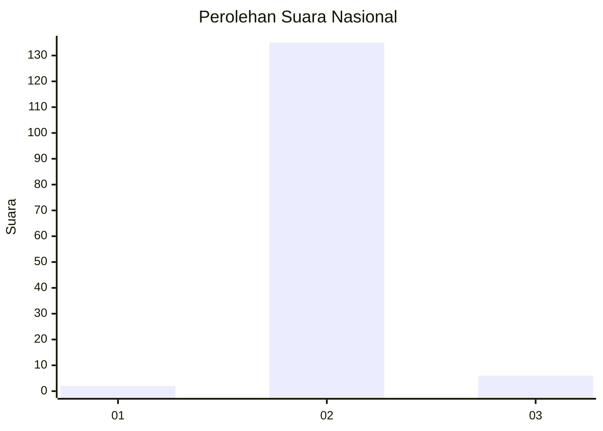
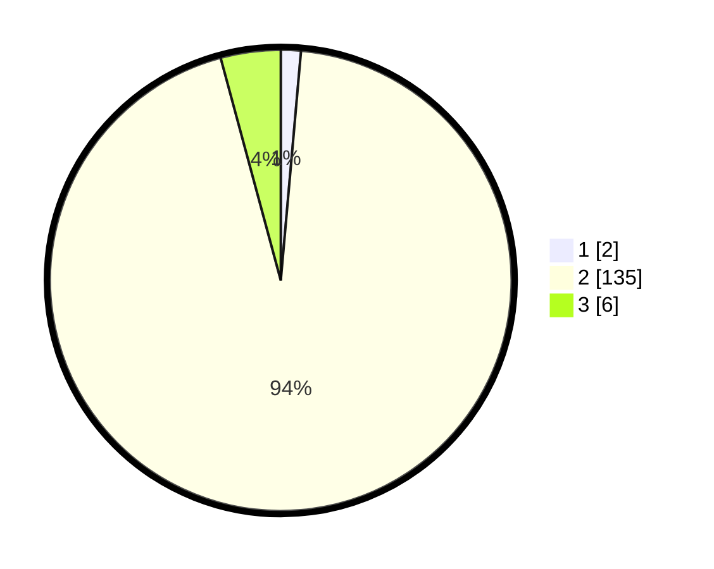

# Hasil

## Grafik

## Tabel

| No. | Nama Paslon    | Suara | Suara (raw) | Persentase |
|:--- |:-------------- | -----:| -----------:| ----------:|
| 1   | ANIES MUHAIMIN | 2     | [2][p-1]    | 1,40       |
| 2   | PRABOWO GIBRAN | 135   | [135][p-2]  | 94,41      |
| 3   | GANJAR MAHFUD  | 6     | [6][p-3]    | 4,20       |

[p-1]: https://github.com/gigit-pemilu/pemilu-2024/blob/main/pilpres/hitung-suara/sub/62-kalimantan-tengah/sub/06-katingan/sub/07-marikit/sub/2001-tumbang-mandurei/sub/001-tps/sub/paslon-1.txt
[p-2]: https://github.com/gigit-pemilu/pemilu-2024/blob/main/pilpres/hitung-suara/sub/62-kalimantan-tengah/sub/06-katingan/sub/07-marikit/sub/2001-tumbang-mandurei/sub/001-tps/sub/paslon-2.txt
[p-3]: https://github.com/gigit-pemilu/pemilu-2024/blob/main/pilpres/hitung-suara/sub/62-kalimantan-tengah/sub/06-katingan/sub/07-marikit/sub/2001-tumbang-mandurei/sub/001-tps/sub/paslon-3.txt

## Foto C Plano

https://sirekap-obj-formc.kpu.go.id/481e/pemilu/ppwp/62/06/07/20/01/6206072001001-20240227-011936--a72c750f-66ca-465f-a1ae-39bc54a7829d.jpg

https://sirekap-obj-formc.kpu.go.id/481e/pemilu/ppwp/62/06/07/20/01/6206072001001-20240215-150649--76d60eaf-bcd7-4467-9313-ffe71b09faa5.jpg

https://sirekap-obj-formc.kpu.go.id/481e/pemilu/ppwp/62/06/07/20/01/6206072001001-20240215-150413--3f6b310c-37b4-4860-a886-9b8ff2b40082.jpg

## Metadata

| Key        | Value               |
| ---------- | ------------------- |
| Time Stamp | 2024-02-27 02:00:00 |

