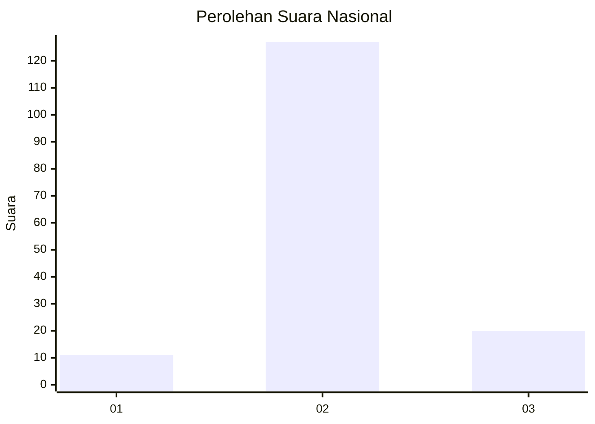
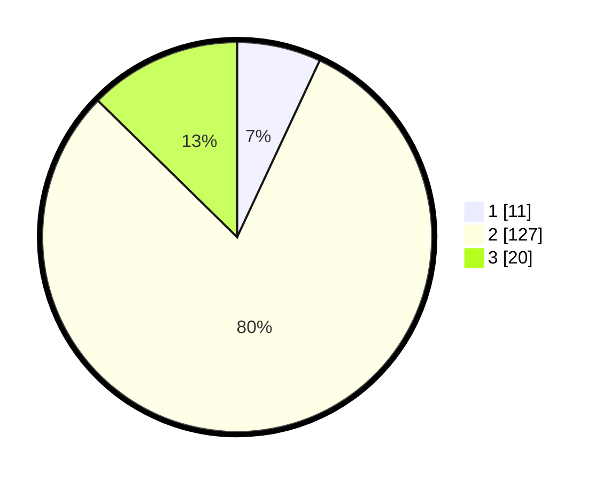

# Hasil

## Grafik

## Tabel

| No. | Nama Paslon    | Suara | Suara (raw) | Persentase |
|:--- |:-------------- | -----:| -----------:| ----------:|
| 1   | ANIES MUHAIMIN | 11    | [11][p-1]   | 6,96       |
| 2   | PRABOWO GIBRAN | 127   | [127][p-2]  | 80,38      |
| 3   | GANJAR MAHFUD  | 20    | [20][p-3]   | 12,66      |

[p-1]: https://github.com/gigit-pemilu/pemilu-2024/blob/main/pilpres/hitung-suara/sub/62-kalimantan-tengah/sub/06-katingan/sub/07-marikit/sub/2002-tumbang-paku/sub/001-tps/sub/paslon-1.txt
[p-2]: https://github.com/gigit-pemilu/pemilu-2024/blob/main/pilpres/hitung-suara/sub/62-kalimantan-tengah/sub/06-katingan/sub/07-marikit/sub/2002-tumbang-paku/sub/001-tps/sub/paslon-2.txt
[p-3]: https://github.com/gigit-pemilu/pemilu-2024/blob/main/pilpres/hitung-suara/sub/62-kalimantan-tengah/sub/06-katingan/sub/07-marikit/sub/2002-tumbang-paku/sub/001-tps/sub/paslon-3.txt

## Foto C Plano

https://sirekap-obj-formc.kpu.go.id/9401/pemilu/ppwp/62/06/07/20/02/6206072002001-20240227-005726--d79c5204-9677-493e-b6af-a84e0b7a4df0.jpg

https://sirekap-obj-formc.kpu.go.id/9401/pemilu/ppwp/62/06/07/20/02/6206072002001-20240215-132407--5623f745-7818-4f54-bf9d-13a807445032.jpg

https://sirekap-obj-formc.kpu.go.id/9401/pemilu/ppwp/62/06/07/20/02/6206072002001-20240215-113448--6422748d-f3f7-46cf-9fba-6b0f422cd601.jpg

## Metadata

| Key        | Value               |
| ---------- | ------------------- |
| Time Stamp | 2024-02-27 01:00:00 |

