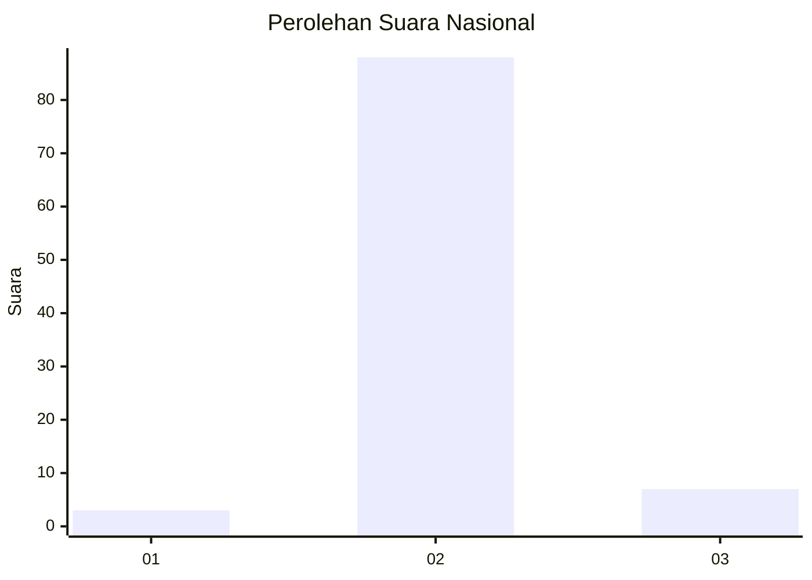
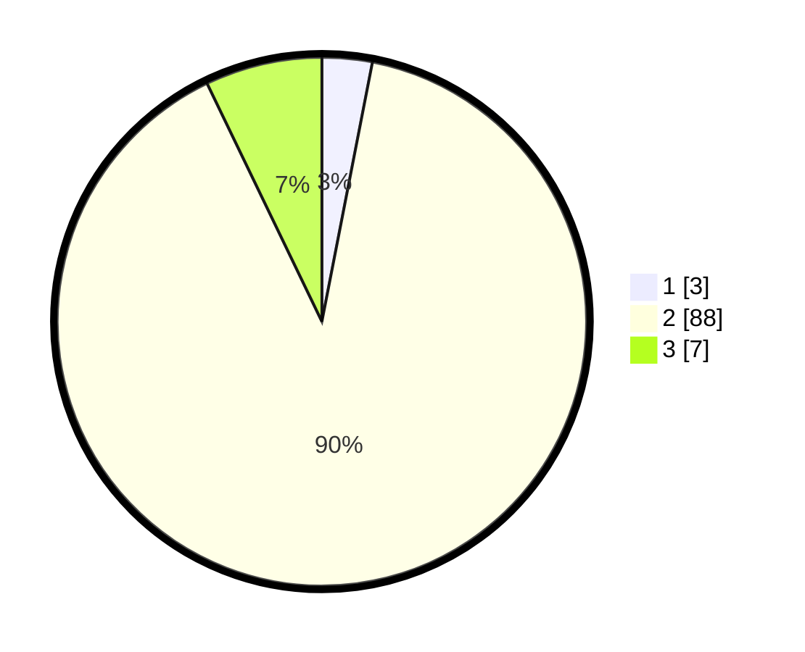

# Hasil

## Grafik

## Tabel

| No. | Nama Paslon    | Suara | Suara (raw) | Persentase |
|:--- |:-------------- | -----:| -----------:| ----------:|
| 1   | ANIES MUHAIMIN | 3     | [3][p-1]    | 3,06       |
| 2   | PRABOWO GIBRAN | 88    | [88][p-2]   | 89,80      |
| 3   | GANJAR MAHFUD  | 7     | [7][p-3]    | 7,14       |

[p-1]: https://github.com/gigit-pemilu/pemilu-2024/blob/main/pilpres/hitung-suara/sub/62-kalimantan-tengah/sub/06-katingan/sub/07-marikit/sub/2013-tumbang-bemban/sub/002-tps/sub/paslon-1.txt
[p-2]: https://github.com/gigit-pemilu/pemilu-2024/blob/main/pilpres/hitung-suara/sub/62-kalimantan-tengah/sub/06-katingan/sub/07-marikit/sub/2013-tumbang-bemban/sub/002-tps/sub/paslon-2.txt
[p-3]: https://github.com/gigit-pemilu/pemilu-2024/blob/main/pilpres/hitung-suara/sub/62-kalimantan-tengah/sub/06-katingan/sub/07-marikit/sub/2013-tumbang-bemban/sub/002-tps/sub/paslon-3.txt

## Foto C Plano

https://sirekap-obj-formc.kpu.go.id/48fc/pemilu/ppwp/62/06/07/20/13/6206072013002-20240215-160548--b561a066-8b7d-4ddb-95cb-53199ba624aa.jpg

https://sirekap-obj-formc.kpu.go.id/48fc/pemilu/ppwp/62/06/07/20/13/6206072013002-20240215-094120--496f1124-701d-4c27-adc8-6951f9085f7e.jpg

https://sirekap-obj-formc.kpu.go.id/48fc/pemilu/ppwp/62/06/07/20/13/6206072013002-20240215-160912--7ad50bdc-d21e-4631-8b87-58d81d9bd946.jpg

## Metadata

| Key        | Value               |
| ---------- | ------------------- |
| Time Stamp | 2024-02-16 00:00:26 |

