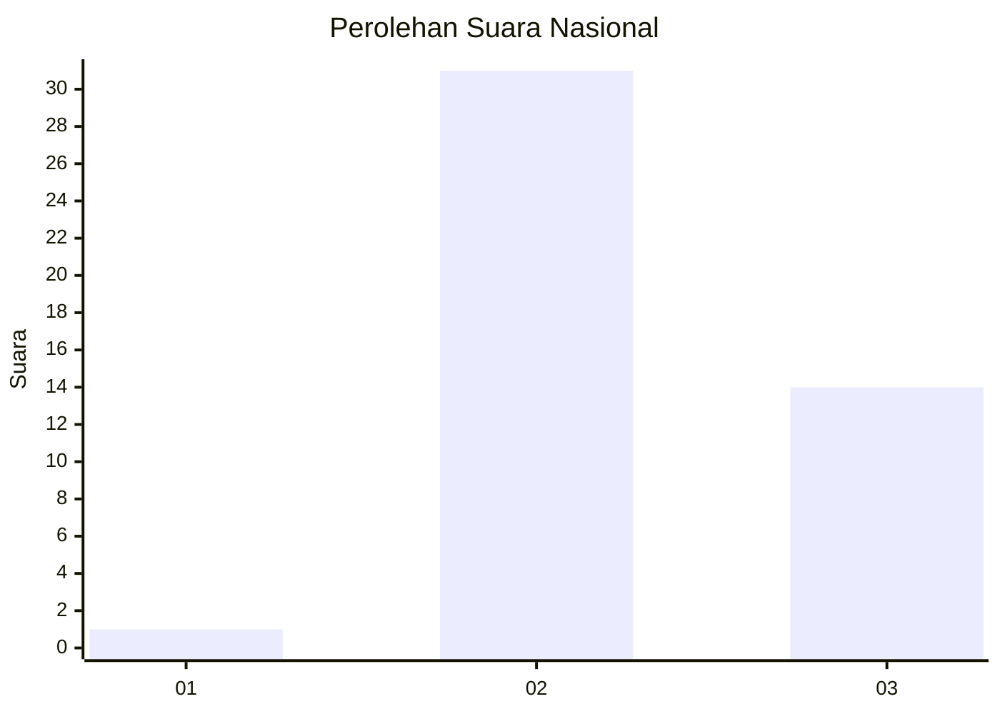
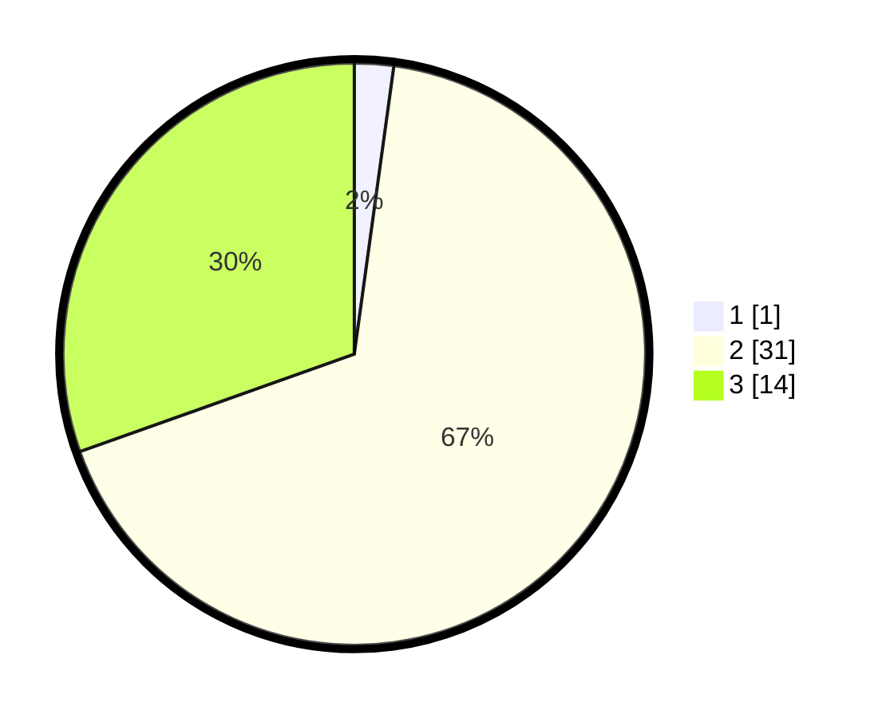

# Hasil

## Grafik

## Tabel

| No. | Nama Paslon    | Suara | Suara (raw) | Persentase |
|:--- |:-------------- | -----:| -----------:| ----------:|
| 1   | ANIES MUHAIMIN | 1     | [1][p-1]    | 2,17       |
| 2   | PRABOWO GIBRAN | 31    | [31][p-2]   | 67,39      |
| 3   | GANJAR MAHFUD  | 14    | [14][p-3]   | 30,43      |

[p-1]: https://github.com/gigit-pemilu/pemilu-2024/blob/main/pilpres/hitung-suara/sub/62-kalimantan-tengah/sub/06-katingan/sub/08-katingan-hulu/sub/2032-teluk-tampang/sub/001-tps/sub/paslon-1.txt
[p-2]: https://github.com/gigit-pemilu/pemilu-2024/blob/main/pilpres/hitung-suara/sub/62-kalimantan-tengah/sub/06-katingan/sub/08-katingan-hulu/sub/2032-teluk-tampang/sub/001-tps/sub/paslon-2.txt
[p-3]: https://github.com/gigit-pemilu/pemilu-2024/blob/main/pilpres/hitung-suara/sub/62-kalimantan-tengah/sub/06-katingan/sub/08-katingan-hulu/sub/2032-teluk-tampang/sub/001-tps/sub/paslon-3.txt

## Foto C Plano

https://sirekap-obj-formc.kpu.go.id/940b/pemilu/ppwp/62/06/08/20/32/6206082032001-20240214-195259--440c8646-6b0f-471a-bee3-eb19dc63c7c1.jpg

https://sirekap-obj-formc.kpu.go.id/940b/pemilu/ppwp/62/06/08/20/32/6206082032001-20240215-014727--4eea6a61-5410-407d-8901-7a766cc7e444.jpg

## Metadata

| Key        | Value               |
| ---------- | ------------------- |
| Time Stamp | 2024-02-15 23:29:50 |

