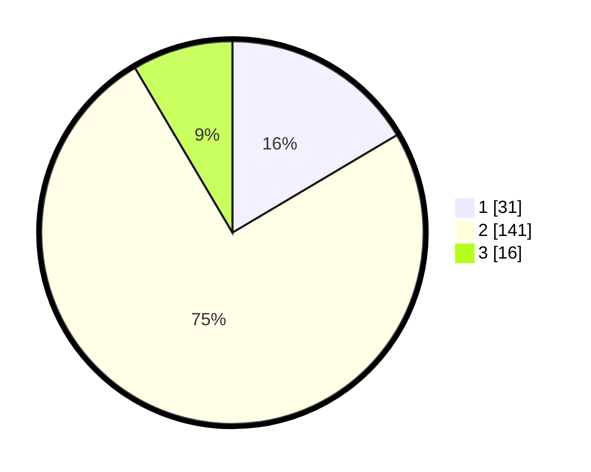

# Hasil

## Grafik

## Tabel

| No. | Nama Paslon    | Suara | Suara (raw) | Persentase |
|:--- |:-------------- | -----:| -----------:| ----------:|
| 1   | ANIES MUHAIMIN | 31    | [31][p-1]   | 16,49      |
| 2   | PRABOWO GIBRAN | 141   | [141][p-2]  | 75,00      |
| 3   | GANJAR MAHFUD  | 16    | [16][p-3]   | 8,51       |

[p-1]: https://github.com/gigit-pemilu/pemilu-2024-62-kalimantan-tengah/blob/main/pilpres/hitung-suara/sub/62-kalimantan-tengah/sub/06-katingan/sub/10-katingan-kuala/sub/1001-pagatan-hilir/sub/002-tps/sub/paslon-1.txt
[p-2]: https://github.com/gigit-pemilu/pemilu-2024-62-kalimantan-tengah/blob/main/pilpres/hitung-suara/sub/62-kalimantan-tengah/sub/06-katingan/sub/10-katingan-kuala/sub/1001-pagatan-hilir/sub/002-tps/sub/paslon-2.txt
[p-3]: https://github.com/gigit-pemilu/pemilu-2024-62-kalimantan-tengah/blob/main/pilpres/hitung-suara/sub/62-kalimantan-tengah/sub/06-katingan/sub/10-katingan-kuala/sub/1001-pagatan-hilir/sub/002-tps/sub/paslon-3.txt

## Foto C Plano

https://sirekap-obj-formc.kpu.go.id/64ec/pemilu/ppwp/62/06/10/10/01/6206101001002-20240220-143556--41acaefe-3a97-4882-b7ab-31a642191289.jpg

https://sirekap-obj-formc.kpu.go.id/64ec/pemilu/ppwp/62/06/10/10/01/6206101001002-20240220-143650--5ddc863f-67c6-4147-90c1-c719cf63776a.jpg

https://sirekap-obj-formc.kpu.go.id/64ec/pemilu/ppwp/62/06/10/10/01/6206101001002-20240220-143818--74fd8534-cfb4-4d1e-89c4-dc8d2348cce2.jpg

## Metadata

| Key        | Value               |
| ---------- | ------------------- |
| Time Stamp | 2024-02-24 22:31:28 |

