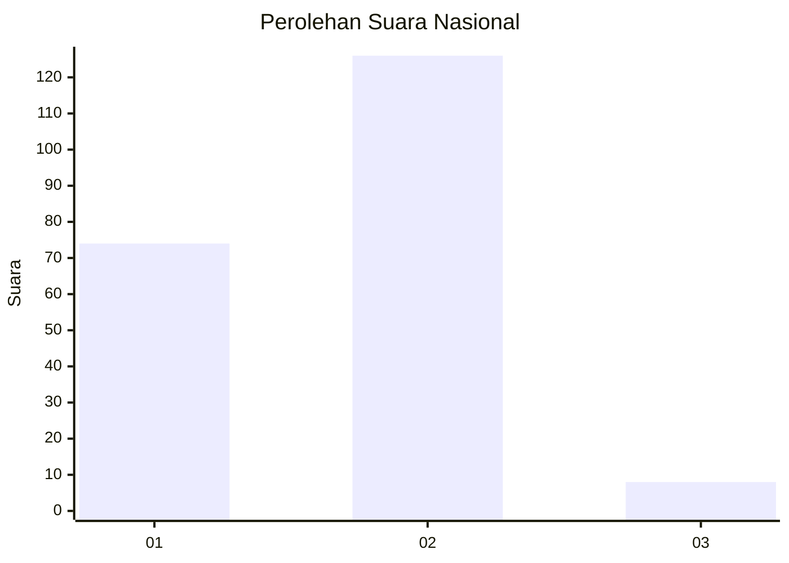
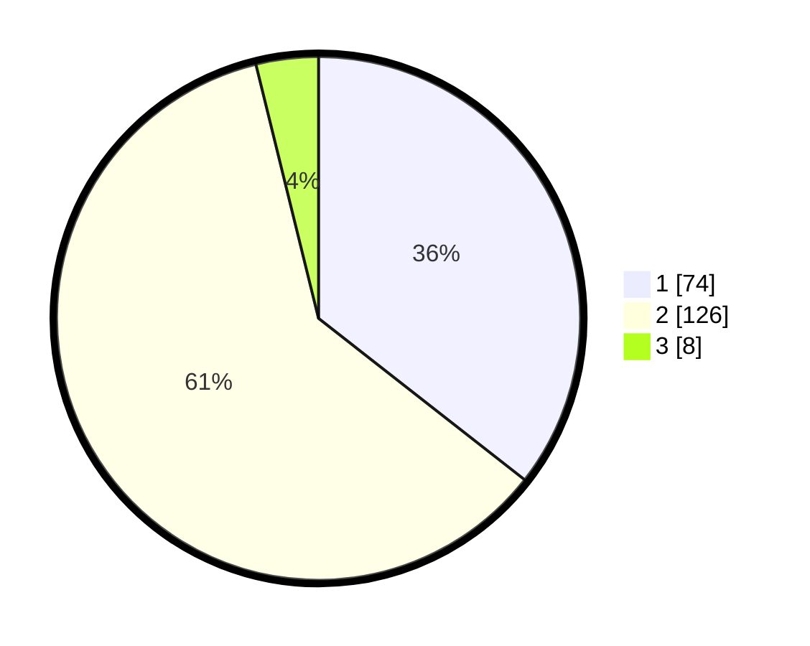

# Hasil

## Grafik

## Tabel

| No. | Nama Paslon    | Suara | Suara (raw) | Persentase |
|:--- |:-------------- | -----:| -----------:| ----------:|
| 1   | ANIES MUHAIMIN | 74    | [74][p-1]   | 35,58      |
| 2   | PRABOWO GIBRAN | 126   | [126][p-2]  | 60,58      |
| 3   | GANJAR MAHFUD  | 8     | [8][p-3]    | 3,85       |

[p-1]: https://github.com/gigit-pemilu/pemilu-2024/blob/main/pilpres/hitung-suara/sub/62-kalimantan-tengah/sub/06-katingan/sub/10-katingan-kuala/sub/1001-pagatan-hilir/sub/005-tps/sub/paslon-1.txt
[p-2]: https://github.com/gigit-pemilu/pemilu-2024/blob/main/pilpres/hitung-suara/sub/62-kalimantan-tengah/sub/06-katingan/sub/10-katingan-kuala/sub/1001-pagatan-hilir/sub/005-tps/sub/paslon-2.txt
[p-3]: https://github.com/gigit-pemilu/pemilu-2024/blob/main/pilpres/hitung-suara/sub/62-kalimantan-tengah/sub/06-katingan/sub/10-katingan-kuala/sub/1001-pagatan-hilir/sub/005-tps/sub/paslon-3.txt

## Foto C Plano

https://sirekap-obj-formc.kpu.go.id/1a62/pemilu/ppwp/62/06/10/10/01/6206101001005-20240220-123006--836fbef4-fa08-4b3d-81e2-63f03ce0091d.jpg

https://sirekap-obj-formc.kpu.go.id/1a62/pemilu/ppwp/62/06/10/10/01/6206101001005-20240220-123220--5b5bc89e-27ac-4c16-b6c3-b3ed2a29f4a8.jpg

https://sirekap-obj-formc.kpu.go.id/1a62/pemilu/ppwp/62/06/10/10/01/6206101001005-20240220-123350--640a7f05-ff36-4cbd-9026-78a122d8a89f.jpg

## Metadata

| Key        | Value               |
| ---------- | ------------------- |
| Time Stamp | 2024-02-24 22:31:28 |

