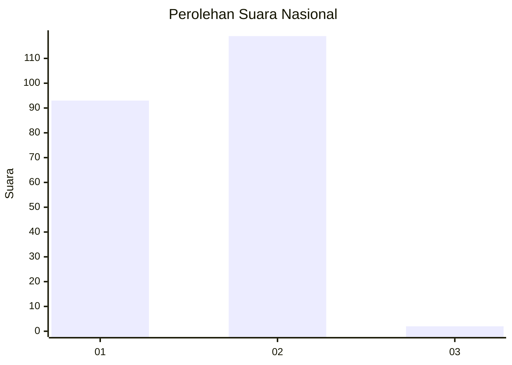
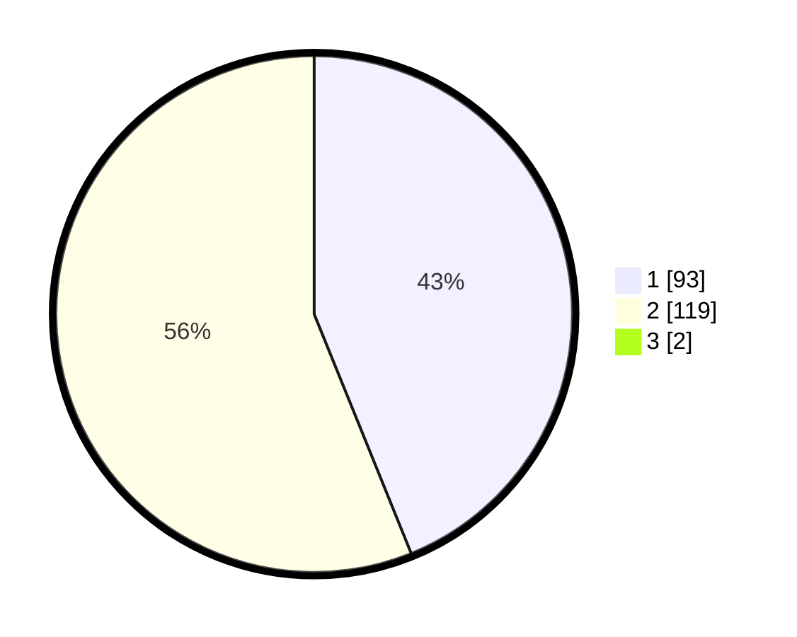

# Hasil

## Grafik

## Tabel

| No. | Nama Paslon    | Suara | Suara (raw) | Persentase |
|:--- |:-------------- | -----:| -----------:| ----------:|
| 1   | ANIES MUHAIMIN | 93    | [93][p-1]   | 43,46      |
| 2   | PRABOWO GIBRAN | 119   | [119][p-2]  | 55,61      |
| 3   | GANJAR MAHFUD  | 2     | [2][p-3]    | 0,93       |

[p-1]: https://github.com/gigit-pemilu/pemilu-2024/blob/main/pilpres/hitung-suara/sub/62-kalimantan-tengah/sub/06-katingan/sub/10-katingan-kuala/sub/1001-pagatan-hilir/sub/006-tps/sub/paslon-1.txt
[p-2]: https://github.com/gigit-pemilu/pemilu-2024/blob/main/pilpres/hitung-suara/sub/62-kalimantan-tengah/sub/06-katingan/sub/10-katingan-kuala/sub/1001-pagatan-hilir/sub/006-tps/sub/paslon-2.txt
[p-3]: https://github.com/gigit-pemilu/pemilu-2024/blob/main/pilpres/hitung-suara/sub/62-kalimantan-tengah/sub/06-katingan/sub/10-katingan-kuala/sub/1001-pagatan-hilir/sub/006-tps/sub/paslon-3.txt

## Foto C Plano

https://sirekap-obj-formc.kpu.go.id/fdc5/pemilu/ppwp/62/06/10/10/01/6206101001006-20240220-142154--0b42bba9-c021-481e-8fee-ec4567571082.jpg

https://sirekap-obj-formc.kpu.go.id/fdc5/pemilu/ppwp/62/06/10/10/01/6206101001006-20240220-142246--87b9c784-038c-4dda-af42-ab090cd5139f.jpg

https://sirekap-obj-formc.kpu.go.id/fdc5/pemilu/ppwp/62/06/10/10/01/6206101001006-20240220-142346--ece0b776-f79e-424a-983f-53db890755ac.jpg

## Metadata

| Key        | Value               |
| ---------- | ------------------- |
| Time Stamp | 2024-02-25 15:00:00 |

