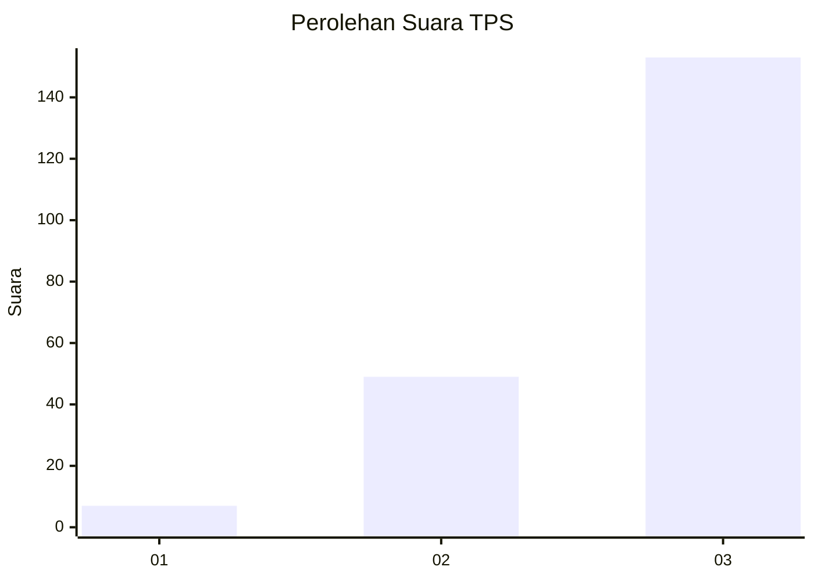
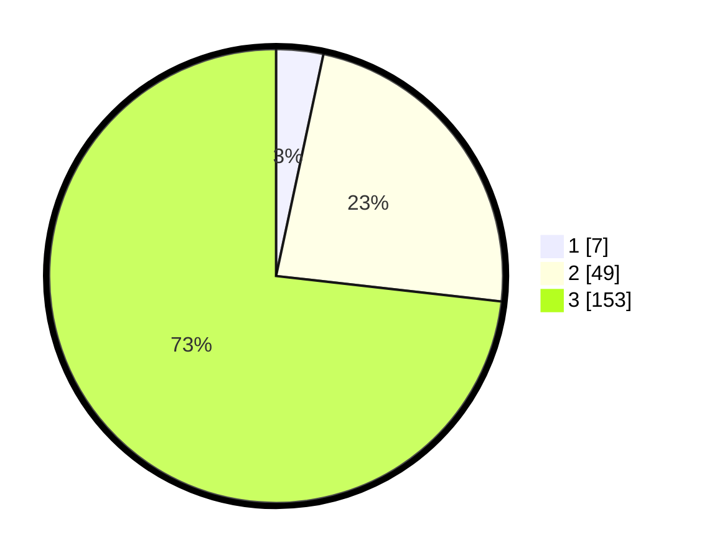

# Hasil

## Grafik

## Tabel

| No. | Nama Paslon    | Suara | Suara (raw) | Persentase |
|:--- |:-------------- | -----:| -----------:| ----------:|
| 1   | ANIES MUHAIMIN | 7     | [7][p-1]    | 3,35       |
| 2   | PRABOWO GIBRAN | 49    | [49][p-2]   | 23,44      |
| 3   | GANJAR MAHFUD  | 153   | [153][p-3]  | 73,21      |

[p-1]: https://github.com/gigit-pemilu/pemilu-2024-62-kalimantan-tengah/blob/main/pilpres/hitung-suara/sub/62-kalimantan-tengah/sub/06-katingan/sub/10-katingan-kuala/sub/2014-makmur-utama/sub/002-tps/sub/paslon-1.txt
[p-2]: https://github.com/gigit-pemilu/pemilu-2024-62-kalimantan-tengah/blob/main/pilpres/hitung-suara/sub/62-kalimantan-tengah/sub/06-katingan/sub/10-katingan-kuala/sub/2014-makmur-utama/sub/002-tps/sub/paslon-2.txt
[p-3]: https://github.com/gigit-pemilu/pemilu-2024-62-kalimantan-tengah/blob/main/pilpres/hitung-suara/sub/62-kalimantan-tengah/sub/06-katingan/sub/10-katingan-kuala/sub/2014-makmur-utama/sub/002-tps/sub/paslon-3.txt

## Foto C Plano

https://sirekap-obj-formc.kpu.go.id/1a2a/pemilu/ppwp/62/06/10/20/14/6206102014002-20240219-194314--1059ee37-e56f-4f59-8a78-7aadbd7181c8.jpg

https://sirekap-obj-formc.kpu.go.id/1a2a/pemilu/ppwp/62/06/10/20/14/6206102014002-20240219-194702--fb406f8d-af2c-4f50-bc53-9e74f747771c.jpg

https://sirekap-obj-formc.kpu.go.id/1a2a/pemilu/ppwp/62/06/10/20/14/6206102014002-20240219-194820--5f8ba3a5-94e7-4271-af03-0cbb1e5ecb3f.jpg

## Metadata

| Key        | Value               |
| ---------- | ------------------- |
| Time Stamp | 2024-02-19 22:00:00 |

## DATA PEMILIH TETAP

Jumlah pemilih dalam DPT: **0**.
 * L: **20**.
 * P: **0**.

## DATA PENGGUNA HAK PILIH

Jumlah pengguna hak pilih dalam DPT: **556**.
 * L: **500**.
 * P: **537**.

Jumlah pengguna hak pilih dalam DPTb: **555**.
 * L: **593**.
 * P: **557**.

Jumlah pengguna hak pilih dalam DPK: **556**.
 * L: **522**.
 * P: **555**.

Jumlah pengguna hak pilih: **51**.
 * L: **5**.
 * P: **5**.

## JUMLAH SUARA SAH DAN TIDAK SAH

JUMLAH SELURUH SUARA SAH: **229**.

JUMLAH SUARA TIDAK SAH: **881**.

JUMLAH SELURUH SUARA SAH DAN SUARA TIDAK SAH: **230**.

