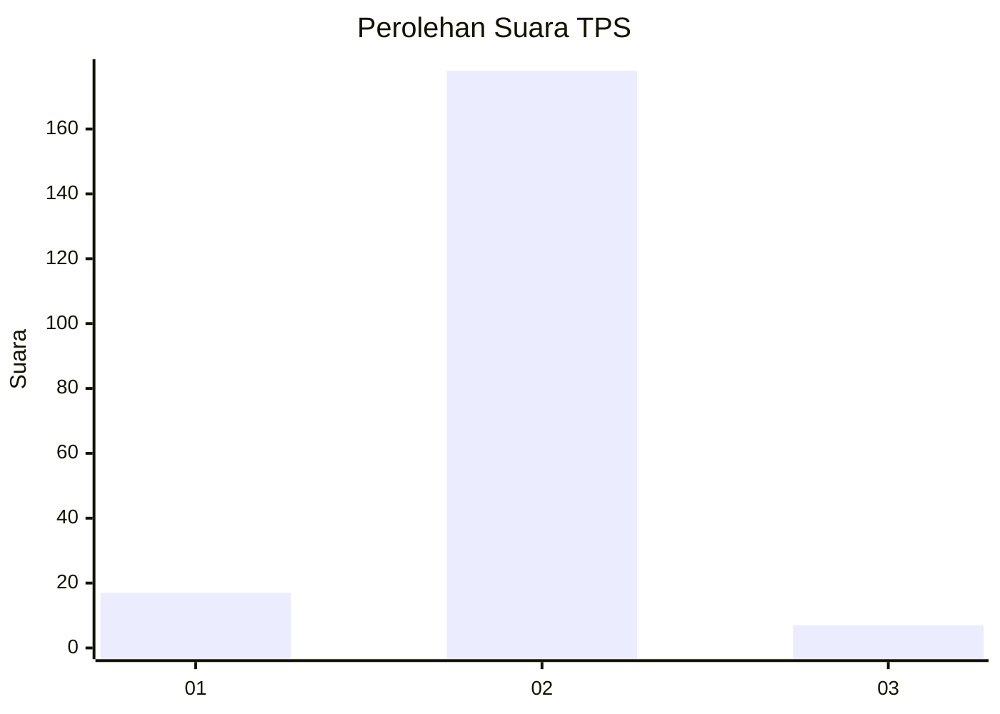
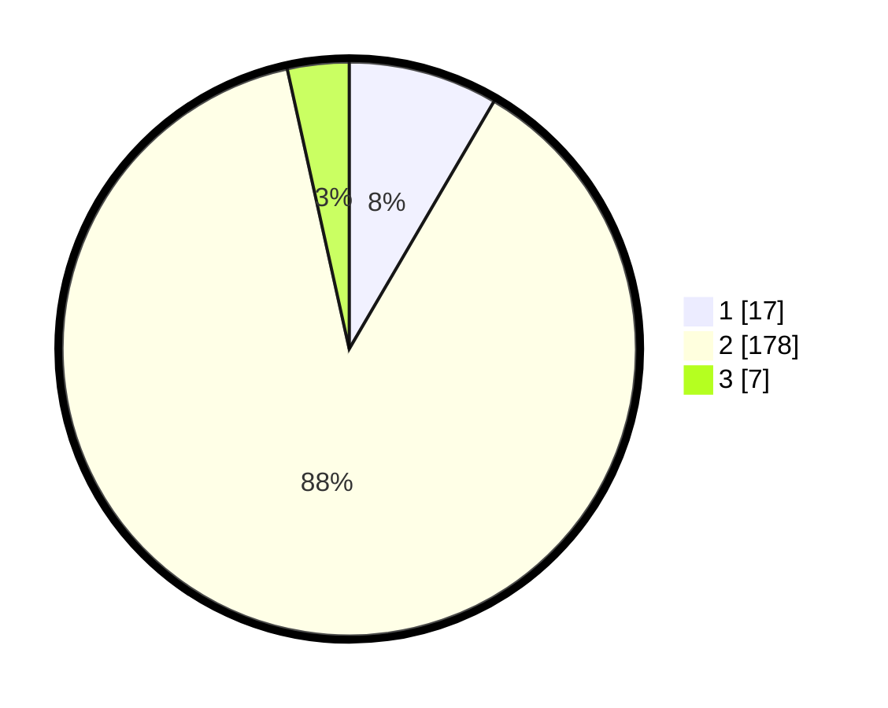

# Hasil

## Grafik

## Tabel

| No. | Nama Paslon    | Suara | Suara (raw) | Persentase |
|:--- |:-------------- | -----:| -----------:| ----------:|
| 1   | ANIES MUHAIMIN | 17    | [17][p-1]   | 8,42       |
| 2   | PRABOWO GIBRAN | 178   | [178][p-2]  | 88,12      |
| 3   | GANJAR MAHFUD  | 7     | [7][p-3]    | 3,47       |

[p-1]: https://github.com/gigit-pemilu/pemilu-2024-62-kalimantan-tengah/blob/main/pilpres/hitung-suara/sub/62-kalimantan-tengah/sub/06-katingan/sub/11-tasik-payawan/sub/2002-hiyang-bana/sub/002-tps/sub/paslon-1.txt
[p-2]: https://github.com/gigit-pemilu/pemilu-2024-62-kalimantan-tengah/blob/main/pilpres/hitung-suara/sub/62-kalimantan-tengah/sub/06-katingan/sub/11-tasik-payawan/sub/2002-hiyang-bana/sub/002-tps/sub/paslon-2.txt
[p-3]: https://github.com/gigit-pemilu/pemilu-2024-62-kalimantan-tengah/blob/main/pilpres/hitung-suara/sub/62-kalimantan-tengah/sub/06-katingan/sub/11-tasik-payawan/sub/2002-hiyang-bana/sub/002-tps/sub/paslon-3.txt

## Foto C Plano

https://sirekap-obj-formc.kpu.go.id/1e64/pemilu/ppwp/62/06/11/20/02/6206112002002-20240226-212944--c389be5d-78cd-4ab1-8280-4df3fd624947.jpg

https://sirekap-obj-formc.kpu.go.id/1e64/pemilu/ppwp/62/06/11/20/02/6206112002002-20240226-213243--75430477-7df2-4c8e-9ce4-5abd0fb7890c.jpg

https://sirekap-obj-formc.kpu.go.id/1e64/pemilu/ppwp/62/06/11/20/02/6206112002002-20240226-213332--ed6aeb91-1ec6-432b-856c-5391e92d8df6.jpg

## Metadata

| Key        | Value               |
| ---------- | ------------------- |
| Time Stamp | 2024-03-01 18:00:00 |

